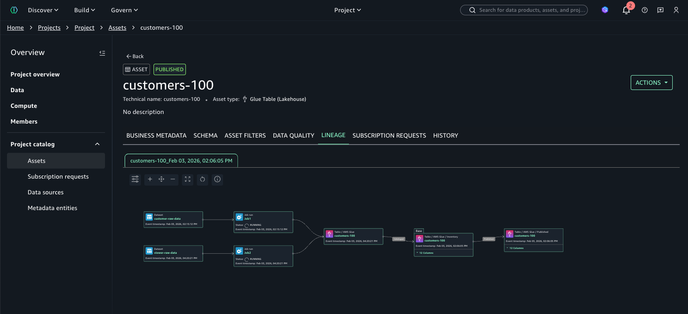
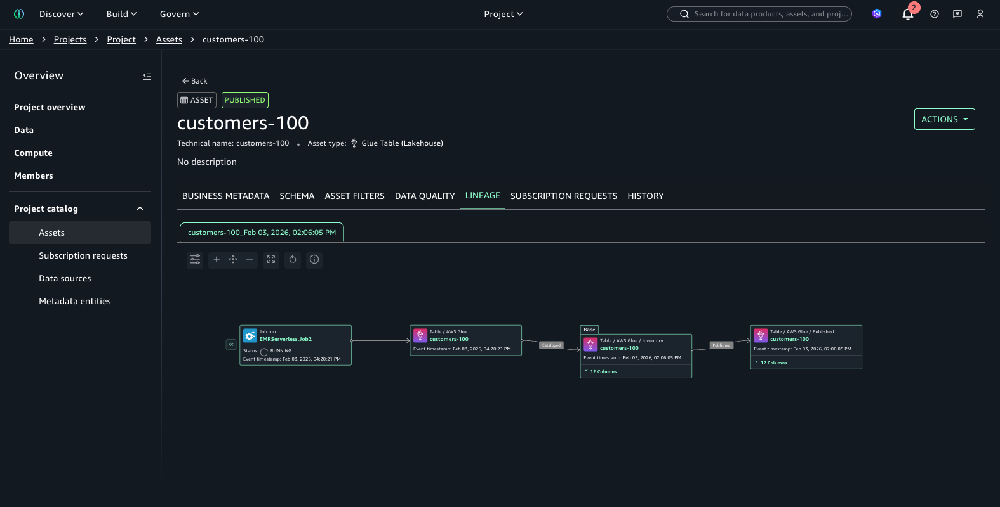

# Aggregated lineage view

You can view an asset's lineage in two ways:

- **Aggregated view** - Shows all jobs that are currently contributing to an asset's lineage, providing a complete picture of the data transformations and dependencies across multiple levels of the lineage graph. Use this view to understand the full scope of jobs impacting your datasets and to identify all upstream sources and downstream consumers.
- **Timestamp view** - Shows the lineage graph as it existed at a specific point in time, displaying only the latest job run for each job at that timestamp. This view includes column-level lineage and is useful for troubleshooting and investigating specific data processing events.
  The aggregated view is the default in most regions and shows the current state of your data lineage. In Opt-In Regions, only the timestamp view is available.

To switch between views, choose the **Open view control** icon in the top left of the lineage graph viewer and toggle the
**Display in event timestamp order** option.
When enabled, the timestamp view is displayed. When disabled, the aggregated view is displayed. This toggle is not available in Opt-In Regions.

Here is a sample aggregated view of a lineage graph:

Here is a sample timestamp view of a lineage graph:

