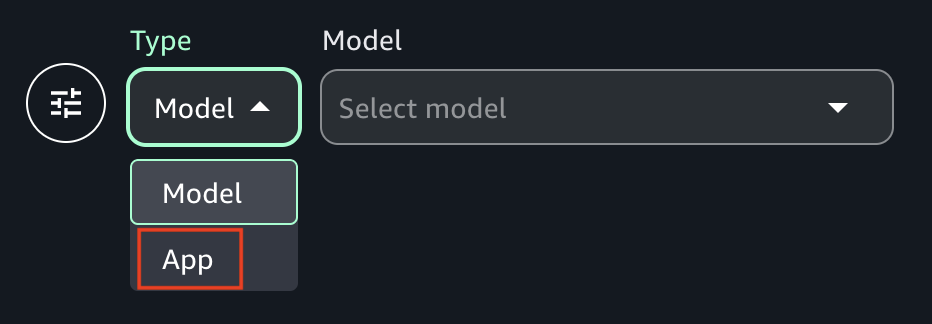

# Chat with an app in the Amazon Bedrock chat playground

You can use the chat playground to experiment with chat agent apps that are shared to you. When
you open a shared app, you can send prompts to the app and see the response.
You can't make changes to the shared app.

Optionally, you can compare the outputs from to 3 shared apps and [models](bedrock-explore-chat-playground.md "bedrock-explore-chat-playground.md"). You can view the configuration
for a shared app, but you can't make configuration changes.

To learn how to share apps that you create, see [Share an Amazon Bedrock chat agent app](app-share.md "app-share.md").

###### To chat with a shared app

1. Navigate to the Amazon SageMaker Unified Studio landing page by using the URL from your administrator.
2. Access Amazon SageMaker Unified Studio using your IAM or single sign-on (SSO) credentials. For more information, see [Access Amazon SageMaker Unified Studio](getting-started-access-the-portal.md "getting-started-access-the-portal.md").
3. At the top of the page, choose the **Discover**.
4. In the **Generative AI** section, choose **Chat
   playground** to open the chat playground.

 5. In **Type** select **App** and then select an
app to use in **App**.

 6. In the **Enter prompt** text box at the bottom of the page, enter
the prompt that you want to use. If the app builder changes the default text for the
text box, the text is different. 7. Press Enter on your keyboard enter to send the prompt to the mode. 8. (Optional) Compare the output from multiple apps, or models.

    1. In the playground, turn on **Compare mode**.
    2. In both panes, select the app that you want to compare.
    3. Enter a prompt in the text box and run the prompt.
    4. (Optional) Choose **View configs** to view the
     app configurations, such as [inference parameters](explore-prompts.md#inference-parameters "explore-prompts.md#inference-parameters"). Choose **View chats** to return to the chat page.
    5. (Optional) Choose **Add chat window** to add a third window. You can compare up to 3 models or apps.
    6. Turn off **Compare mode** to stop comparing models.
