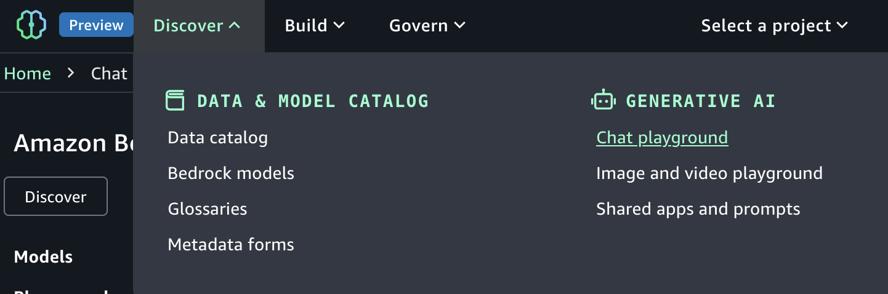
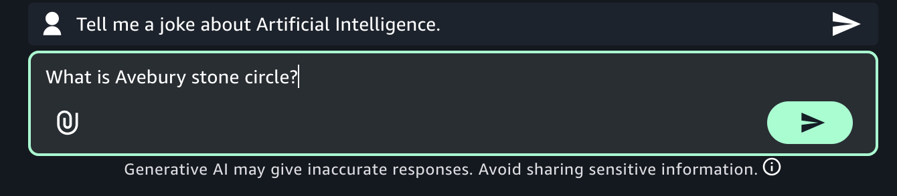
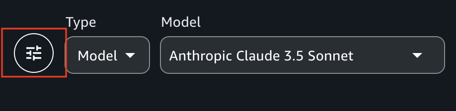

# Chat with a model in the Amazon Bedrock chat playground

The Amazon Bedrock in SageMaker Unified Studio chat playground allows you chat with an Amazon Bedrock model and try
chat agent apps that are [shared](bedrock-explore-chat-playground-app.md "bedrock-explore-chat-playground-app.md")
to you. A chat provides a back-and-forth, dialogue-like interaction between you and an
Amazon Bedrock model. The model is able to retain context during a chat allowing for coherent and relevant responses
from the model. You chat with a model by sending a prompt to the model and by receiving the response
that the model generates. You continue the chat by sending further prompts.

If a model supports multimodal prompts, you can send prompts that contain text and images.
A chat can contain multiple text and image prompts. After you finish a chat, you can reset
the playground to begin a new chat. Amazon Bedrock models support differing modalities. For more
information, see [Supported foundation models in
Amazon Bedrock](../../../bedrock/latest/userguide/models-supported.md "../../../bedrock/latest/userguide/models-supported.md").

The maximum image file size is 5MB. You can upload images that are in JPG, PNG, GIF, and WebP format.

When you run a prompt in the chat playground, you get the following information about the request:

- **Input tokens** — The number of input tokens
  used by the foundation model during inference.
- **Output tokens** — The number of tokens
  generated in a response by the foundation model.
- **Latency** — The amount of time the
  foundation model uses to generate each token in a sequence, based on the
  [on-demand](../../../bedrock/latest/userguide/throughput.md "../../../bedrock/latest/userguide/throughput.md") throughput.
  The chat playground provides
  quick start prompts that illustrate the kinds of prompt that you can send to a model.

Optionally, you can compare the outputs from up to 3 shared apps and models. You can make
configuration changes for models, such as [inference
parameters](explore-prompts.md#inference-parameters "explore-prompts.md#inference-parameters") and [system instructions](explore-prompts.md#system-prompts "explore-prompts.md#system-prompts") and compare the results. You can't make configuration changes for
shared apps.

###### To chat with a model

1. Navigate to the Amazon SageMaker Unified Studio landing page by using the URL from your administrator.
2. Access Amazon SageMaker Unified Studio using your IAM or single sign-on (SSO) credentials. For more information, see [Access Amazon SageMaker Unified Studio](getting-started-access-the-portal.md "getting-started-access-the-portal.md").
3. At the top of the page, choose the **Discover**.
4. In the **Generative AI** section, choose **Chat
   playground** to open the chat playground.

 5. In **Type** select **Model** and then select a model
to use in **Model**. For full information about the model, choose
**View full model details** in the information panel. For more
information, see [Find serverless models with the Amazon Bedrock model
catalog](model-catalog.md "model-catalog.md"). If you
don't have access to an appropriate model, contact your administrator. Different models
might not support all features. 6. In the **Enter prompt** text box, enter `What is Avebury stone
 circle?`. 7. (Optional) If the model you chose is a reasoning model, you can choose
**Reason** to have the model include its reasoning in the reponse.
For more information, see [Enhance model responses with
model reasoning](../../../bedrock/latest/userguide/inference-reasoning.md "../../../bedrock/latest/userguide/inference-reasoning.md") in the _Amazon Bedrock user guide_. 8. Press Enter on your keyboard, or choose the run button, to send the prompt to the
model. Amazon Bedrock in SageMaker Unified Studio shows the response from the model in the playground.

 9. Continue the chat by entering the prompt `Is there a museum
 there?` and pressing Enter.

The response shows how the model uses the previous prompt as context for generating
its next response. 10. Choose **Reset** to start a new chat with the model. 11. Influence the model response by doing the following:

    1. Enter and run a prompt. Note the response from the model.
    2. Choose the configurations menu to open the **Configurations** pane.

    
    3. Influence the model response by making [inference parameters](explore-prompts.md#inference-parameters "explore-prompts.md#inference-parameters") changes.
    4. (Optional) In **System instructions**, enter any overarching system instructions that you want the model to apply for future interactions.
    5. Run the prompt again and compare the response with the previous response.

12. Choose **Reset** to start a new chat with the model.
13. Try sending an image to a model by doing the following:
    1.  For **Model**, choose a model
        that supports [images](../../../bedrock/latest/userguide/models-supported.md "../../../bedrock/latest/userguide/models-supported.md").
    2.  Choose the attachment button at the left of the **Enter prompt** text box.

     3. In the open file dialog box, choose an image from your local computer. 4. In the text box, next to the image that you uploaded, enter `What's in this
 image?`. 5. Press Enter on your keyboard enter to send the prompt to the model. The response from the
    models describes the model or image.

14. (Optional) Try using another model and different prompts. Different models have different
    recommendations for creating, or engineering, prompts. For more information, see [Prompt engineering guides](explore-prompts.md#prompt-guides "explore-prompts.md#prompt-guides").
15. (Optional) Compare the output from multiple models, or [shared apps](bedrock-explore-chat-playground-app.md "bedrock-explore-chat-playground-app.md").

        1. In the playground, turn on **Compare mode**.
        2. In both panes, select the model that you want to compare. If you want to use a
         shared app, select **App** in **Type** and
         then select the app in **App**.
        3. Enter a prompt in the text box and run the prompt. The output from each model is shown. You
         can choose the copy icon to copy the prompt or model response to the clipboard.
        4. (Optional) Choose **View configs** to make configuration
         changes, such as [inference
         parameters](explore-prompts.md#inference-parameters "explore-prompts.md#inference-parameters"). Choose **View chats** to return to the chat page.
        5. (Optional) Choose **Add chat window** to add a third window.
         You can compare up to 3 models or apps.
        6. Turn off **Compare mode** to stop comparing models.

    Now that you are familiar with the explorer playground, try creating a Amazon Bedrock in SageMaker Unified Studio app next.
    For more information, see [Build a chat agent app with Amazon Bedrock](create-chat-app.md "create-chat-app.md").
