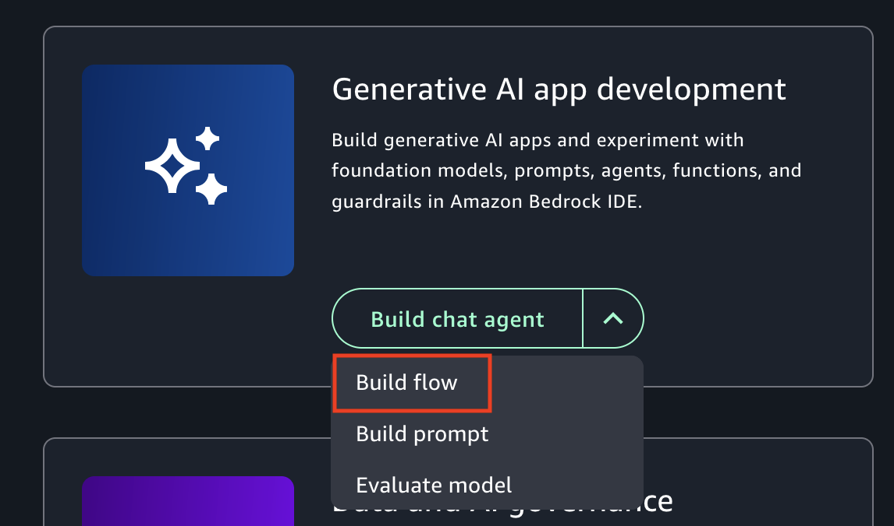
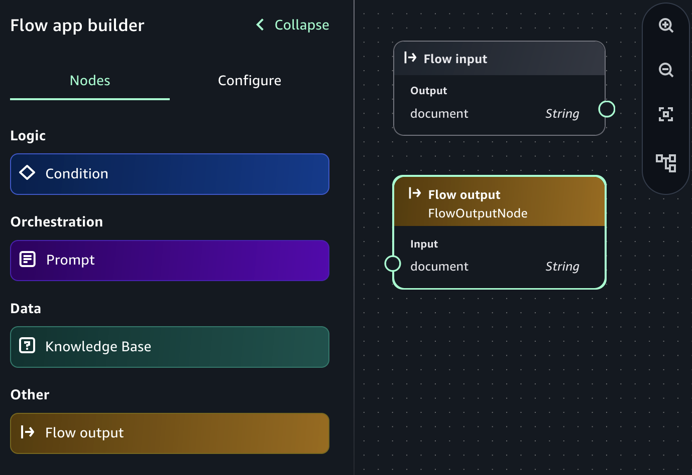
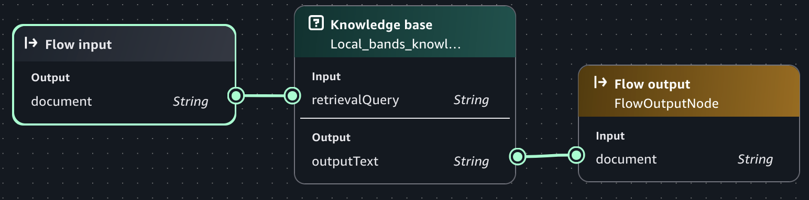
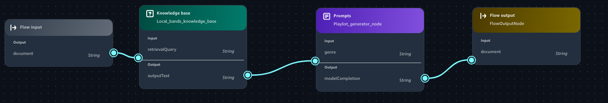
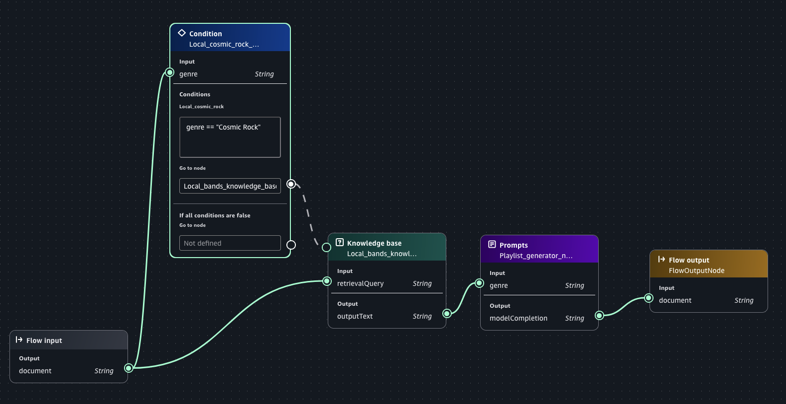
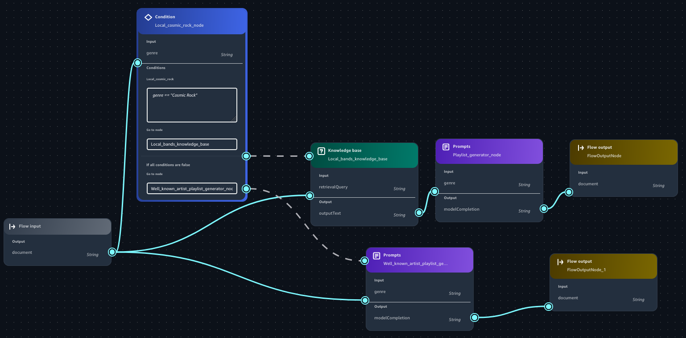

# Create a flow app with Amazon Bedrock

In this section you first build a flow app that generates a playlist of music from an Amazon Bedrock knowledge base of
songs by fictional local bands. Next, you use [Reusable prompts](creating-a-prompt.md "creating-a-prompt.md") to add a
prompt that can customizes the playlist for different genres of music.

###### Topics

- [Step 1: Create an initial flow app](#build-flow-empty "#build-flow-empty")
- [Step 2: Add a Knowledge Base to your flow app](#build-flow-kb "#build-flow-kb")
- [Step 3: Add a prompt to your flow app](#build-flow-prompt "#build-flow-prompt")
- [Step 4: Add a condition to your flow app](#build-flow-condition "#build-flow-condition")

## Step 1: Create an initial flow app

In this procedure you create an initial flow app which has an [Flow input](nodes.md#flow-node-input "nodes.md#flow-node-input") node and a [Flow output](nodes.md#flow-node-output "nodes.md#flow-node-output") node.

A flow contains only one flow input node which is where the flow begins. The
flow input node takes your input and passes it to the next node in a data type of your
choice (String, Number, Boolean, Object and Array). In these procedures, the input to
the flow is a String. To learn more about using different data types in a flow, see
[Define inputs with expressions](flows-expressions.md "flows-expressions.md").

A flow output node extracts the input data from the previous node, based on
the defined expression, and outputs the data. A flow can have multiple flow output nodes if
there are multiple branches in the flow.

After completing the procedure, the flow app is empty, other than the flow input
and flow output nodes. In the next step you add Knowledge Base as a data source and run
the flow app for the first time.

While you develop your app, you work on the current draft. You can save the current draft to
the app history. Later you might want to restart work from a previous draft. For more
information, see [Use app history to view and restore versions of an Amazon Bedrock app](app-history.md "app-history.md").

###### To create an initial flow app

1. Navigate to the Amazon SageMaker Unified Studio landing page by using the URL from your administrator.
2. Access Amazon SageMaker Unified Studio using your IAM or single sign-on (SSO) credentials. For more information, see [Access Amazon SageMaker Unified Studio](getting-started-access-the-portal.md "getting-started-access-the-portal.md").
3. On the Amazon SageMaker Unified Studio home page, navigate to the **Amazon Bedrock in SageMaker Unified Studio**
   tile.

For the **Build chat agent app** button dropdown, select
**Build flow**.

 4. In the **Select or create a new project to continue** dialog box, do one of the following:

    * If you want to use a new project, follow the instructions at
     [Create a new project](create-new-project.md "create-new-project.md"). For the **Project profile** in step 1, choose
     **Generative AI application development**.
    * If you want to use an existing project, select the project that you
     want to use and then choose **Continue**.

5. In the flow builder, choose the flow name (**Untitled flow-nnnn**) and enter `Local bands` as the name for the flow.
6. In the **flow app builder** pane, select the
   **Nodes** tab. The center pane displays a **Flow input**
   node and a **Flow output** node. These are the input and output nodes for your
   flow. The circles on the nodes are connection points. In the next procedure, you use the connection points
   to connect a Knowledge Base node to the Flow input node and the Flow output node.

 7. Next step: [Step 2: Add a Knowledge Base to your flow app](#build-flow-kb "#build-flow-kb").

## Step 2: Add a Knowledge Base to your flow app

In this procedure, you add a [Knowlege Base](nodes.md#flow-node-kb "nodes.md#flow-node-kb") node
as a data source to the flow that you created in [Step 1: Create an initial flow app](#build-flow-empty "#build-flow-empty"). The Knowledge Base you add is Comma Seperated
Values (CSV) file containing a list of ficticious songs and artists. The list includes
the duration (seconds) and genre of each song. For more information about Knowledge
Bases, see [Add a Knowledge Base to your Amazon Bedrock app](data-sources.md "data-sources.md").

During the procedure, you make connections from the Flow input node to the Knowledge
Base node and from the Knowledge Base node to the Flow output node. At some point, you
might need to delete a node or remove a node connection. To delete a node, select the
node that you want to delete and press the Delete button. To remove a connection, choose
the connection that you want to delete and then press the delete button.

When you run the flow with the input `Create a playlist`, the app
creates a playlist using songs only from the Knowledge Base.

###### To create the flow with a Knowledge Base

1. Create a CSV file name _songs.csv_ and fill with the following
   ficticious CSV data. This is the data source for your Knowledge Base. Save the CSV file to your
   local computer.

```
song,artist,genre,length-seconds
"Celestial Odyssey","Starry Renegades","Cosmic Rock",240
"Neon Rapture","Synthwave Siren","Synthwave Pop",300
"Wordsmith Warriors","Lyrical Legions","Lyrical Flow",180
"Nebula Shredders","Galactic Axemen","Cosmic Rock",270
"Electro Euphoria","Neon Nomads","Synthwave Pop",210
"Rhythm Renegades","Percussive Pioneers","Lyrical Flow",240
"Stardust Rift","Cosmic Crusaders","Cosmic Rock",180
"Synthwave Serenade","Electro Enchanters","Synthwave Pop",300
"Lyrical Legends","Rhyme Royale","Lyrical Flow",240
"Supernova Shredders","Amplified Ascension","Cosmic Rock",300
"Celestial Chords","Ethereal Echoes","Cosmic Rock",240
"Neon Nirvana","Synthwave Sirens","Synthwave Pop",270
"Verbal Virtuoso","Lyrical Maestros","Lyrical Flow",210
"Cosmic Collision","Stellar Insurgents","Cosmic Rock",180
"Pop Paradox","Melodic Mavericks","Synthwave Pop",240
"Flow Fusion","Verbal Virtuosos","Lyrical Flow",300
"Shredding Shadows","Crimson Crusaders","Cosmic Rock",270
"Synth Serenade","Electro Enchanters","Synthwave Pop",180
"Wordsmith Warlords","Lyrical Legionnaires","Lyrical Flow",240
"Sonic Supernova","Amplified Ascension","Cosmic Rock",210
"Celestial Symphony","Ethereal Ensemble","Cosmic Rock",300
"Electro Euphoria","Neon Nomads","Synthwave Pop",180
"Lyrical Legends","Rhyme Royale","Lyrical Flow",270
"Crimson Crescendo","Scarlet Serenaders","Cosmic Rock",240
"Euphoric Tides","Melodic Mystics","Synthwave Pop",210
"Rhythm Renegades","Percussive Pioneers","Lyrical Flow",180
"Cosmic Collision","Stellar Insurgents","Cosmic Rock",300
"Stardust Serenade","Celestial Crooners","Synthwave Pop",240
"Wordsmith Warriors","Lyrical Legions","Lyrical Flow",270
"Sonic Supernova III","Amplified Ascension","Cosmic Rock",180
```

2.  Open the flow app that you created in [Step 1: Create an initial flow app](#build-flow-empty "#build-flow-empty").
3.  Add and configure a Knowledge Base node by doing the following:
    1. In the **flow app builder** pane, select the
       **Nodes** tab.
    2. From the **Data** section, drag a **Knowledge
       Base** node onto the flow builder canvas.
    3. The circles on the nodes are connection points. Using your mouse,
       click on the circle for the **Flow input** node and
       draw a line to the circle on **Input** section of the
       Knowledge Base node that you just added.
    4. Connect the **Output** of the Knowledge Base node in
       your flow with the **Input** of the **Flow
       output** node.

     5. Select the Knowledge Base node that you just added. 6. In the **flow
    builder** pane, choose the **Configure** tab and do the following:

        1. In **Node name** enter
         `Local_bands_knowledge_base`.
        2. In **Knowledge Base Details**, choose
         **Create new Knowledge Base** to open the
         **Create Knowledge Base** pane.
        3. For **Knowledge Base name**, enter
         `Local-bands`.
        4. For **Knowledge Base description**, enter
         `Songs by local bands. Includes song, artist,
         genre, and song length (in seconds).`.
        5. In **Add data sources**, choose
         **Local file**.
        6. Choose **Click to upload** and upload the CSV
         file (songs.csv) that you created in step 1. Alternatively, add
         your source document by dragging and dropping the CSV from your
         computer.
        7. For **Parsing** leave as **Default parsing**.
        8. For **Embeddings model**, choose a model for converting your
         data into vector embeddings.
        9. For **Vector store**, choose
         **OpenSearch Serverless**.
        10. Choose **Create** to create the Knowledge
         Base. It might take a few minutes to create the Knowledge
         Base.

    7. Back in the **flow builder** pane, in
       **Select Knowledge Base**, select the Knowledge
       Base that you just created (Local-bands).
    8. In **Select response generation model**, select the
       model that you want the Knowledge Base to generate responses with.
    9. (Optional) In **Select guardrail** select an existing
       guardrail or create a new guardrail. For more information, see [Safeguard your Amazon Bedrock app with a guardrail](guardrails.md "guardrails.md").

4.  Choose **Save** to save the app.
5.  Test your prompt by doing the following:
    1. On right side of the page, choose **<** to open the test pane.
    2. Enter `Create a playlist` in the prompt **Text** box.
    3. Press Enter on the keyboard or choose the run button to test the prompt.
    4. If necessary, make changes to your flow. If you are satisfied with the flow, choose
       **Save**.

6.  Next step: [Step 3: Add a prompt to your flow app](#build-flow-prompt "#build-flow-prompt").

## Step 3: Add a prompt to your flow app

In this procedure you add a prompt to the flow by adding a [prompt node](nodes.md#flow-node-prompt "nodes.md#flow-node-prompt"). The prompt allows you to easily
choose which genre of songs should be included in the playlist that the flow
generates. For more information, see [Reuse and share Amazon Bedrock prompts](prompt-mgmt.md "prompt-mgmt.md").

###### To add a prompt to the flow

1. In the **flow builder** pane, select **Nodes**.
2. From the **Orchestration** section, drag a **Prompt**
   node onto the flow builder canvas.
3. Select the node you just added.
4. In the **Configurations** tab of the **flow builder**
   pane, do the following:
   1. In **Node name** enter `Playlist_generator_node`.
   2. In **Prompt details** choose **Create new prompt** to open the
      **Create prompt** pane.
   3. For **Prompt name** enter `Playlist_generator_prompt`.
   4. For **Model**, choose the model that you want the prompt to use.
   5. For **Prompt message** enter `Create a playlist of songs in the genre {{genre}}.`.
   6. (Optional) In **Model configs**, make changes to the inference parameters or provide system instruction prompts.
   7. Choose **Save draft and create version** to create the prompt. It might take a couple of minutes to
      finish creating the prompt.

5. In the flow builder, choose the prompt node that you just added.
6. In the **Configure** tab, do the following in the **Prompt details** section:
   1. In **Prompt** select the prompt that you just created.
   2. In **Version** select the version (**1**) of the prompt to use.

7. (Optional) In **Select guardrail** select an existing
   guardrail. For more information, see [Safeguard your Amazon Bedrock app with a guardrail](guardrails.md "guardrails.md").
8. Update the flow paths by doing the following:
   1. Delete the output from the **Knowledge Base** node that goes into the
      **Flow output**.
   2. Connect the output from the **Knowledge Base** node to the input of
      the **Prompts** node.
   3. Connect the output from the **Prompts** node to the input of the **Flow
      output** node.

9. Choose **Save** to save the flow. The flow should look similar to the following.

 10. Test your prompt by doing the following:

    1. On right side of the app flow page, choose **<** to open the test pane.
    2. For the **Text** box, enter `Cosmic Rock`.
    3. Press Enter on the keyboard or choose the run button to test the prompt. The response should be a playlist of songs
     in the Cosmic Rock genre.
    4. Change the prompt to `Synthwave Pop` and run the prompt again. The
     songs should now be from the Synthwave Pop genre.
    5. If necessary, make changes to your flow. If you are satisfied with the flow, choose
     **Save**.

11. Next step: [Step 4: Add a condition to your flow app](#build-flow-condition "#build-flow-condition").

## Step 4: Add a condition to your flow app

In this procedure, you add a [condition](nodes.md#flow-node-condition "nodes.md#flow-node-condition") node to
the flow so that if you enter the prompt `Cosmic Rock`, the flow only
generates a playlist from the local bands Knowledge Base. If you enter a different
genre, the flows uses the playlist generator prompt to create a playlist of well known
artists in that genre.

###### To add a condition to the flow

1. In the **flow app builder** pane, choose
   **Nodes**.
2. From the **Logic** section, drag a
   **Condition** node onto the flow builder canvas.
3. Select the **Condition** node that you just added.
4. Add the flow that generates a playlist from local bands by doing the
   following:
   1. In the **Inputs** section of the
      **Configurations** tab, change the **Node
      Name** to `Local_cosmic_rock_node`.
   2. In the **Inputs** section, change the
      **Name** to `genre`.
   3. In the **Conditions** section, do the
      following:
      1. For **Name**, enter
         `Local_cosmic_rock`.
      2. For **Condition**, enter the condition
         `genre == "Cosmic Rock"`.

   4. In the flow builder, choose the condition node that you just
      added.
   5. Connect **Go to node** to the **Knowledge
      base** node.
   6. Connect the **Output** of the **Flow
      input** node to the **Input** of the
      **Condition** node. Leave the existing connection
      to the **Knowledge Base** node as this ensures the
      prompt is passed to the Knowledge Base.

   

5. Choose **Save** to save your flow app.
6. Add the flow that generates a playlist by well known bands by doing the
   following:
   1. In the **flow app builder** pane, select
      **Nodes**.
   2. From the **Orchestration** section, drag a
      **Prompt** node onto the flow builder
      canvas.
   3. Select the node you just added.
   4. Choose the **Configurations** tab of the
      **flow builder** pane and do the
      following:
      1. For **Node name**, enter
         `Well_known_artist_playlist_generator_node`.
      2. In **Prompt details** section, choose the
         **Playlist_generator_prompt** prompt that
         you previously created.
      3. For **Version**, select the version
         (**1**) of the prompt to use.
      4. Connect the **Output** from the
         **Flow input** node to the
         **Input** of the prompt that you just
         created.
      5. In the **Condition** node, connect the
         **If all conditions are false** go to node
         to the new prompt.
      6. In the **flow app builder** pane, select
         **Nodes**.
      7. From the **Other** section, drag a
         **Flow output** node onto the flow builder
         canvas.
      8. Connect the **Output** of the new
         **Prompt**
         (Well_known_artist_playlist_generator_node) to the input of the
         new **Flow output** node.

7. Choose **Save** to save the flow. The flow should look
   similar to the following.

 8. Test your prompt by doing the following:

    1. On right side of the app flow page, choose
     **<** to open the test pane.
    2. In **Enter prompt**, enter `Cosmic
     Rock`.
    3. Press Enter on the keyboard or choose the run button to test the prompt. The
     response should be a playlist of songs in the Cosmic Rock genre with
     bands that are only from the Knoweledge Base.
    4. Change the prompt to `Classic Rock` and run the
     prompt again. The songs should now be well known bands from the classic
     rock genre.
