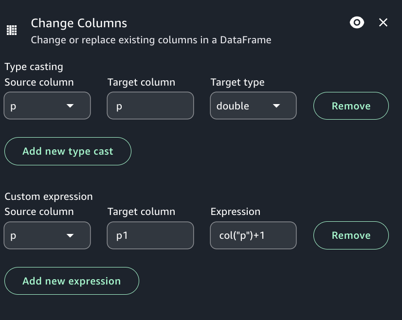

# Change columns transform

A Change columns transform remaps the source data property keys into the desired
configured for the target data. In a Change Columns transform node, you can:

1. Change the name of multiple columns.
2. Change the data type of the columns, if the new data type is supported and there is
   a transformation path between the two data types.
3. Use a custom expression to change the values of selected columns.

###### To add a Change Schema node to your job diagram

1. Open the menu and then choose Change Columns to add a new transform to your job
   diagram, if needed.
2. (Optional) Click on the rename node icon to enter a new name for the node in the
   job diagram.
3. Modify the input schema by clicking on the node, then:
   1. To rename a column, enter the new name in the Target column field.
   2. To change the data type for a selected column, select "Add new type cast", then
      choose the source column, target column, and new data type from the Target type
      list.
   3. To change the data values for a selected column, add a custom expression.

4. (Optional) After configuring the node properties and transform properties, you can
   preview the modified dataset by choosing the Data preview tab in the node details
   panel.

