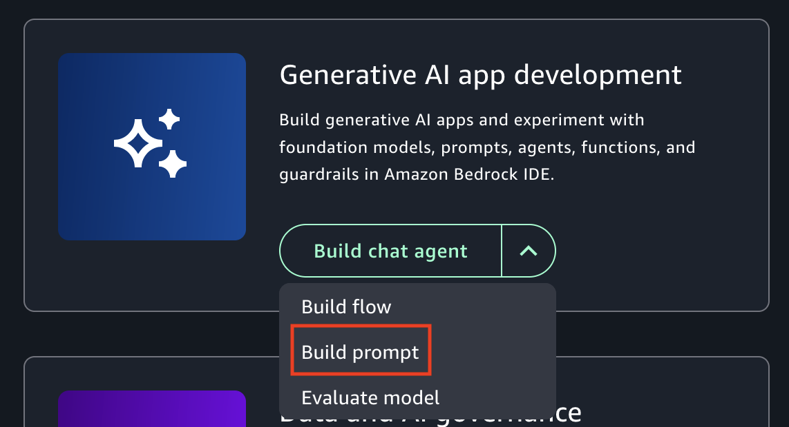

# Create an Amazon Bedrock prompt

When you create a prompt, you select a model for it and can modify inference parameters.
To adjust the prompt for different use cases, you can include up to 5 variables.

You define variables in a prompt by surrounding them in double curly braces
`{{`variable`}}`. For example, the following prompt defines
two variables, `topic` and `location`.

_Generate a playlist of songs about {{`topic`}}. Make sure each song is
by artists from {{`location`}}._

When you run the prompt, you supply values for the variables. Amazon Bedrock in SageMaker Unified Studio fills the prompt
with the variable values and then passes the prompt to the model. For example, if you supply a
`topic` value of _castle_ and a `location` value of
_Wales_, the model generates a playlist of songs about castles by Welsh artists.

You initially create a draft of your prompt. You can then test your prompt by inputing test
values for the variables and running the prompt. These values are only for temporary testing and
aren't saved to your prompt.

You can create variants of your prompt that use different messages, models, or configurations so
that you can compare their outputs to decide the best variant for your use case.

When you are ready, you can create a version of your prompt for use in a flow app.
You can create multiple versions of a prompt, but you can only [edit](editing-a-prompt.md "editing-a-prompt.md") the latest version. When you [delete](deleting-a-prompt.md "deleting-a-prompt.md") a
prompt, it deletes all versions of the prompt.

###### Warning

Generative AI may give inaccurate responses. Avoid sharing sensitive information.
Chats may be visible to others in your organization.

###### To create a prompt

1. Navigate to the Amazon SageMaker Unified Studio landing page by using the URL from your administrator.
2. Access Amazon SageMaker Unified Studio using your IAM or single sign-on (SSO) credentials. For more information, see [Access Amazon SageMaker Unified Studio](getting-started-access-the-portal.md "getting-started-access-the-portal.md").
3. On the Amazon SageMaker Unified Studio home page, navigate to the **Generative AI app development**
   tile.

For the **Build chat agent app** button dropdown, select
**Build prompt**. You can also create a prompt from the
**Build** menu at the top of the page.

 4. In the **Select or create a new project to continue** dialog box, do one of the following:

    * If you want to use a new project, follow the instructions at
     [Create a new project](create-new-project.md "create-new-project.md"). For the **Project profile** in step 1, choose
     **Generative AI application development**.
    * If you want to use an existing project, select the project that you
     want to use and then choose **Continue**.

5. Choose the prompt name (**Untitled Prompt-nnnn**) and enter a name for
   the prompt.
6. In the **Configs** section, do the following:
   1. For **Model**, select the model that you want to use.
   2. (Optional) In **Parameters**, set the inference parameters values that
      you want to use. If you don't make changes, the prompt uses the default values for the model.
      For more information, see [Inference parameters](explore-prompts.md#inference-parameters "explore-prompts.md#inference-parameters").
   3. (Optional) In **System instructions**, enter any overarching system prompts that you want the model to apply for future interactions. For more information, see [System instructions](explore-prompts.md#system-prompts "explore-prompts.md#system-prompts").

7. In the center pane, enter `Generate a playlist of songs about {{topic}}. Make
sure each song is by artists from {{location}}.` in the **Prompt
   message** text box.
8. Choose **Save** to save a draft of your prompt.
9. Test your prompt by doing the following:
   1. On right side of the page, choose **<** to open the test pane.
   2. For **Test variable values**, enter the following values for your
      prompt variables.
      - **topic**– Enter `castles`.
      - **location**– Enter `Wales`.

   3. Choose **Run** to test your prompt. You should see your prompt, with
      populated variables, in the **Test** section. Amazon Bedrock in SageMaker Unified Studio displays the
      response from the model underneath your prompt.
   4. (Optional) Choose **Reset** to clear previously shown test
      results.

10. (Optional) Compare the prompt with up to 2 variants by doing the following:
    1. Choose **Compare variants**
    2. In **Variant_1** enter the model and prompt message that you want to
       use. Also Add the test variable values.
    3. Choose **Run all** to run and compare the results.
    4. (Optional) choose **Add variant_2** to add another prompt variant to
       compare.
    5. Decide which prompt you want to save and choose **Save**.
    6. Choose **Exit comparison** to finish comparing the prompts.
    7. In the **Exit comparison** dialog box decide whether you want to continue
       with the original prompt or continue with a variant of the prompt. Choose
       **Exit**.

11. Continue to make changes to the prompt and variables until you are satisfied with the
    results. You can choose **Reset** to clear previously shown test
    results.
12. When you are ready, choose **Create version** to create a version of
    your prompt. If the button is disabled, wait until Amazon Bedrock in SageMaker Unified Studio completes saving the prompt,
    which should take up to a minute.
13. Add your prompt to a [flow app](add-prompt-to-prompt-flow-app.md "add-prompt-to-prompt-flow-app.md").
