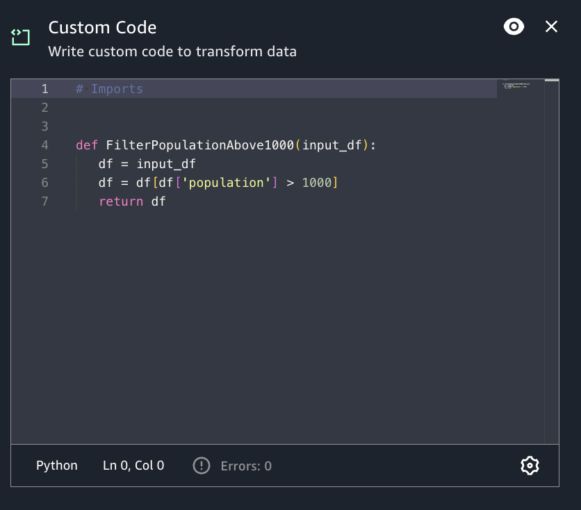

# Custom code transform

If you need to perform more complicated transformations on your data, or want to add
data property keys to the dataset, you can add a Custom code transform to your job diagram.
The Custom code node allows you to enter a script that performs the transformation.

###### To add a custom code node to your job diagram

1. Open the Resource panel and then choose Custom Code to add a custom transform to
   your job diagram.
2. (Optional) Click on the rename node icon to enter a new name for the node in the
   job diagram.
3. Enter desired code changes.
   The following examples show the format of the code to enter in the code box:

```
def FilterPopulationAbove1000(input_df):
  df = input_df
  df = df[df['population'] > 1000]
  return df

```


