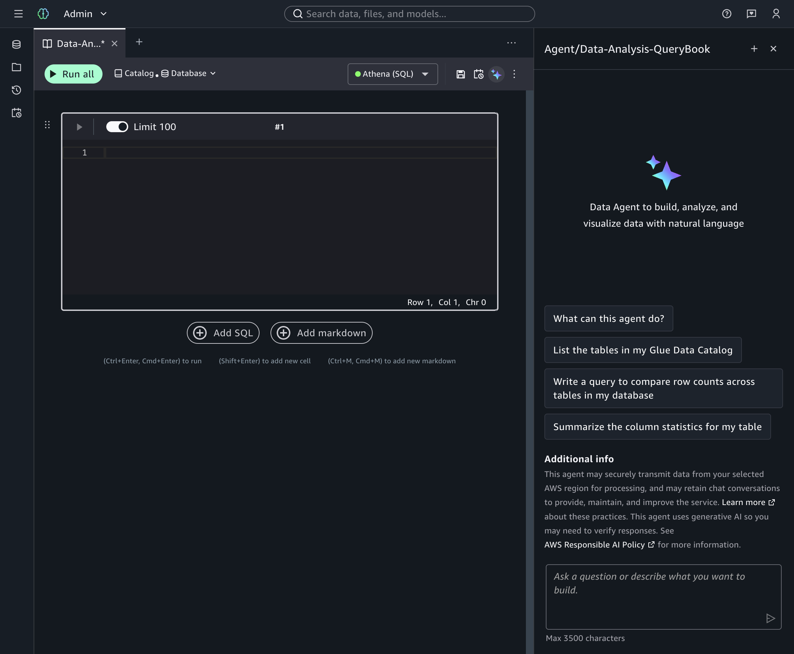
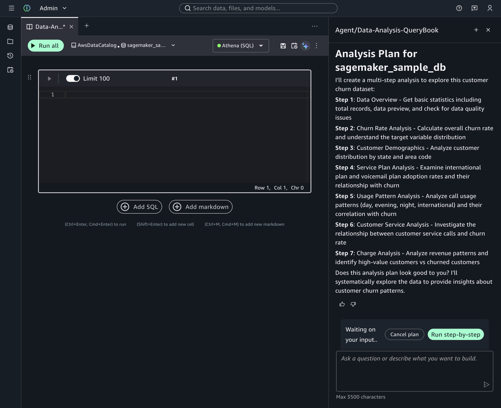
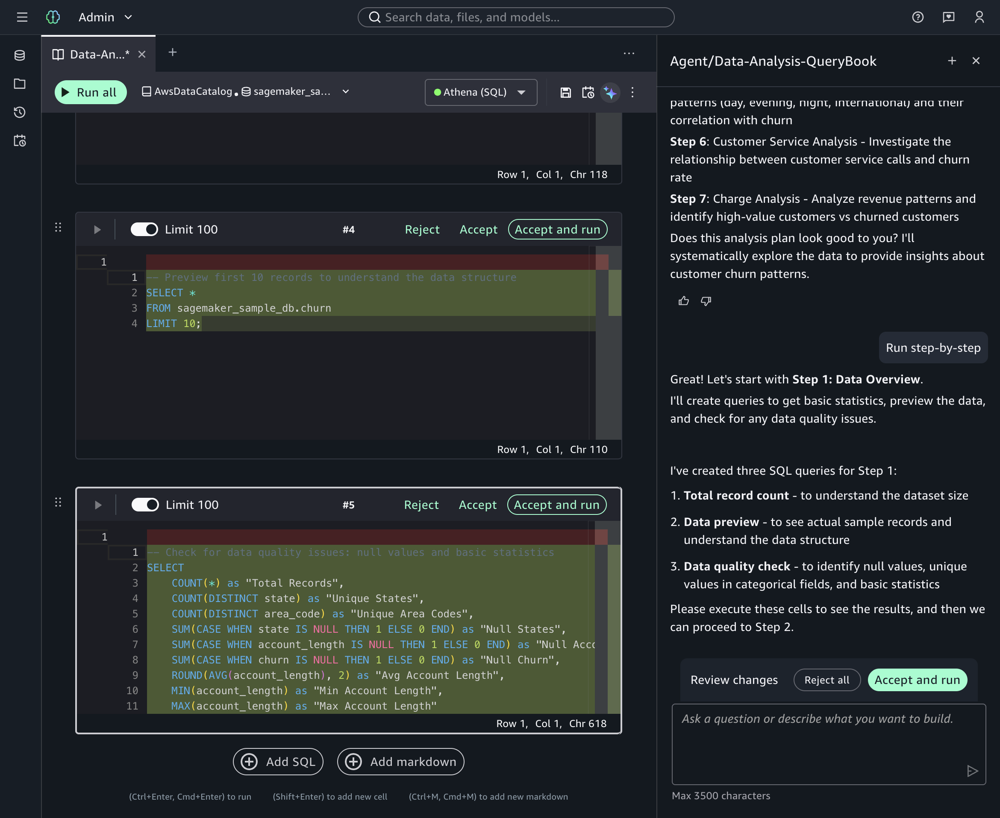
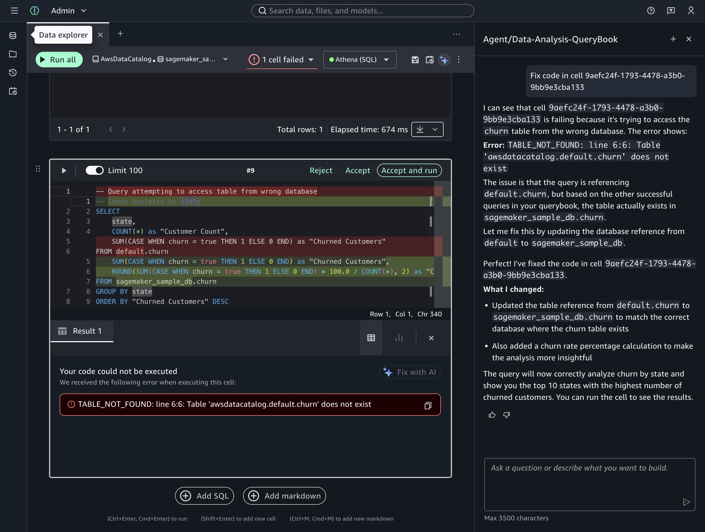

# Getting started with the SageMaker Data Agent for Query Editor

The SageMaker Data Agent in Query Editor provides a conversational SQL development
experience. Unlike single-turn SQL generation, the agent supports multi-turn conversations
where you can ask follow-up questions, request modifications to generated queries, and receive
contextual guidance on query optimization.

The agent is accessible directly within the Query Editor interface through the agent
panel.

Step-by-step planner

When you describe a complex analytical task, the agent proposes a step-by-step plan
to guide your workflow. You can review and approve the plan before the agent generates
SQL for each step.

Auto-injection of generated SQL

The agent automatically creates cells with generated SQL directly in your querybook,
matching the notebook experience. You can review and run the generated SQL in
place.

Fix with AI

When a query fails, the agent can analyze the error and suggest corrections. Use the
Fix with AI capability to get agent-generated fixes for failed queries.

###### To use the SageMaker Data Agent in Query Editor

1. Navigate to a project and open the Query Editor from the **Build**
   menu.
2. Open the agent panel from the Query Editor interface.
3. Enter a natural language prompt describing your SQL task. For example:
   _"Write a query that calculates monthly recurring revenue by customer segment for
   Q4 2025, using the billing.invoices and customer.segments
   tables."_
4. Review the agent's proposed plan and choose to accept or modify it.
5. The agent generates SQL and injects it into your querybook cells.
6. Review and run the generated SQL. If a query fails, use **Fix with
   AI** to get suggested corrections.

###### Example: Multi-turn SQL development

Initial prompt: _"Which Redshift tables in the analytics schema have columns
related to customer churn? Show me their schemas."_

The agent queries your data catalog and returns schema information. You can then follow
up:

Follow-up prompt: _"Help me find all customers who downgraded their
subscription in the last 90 days and calculate the revenue impact by
region."_

The agent builds on the previous context to generate a multi-step query plan.
