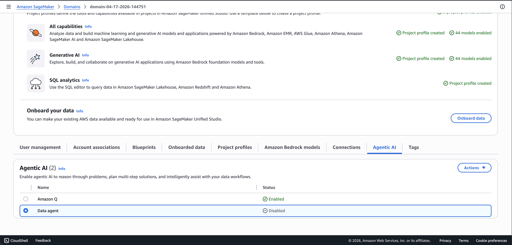

# Security and access control for the SageMaker Data Agent

###### Topics

- [Required IAM permissions to use SageMaker Data Agent](#data-agent-control-actions "#data-agent-control-actions")
- [Disable the SageMaker Data Agent in IdC domains](#data-agent-disable-idc "#data-agent-disable-idc")

## Required IAM permissions to use SageMaker Data Agent

To use the SageMaker Data Agent in Notebooks or Query Editor, your project role needs
the required IAM permissions. Your role must have the permissions to invoke the following
Amazon DataZone APIs: SendMessage, GenerateCode, StartConversation, GetConversation, and
ListConversations.

## Disable the SageMaker Data Agent in IdC domains

In IAM Identity Center (IdC) domains, administrators can disable the SageMaker Data
Agent through the domain configuration. When disabled, users in the domain don't
have access to the Data Agent in Notebooks or Query Editor.

The following image shows the domain configuration option for disabling the SageMaker Data Agent.

