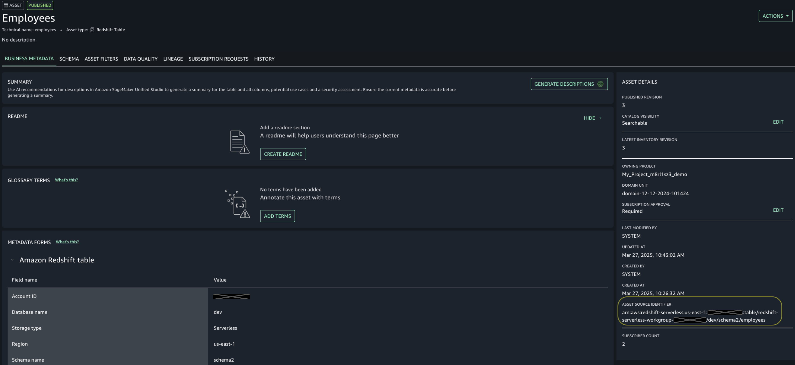
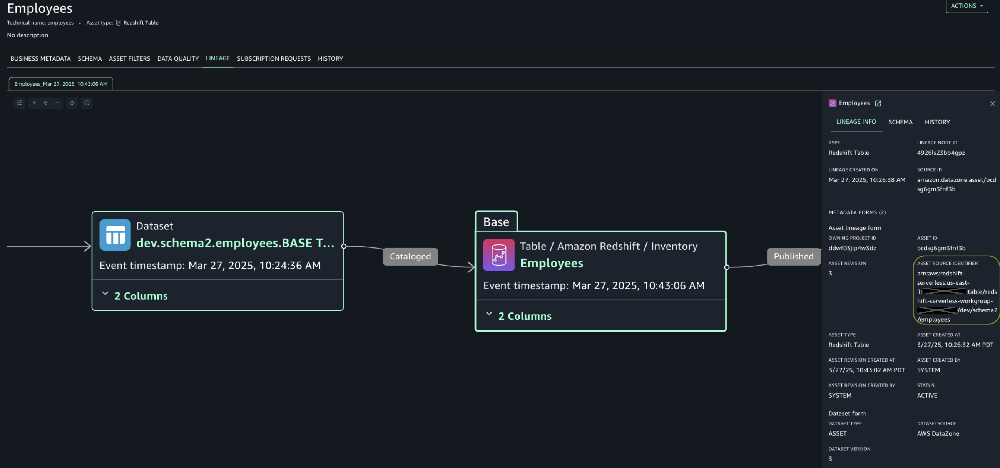
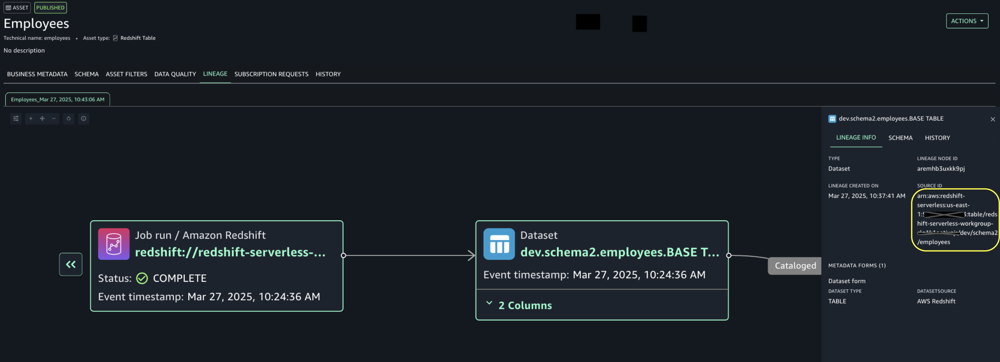

# Linking dataset lineage nodes

with assets imported into Amazon SageMaker Unified Studio

**Linking dataset lineage nodes with assets imported into
Amazon SageMaker Unified Studio**

Every lineage node is uniquely identified by its sourceIdentifier. Previous
section talks about formats of sourceIdentifier. Amazon SageMaker Unified Studio automatically links the
dataset nodes with assets in inventory based on the sourceIdentifier value. Hence,
use the same sourceIdentifier value of dataset node when creating/updating the asset
(via AssetCommonDetailsForm::sourceIdentifier attribute).

Following images show the sourceIdentifier on asset details page along with
lineage graph highlighting the same sourceIdentifier of dataset node with its
downstream asset’s sourceIdentifier.

Asset details page:

Asset’s SourceIdentifier in node details:

Amazon Redshift dataset/table’s sourceIdentifier in node details:

