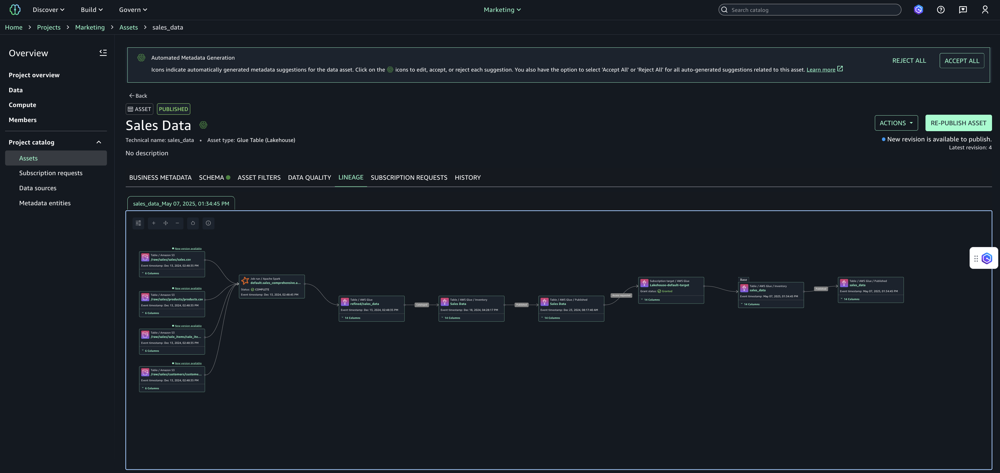
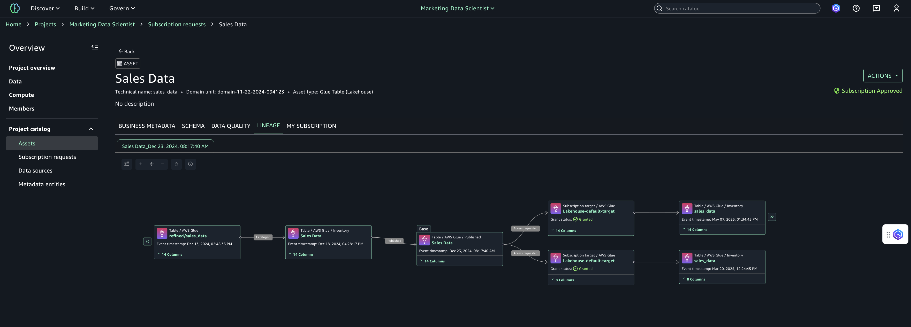

# Visualizing data lineage

In Amazon SageMaker Unified Studio, nodes in the lineage graph contain lineage information while edges
represent upstream/downstream directions of data propagation. The lineage
information is present in metadata forms attached to the lineage node. Amazon SageMaker Unified Studio
defines three types of lineage nodes:

- Dataset node - this node includes data lineage information about a
  specific dataset.
  - Dataset refers to any object such as table, view, Amazon S3 file,
    Amazon S3 bucket, etc. It also refers to the assets in Amazon SageMaker Unified Studio's
    inventory and catalog, and subscribed tables/views.
  - Each version of the dataset node represents an event happening on
    the dataset at that timestamp. The history tab on the dataset node
    shows all dataset versions.

- Job node - this node includes job details such as type of the job (query,
  etl etc), processing type (batch, streaming) etc job-type (query, etl etc),
  processing-type etc.
- JobRun node - this node represents the job run details such as the job it
  belongs to, status, start/end timestamps etc. Amazon SageMaker Unified Studio's lineage graph
  shows a combined for job and job-run which shows job details and latest run
  details along with a history of previous job-runs.
  Lineage graph can be visualized with base node as an asset. In the SageMaker
  Unified Studio, search for the assets, open any asset and you can see lineage on the
  Asset Details page.

Here is the sample lineage graph for a user who is a data producer:

Here is the sample lineage graph for a user who is a data consumer:

The asset details page provides the following capabilities to navigate the
graph:

- Column-level lineage: expand column-level lineage when available in
  dataset nodes. This automatically shows relationships with upstream or
  downstream dataset nodes if source column information is available.
- Column search: the default display for number of columns is 10. If there
  are more than 10 columns, pagination is activated to navigate to the rest of
  the columns. To quickly view a particular column, you can search on the
  dataset node that list just the searched column.
- View dataset nodes only: if you want to toggle to view only dataset
  lineage nodes and filter out the job nodes, you can choose the
  **Open view control** icon on the top left of the graph
  viewer and toggle the **Display dataset nodes only**
  option. This will remove all the job nodes from the graph and lets you
  navigate just the dataset nodes. Note that when the view only dataset nodes
  is turned on, the graph cannot be expanded upstream or downstream.
- Details pane: Each lineage node has details captured and displayed when
  selected.
  - Dataset node has a detail pane to display all the details captured
    for that node for a given timestamp. Every dataset node has 3 tabs,
    namely: Lineage info, Schema, and History tab. The history tab lists
    the different versions of lineage event captured for that node. All
    details captured from API are displayed using metadata forms or a
    JSON viewer.
  - Job node has a detail pane to display job details with tabs,
    namely: Job info, and History. The details pane also captures query
    or expressions captured as part of the job run. The history tab
    lists the different job runs captured for that job. All details
    captured from API are displayed using metadata forms or a JSON
    viewer.

- History tab: all lineage nodes in Amazon SageMaker Unified Studio's lineage have versioning. For
  every dataset node or job node, the versions are captured as history and
  that enables you to navigate between the different versions to identify what
  has changed over time. Each version opens a new tab in the lineage page to
  help compare or contrast.
