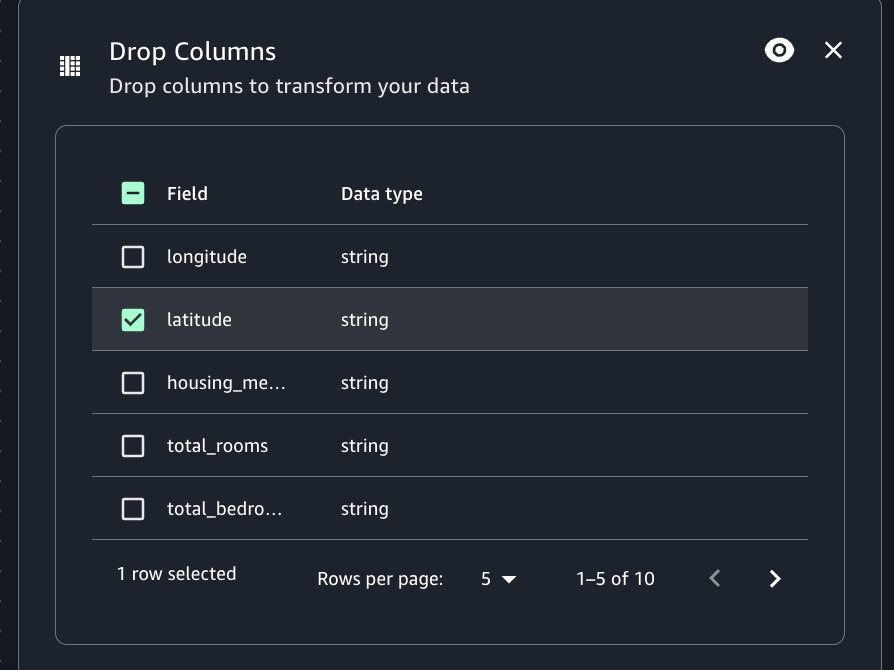

# Drop columns transform

You can create a subset of data property keys from the dataset using the Drop columns
transform. You indicate which data property keys you want to remove from the dataset and the
rest of the keys are retained.

###### To add a Drop columns transform node to your job diagram

1. Open the Resource panel and then choose Drop columns to add a new transform to your
   diagram.
2. (Optional) Click on the rename node icon to enter a new name for the node in the job
   diagram.
3. Click on the node and view the Node properties panel.
4. Choose the data property keys from the "Field" column to drop the column from the
   data source.
5. (Optional) After configuring the node properties and transform properties, you can
   preview using the Data preview tab in job diagram.

