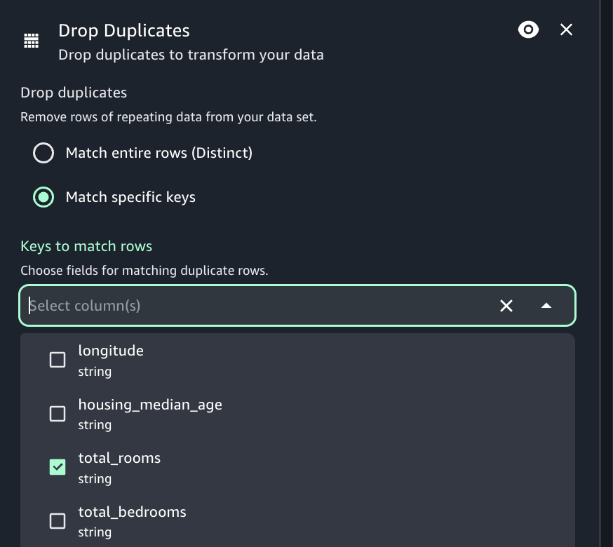

# Drop duplicates transform

The Drop duplicates transform removes rows from your data source by giving you two
options. You can choose to remove the duplicate row that are completely the same, or you can
choose to choose the fields to match and remove only those rows based on your chosen
fields.

For example, in this data set, you have duplicate rows where all the values in some of
the rows are exactly the same as another row, and some of the values in rows are the same or
different.

| Example Data Set | Row  | Name       | Email | Age | State                                                                  | Note |
| ---------------- | ---- | ---------- | ----- | --- | ---------------------------------------------------------------------- | ---- |
| 1                | Joy  | joy@gmail  | 33    | NY  |                                                                        |
| 2                | Tim  | tim@gmail  | 45    | OH  |                                                                        |
| 3                | Rose | rose@gmail | 23    | NJ  |                                                                        |
| 4                | Tim  | tim@gmail  | 42    | OH  |                                                                        |
| 5                | Rose | rose@gmail | 23    | NJ  |                                                                        |
| 6                | Tim  | tim@gmail  | 42    | OH  | this is a duplicate row and matches completely on all values as row #4 |
| 7                | Rose | rose@gmail | 23    | NJ  | This is a duplicate row and matches completely on all values as row #5 |

If you choose to match entire rows, rows 6 and 7 will be removed from the data set. The
data set is now:

| Data Set After Matching Entire Rows | Row  | Name       | Email | Age | State |
| ----------------------------------- | ---- | ---------- | ----- | --- | ----- |
| 1                                   | Joy  | joy@gmail  | 33    | NY  |
| 2                                   | Tim  | tim@gmail  | 45    | OH  |
| 3                                   | Rose | rose@gmail | 23    | NJ  |
| 4                                   | Tim  | tim@gmail  | 42    | OH  |
| 5                                   | Rose | rose@gmail | 23    | NJ  |

If you chose to specify keys, you can choose to remove rows that match on 'name' and
'email'. This gives you finer control of what is a 'duplicate row' for your data set. By
specifying 'name' and 'email', the data set is now:

| Data Set After Specifying Keys | Row  | Name       | Email | Age | State |
| ------------------------------ | ---- | ---------- | ----- | --- | ----- |
| 1                              | Joy  | joy@gmail  | 33    | NY  |
| 2                              | Tim  | tim@gmail  | 45    | OH  |
| 3                              | Rose | rose@gmail | 23    | NJ  |

Some things to keep in mind:

- In order for rows to be recognized as a duplicate, values are case sensitive. all
  values in rows need to have the same casing - this applies to either option you choose
  (Match entire rows or Specify keys).
- All values are read in as strings.
- The Drop duplicates transform utilizes the Spark dropDuplicates command.
- When using the Drop duplicates transform, the first row is kept and other rows are
  dropped.
- The Drop duplicates transform does not change the schema of the dataframe.

###### To add a Drop duplicates transform node to your job diagram

1. Open the Resource panel and then choose Drop duplicates to add a new transform to
   your diagram.
2. (Optional) Click on the rename node icon to enter a new name for the node in the job
   diagram.
3. Click on the node and view the Node properties panel.
4. Choose if you prefer to drop duplicates by matching entire rows or specific
   keys.
5. (Optional) After configuring the node properties and transform properties, you can
   preview using the Data preview tab in job diagram.

