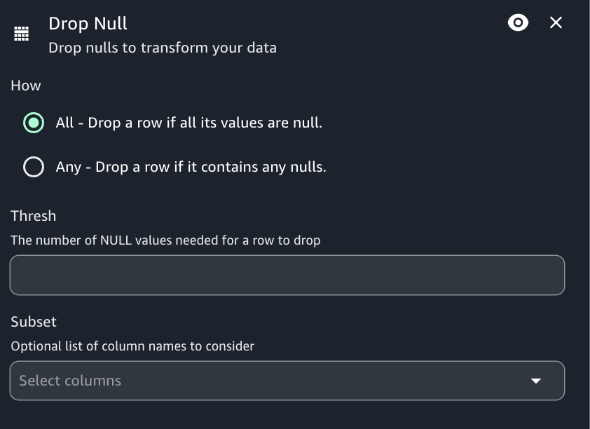

# Drop nulls transform

Use the Drop nulls transform to remove fields from the dataset if all values in the
field are 'null'. By default, Visual ETL will recognize null objects, but some values such
as empty strings, strings that are "null", -1 integers or other placeholders such as zeros,
are not automatically recognized as nulls.

###### To use the Drop nulls

1. Add a Drop nulls node to the diagram, if needed.
2. Set a number as threshold value, if the rows(s) need to be drop only if a certain
   number of nulls is present.
3. Choose if you prefer to drop nulls for all columns or only check null values for
   specific columns. If you choose the subset option, select the desired column names from
   the drop down list.

