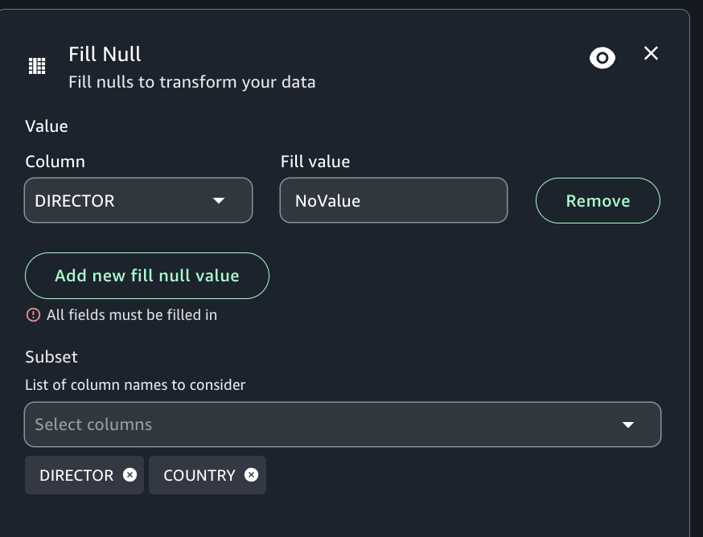

# Fill nulls transform

Fill nulls allows you to fill in null value in a column with a chosen fill value. Select
a column with nulls you want to fill and provide a fill value. You can use multiple fill
conditions at one time. Select a subset of the data to consider by using a dropdown menu to
select columns.

###### To add a Fill nulls node to your job diagram

1. Open the menu and then choose Fill nulls to add a new transform to your job
   diagram.
2. (Optional) Click on the rename node icon to enter a new name for the node in the
   job diagram.
3. Modify the input schema:
   1. To create a subset, use the dropdown menu and select a column or columns to
      consider.
   2. To specify a value to fill nulls with, select "Add new fill null value", then
      choose a column to fill and provide a Fill value.

4. (Optional) After configuring the node properties and transform properties, you can
   preview the modified dataset by choosing the Data preview tab in the node details
   panel.

