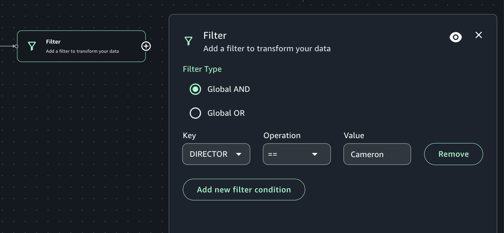

# Filter transform

Use the Filter transform to create a new dataset by filtering records from the input
dataset. Rows that don't satisfy the filter condition are removed from the output. You can
select from two filter types: Global AND or Global OR. You must select a column name to
serve as the key, a comparison operation, and provide a value to filter on.

###### To add a Filter node to your job diagram

1. Open the menu and then choose Filter to add a new transform to your job
   diagram.
2. (Optional) Click on the rename node icon to enter a new name for the node in the job
   diagram.
3. Modify the input schema:
   1. Select "Add new filter condition".
   2. Choose a filter type: "Global AND" or "Global or".
   3. Select a Key column to filter.
   4. Select a comparison operation.
   5. Type in a value to compare in the "Value" box.

4. (Optional) After configuring the node properties and transform properties, you can
   preview the modified dataset by choosing the Data preview tab in the node details
   panel.

