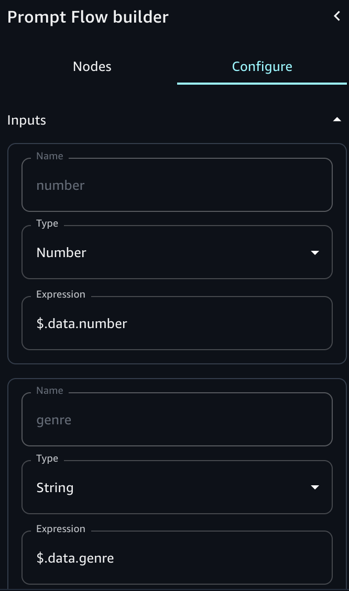
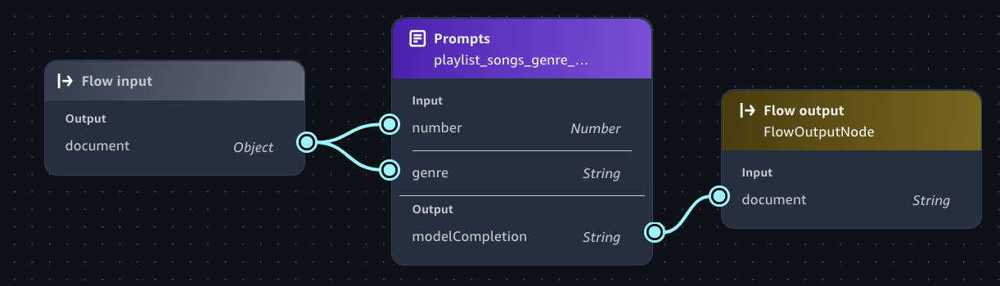

# Define inputs with expressions

When you configure the inputs for a node, you must define it in relation to the whole
input that will enter the node. The whole input can be a string, number, boolean, array, or
object. To define an input in relation to the whole input, you use a subset of supported
expressions based off [JsonPath](https://github.com/json-path/JsonPath "https://github.com/json-path/JsonPath").
Every expression must begin with `$.data`, which refers to the whole input. Note
the following for using expressions:

- If the whole input is a string, number, or boolean, the only expression that you can use to define an individual input is `$.data`
- If the whole input is an array or object, you can extract a part of it to define an individual input.
  As an example to understand how to use expressions, let's say that the whole input is the following JSON object:

```
{
    "animals": {
        "mammals": ["cat", "dog"],
        "reptiles": ["snake", "turtle", "iguana"]
    },
    "organisms": {
        "mammals": ["rabbit", "horse", "mouse"],
        "flowers": ["lily", "daisy"]
    },
    "numbers": [1, 2, 3, 5, 8]
}
```

You can use the following expressions to extract a part of the input (the
examples refer to what would be returned from the preceding JSON object):

| Expression            | Meaning                                                                                                                                                                                                  | Example                      | Example result                                 |
| --------------------- | -------------------------------------------------------------------------------------------------------------------------------------------------------------------------------------------------------- | ---------------------------- | ---------------------------------------------- |
| $.data                | The entire input.                                                                                                                                                                                        | $.data                       | The entire object                              |
| .`name`               | The value for a field called `name` in a JSON object.                                                                                                                                                    | $.data.numbers               | [1, 2, 3, 5, 8]                                |
| [`int`]               | The member at the index specified by `int` in an array.                                                                                                                                                  | $.data.animals.reptiles[2]   | turtle                                         |
| [`int1`, `int2`, ...] | The members at the indices specified by each `int` in an array.                                                                                                                                          | $.data.numbers[0, 3]         | [1, 5]                                         |
| [`int1`:`int2`]       | An array consisting of the items at the indices between `int1` (inclusive) and `int2` (exclusive) in an array. Omitting `int1` or `int2` is equivalent to the marking the beginning or end of the array. | $.data.organisms.mammals[1:] | ["horse", "mouse"]                             |
| \*                    | A wildcard that can be used in place of a<br>`name` or<br>`int`. If there are multiple<br>results, the results are returned in an array.                                                                 | $.data.\*.mammals            | [["cat", "dog"], ["rabbit", "horse", "mouse"]] |

The following procedure shows how to use expressions to identify fields in a JSON object
that you send to a prompt node. The prompt generates a playlist of songs.
The JSON object you pass to the flow identifies the number of songs that you want in
the playlist and the genre of music that you want the songs to represent. For example, enter
the following JSON object to request a playlist of 3 songs in the pop genre.

`{ "genre": "Pop", "number": 3 }`

###### To use an expression

1.  Create an empty flow app by doing [Step 1: Create an initial flow app](build-flow.md#build-flow-empty "build-flow.md#build-flow-empty").
2.  In the flow builder, choose the **Flow input** node.
3.  In the **flow builder** pane choose the **Configure** tab.
4.  In **Outputs** section, choose **Type** and then select **Object**.
5.  In the **flow builder** pane, select **Nodes**.
6.  From the **Orchestration** section, drag a **Prompt**
    node onto the flow builder canvas.
7.  Select the node you just added.
8.  In the **Configurations** tab of the **flow builder**
    pane, do the following:
    1. For **Node name**, enter `playlist_songs_genre_node`.
    2. In **Prompt details** choose **Create new prompt** to open the
       **Create prompt** pane.
    3. For **Prompt name**, enter `playlist_songs_genre_prompt`.
    4. For **Model**, choose the model that you want the prompt to use.
    5. For **Prompt message** enter `Create a playlist of {{number}} songs that are in the {{genre}} genre of music.`.
    6. (Optional) In **Model configs**, make changes to the inference parameters.
    7. Choose **Save draft and create version** to create the prompt. It might take a couple of minutes to
       finish creating the prompt.

9.  In the flow builder, choose the prompt node that you just added.
10. Choose the **Configure** tab and do the following in the
    **Prompt details** section:

        1. For **Prompt**, select the prompt that you just
         created (**playlist\_songs\_genre\_prompt**).
        2. For **Version**, select the version
         (**1**) of the prompt to use.
        3. For the **number** input in the
         **Inputs** section, do the following:


        	1. Change the value of **Type** to
        	 **Number**.
        	2. Change the value of **Expression** to
        	 `$.data.number`.
        4. For the **genre** input in the
         **Inputs** section, do the following:


        	1. Make sure the value of **Type** is
        	 **String**.
        	2. Change the expression for the input to
        	 `$.data.genre`.

    

11. Connect the output from **Flow input** node to the
    input **number** of the Prompt node.
12. Connect the output from **Flow input** node to the
    input **genre** of the Prompt node.
13. Connect the output from the prompt node to the input of the **Flow
    output** node.
14. Choose **Save** to save the flow. The flow should look similar to the following.

 15. Test your prompt by doing the following:

    1. On the right side of the page, choose **<** to open the **Test** pane.
    2. Enter the following JSON in the **Enter prompt** text box.


    ```
    {
        "genre": "Pop",
        "number": 3
    }
    ```
    3. Press Enter on your keyboard or choose the run button to test the prompt. The response should be a playlist of 3 songs
     in the pop music genre.
