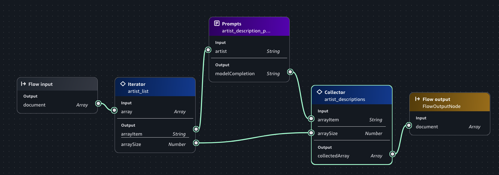

# Use logic nodes to control flow

Within an Amazon Bedrock in SageMaker Unified Studio flow app you can use logic flows to control how the flow processes
input.

The [condition](nodes.md#flow-node-condition "nodes.md#flow-node-condition") node lets you change the flow of
processing based on values passed to the node. For example, suppose you have a flow that creates
music playlists. You can use a condition node to direct requests for local artists to a
sub-flow that uses a knowledge base of local artist information. For national artists,
the knowledge base wouldn't be needed and a different flow path can be used. For an example,
see [Step 4: Add a condition to your flow app](build-flow.md#build-flow-condition "build-flow.md#build-flow-condition").

You can also use the [iterator](nodes.md#flow-node-iterator "nodes.md#flow-node-iterator") and [collector](nodes.md#flow-node-collector "nodes.md#flow-node-collector") nodes to process arrays of information.
For example, a radio station might want descriptions and song suggestions for a list of
artists. With a flow, you can send a list (Array) of artists to an iterator node which then
passes each artist to a prompt. The prompt processes the artists in the array, one at time,
to get the required descriptions and song suggestions. The collector node collects the
results of the prompt as an array which can then be sent to other nodes.

The following procedure shows how to use iterator and collector nodes to generate descriptions for each artist in a list.
The flow also generates a suggested popular, and less popular, song for the artist.
When you run the flow, you supply the list of artists as an array, such as the following.

`["Stereophonics", "Manic Street Preachers"]`

###### To get artist descriptions

1. Create an empty flow app by doing [Step 1: Create an initial flow app](build-flow.md#build-flow-empty "build-flow.md#build-flow-empty"). In step 5, name the app `band info`.
2. On the flow canvas, select the **Flow input** node.
3. In the **flow builder** pane choose the **Configure** tab.
4. In **Outputs** section, choose **Type** and then select **Array**.
5. In the **flow app builder** pane, select **Nodes**.
6. From the **Logic** section, drag an **Iterator** node onto the
   builder canvas.
7. Select the **Iterator** node.
8. In the **Configure** tab of the **flow builder**
   pane, do the following:
   1. For **Node name**, enter `artist_list`.
   2. In the **Output** section, make sure the
      **Type** for **arrayItem** is
      **String**.
   3. In the **Output** section, make sure the
      **Type** for **arraySize** is
      **Number**.

9. On the canvas, connect **document** from the output of the Flow input node to
   the **array** input of the **Iterator**
   node.
10. In the **flow app builder** pane, select **Nodes**.
11. From the **Orchestration** section, drag a **Prompt**
    node onto the flow builder canvas.
12. Select the **Prompt** node.
13. In the **Configure** tab of the **flow app builder**
    pane, do the following:
    1. For **Node name**, enter `artist_description`.
    2. In **Prompt details** choose **Create new prompt** to open the
       **Create prompt** pane.
    3. For **Prompt name**, enter `get_artist_description_prompt`.
    4. For **Model**, choose the model that you want the prompt to use.
    5. For **Prompt message** enter the following:

    ```
    Give a one sentence description about the music played by the artist {{artist}}. Format your response as follows:

    Artist : the artist name
    Description :  the artist description
    Popular song : a popular song by the artist
    Deep cut_song :  a less well known song by the artist

    ```

    6. (Optional) In **Model configs**, make changes to the
       inference parameters.
    7. Choose **Save draft and create version** to create the prompt. It might take a couple of minutes to
       finish creating the prompt.

14. In the **flow app builder** pane, select **Nodes**.
15. From the **Logic** section, drag a **Collector** node onto the
    canvas.
16. Select the **Collector node** on the canvas.
17. In the **Configure** tab of the **flow builder**
    pane, do the following:
    1. For **Node name**, enter `artist_descriptions`.

18. Select the **Iterator** node on the canvas, and do the following:
    1. Connect **arrayItem** to the **artist** input of the Prompt.
    2. Connect **arraySize** to the **arraySize** input of the Collector node.

19. In the **Prompt** node, connect
    **modelCompletion** to the **arrayItem** input
    of the **Collector** node.
20. In the **Collector** node, connect the
    **collectedArray** output to the **document**
    input of the **Flow output** node.
21. Select the **Output** node on the canvas., and do the following:
22. In the **Configure** tab of the **flow app builder**
    pane, do the following:
    1. In the **Outputs** section, change the type of **collectedArray** to **Array**.

23. Choose **Save** to save the flow. The flow should look similar to the following.

 24. Test your flow by doing the following:

    1. On the right side of the page, choose **<** to open the **Test** pane.
    2. Enter the following JSON in the **Enter prompt** text box.


    ```
    ["Stereophonics", "Manic Street Preachers"]
    ```
    3. Press Enter on your keyboard or choose the run button to test the prompt.
     The response should be an array of artists with a descriptions and suggested
     songs for each artist.
