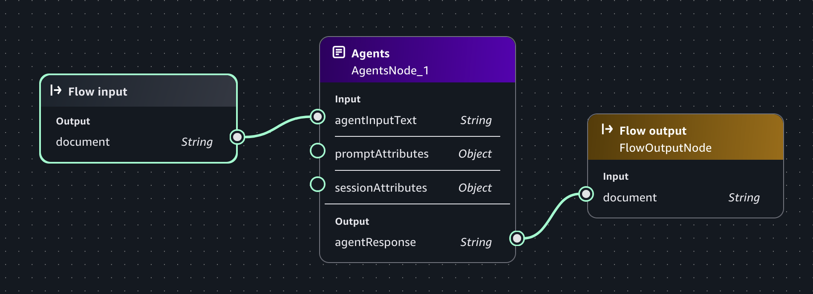

# Use a chat agent app in a flow app

You can use a chat agent app in a flow app by adding an [agent node](nodes.md#flow-node-agent "nodes.md#flow-node-agent") that references the chat agent app.

Before you can use an chat agent app in a flow, you must first [deploy](app-deploy.md "app-deploy.md") the chat agent app. Deployment creates an alias for
the chat agent app and a new version of the chat agent app. In your flow, you add an
agent node and configure the agent node to reference the alias of the
chat agent app.

The following procedure shows how to integrate a chat agent app as an agent node in a
flow app. After completing this procedure you can add other nodes to the flow, as necessary
for your solution.

###### To use a chat agent app in an agent node

1. Create a chat agent app by following instructions at [Build a chat agent app with Amazon Bedrock](create-chat-app.md "create-chat-app.md"). For this procedure,
   you only need to do [Step 1: Create the initial chat agent app](create-chat-app-with-components.md#chat-app-create-app "create-chat-app-with-components.md#chat-app-create-app"), but you can complete the other steps, as
   desired.
2. Deploy the chat agent app by following the instructions at [Deploy an Amazon Bedrock chat agent app](app-deploy.md "app-deploy.md").
3. Create an empty flow app by following the instructions at [Step 1: Create an initial flow app](build-flow.md#build-flow-empty "build-flow.md#build-flow-empty"). Don't do the subsequent steps on that
   page.
4. In the **flow app builder** pane, select the
   **Nodes** tab.
5. From the **Orchestration** section, drag an
   **Agent** node onto the flow builder canvas.
6. In the flow builder, select the **Agent** node, if it isn't
   already selected.
7. In the **flow builder** pane choose the
   **Configure** tab.
8. For **Node name**, enter a name for the agent node.
9. For **Chat agent**, select the name of the chat agent app that
   you want to use.
10. For **Agent**, select the alias for the chat agent app that you
    want to use.
11. Connect the **Input** of the Agent node with the
    **output** of the **Flow input** node.
12. Connect the **Output** of the Agent node with the
    **Input** of the **Flow output** node.
13. Choose **Save** to save the flow. The flow should look similar to
    the following image.

 14. Test your prompt by doing the following:

    1. On the right side of the page, choose **<** to open
     the **Test** pane.
    2. In the **Enter prompt** text box, enter `Create
     a playlist of pop music`.
    3. Press Enter on your keyboard or choose the run button to test the prompt.
     The response should be a playlist music in the pop music genre.
