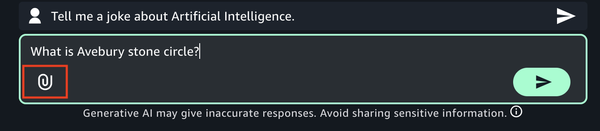

# Get started with

Amazon Bedrock in SageMaker Unified Studio

Get started with Amazon Bedrock in SageMaker Unified Studio by experimenting with a model in a [playground](bedrock-playgrounds.md "bedrock-playgrounds.md").

The Amazon Bedrock in SageMaker Unified Studio playgrounds that lets you easily experiment with Amazon Bedrock models. The
[chat](bedrock-explore-chat-playground.md "bedrock-explore-chat-playground.md") playground lets you chat
with a model by providing text and image prompts to the model (not all models support
images). The [image and video](explore-image-playground.md "explore-image-playground.md") playground lets
you generate images and videos with a suitable model. With both playgrounds you can
experiment by making configuration changes. For example, you can influence the response from a
model by changing [inference](explore-prompts.md#inference-parameters "explore-prompts.md#inference-parameters") parameters.

After trying the chat and image playgrounds, you can try creating a chat agent app or
flows app. A chat agent app allows users to chat with an Amazon Bedrock model through a
conversational interface, typically by sending prompts (text or image) and receiving
responses. To create a chat agent app, see [Build a chat agent app with Amazon Bedrock](create-chat-app.md "create-chat-app.md").

You can also create a [flows app](create-flows-app.md "create-flows-app.md") that lets you visually design the flow of an app.

## Chat with a model in

the chat playground

In these instructions, you use the Amazon Bedrock in SageMaker Unified Studio chat playground to chat with an Amazon Bedrock in SageMaker Unified Studio model. You
chat by sending a prompt to the model and answering the response that the model
generates. For more information, see [Experiment with the Amazon Bedrock playgrounds](bedrock-playgrounds.md "bedrock-playgrounds.md").

If you don't have access to a model, contact your administrator.

###### To chat with a model

1. Navigate to the Amazon SageMaker Unified Studio landing page by using the URL from your administrator.
2. Access Amazon SageMaker Unified Studio using your IAM or single sign-on (SSO) credentials. For more information, see [Access Amazon SageMaker Unified Studio](getting-started-access-the-portal.md "getting-started-access-the-portal.md").
3. At the top of the page, choose the **Discover**.
4. In the **Generative AI** section, choose **Chat
   playground** to open the chat playground.

 5. In **Type** select **Model** and then select a model
to use in **Model**. For full information about the model, choose
**View full model details** in the information panel. For more
information, see [Find serverless models with the Amazon Bedrock model
catalog](model-catalog.md "model-catalog.md"). If you
don't have access to an appropriate model, contact your administrator. Different models
might not support all features. 6. In the **Enter prompt** text box, enter `What is Avebury stone
 circle?`. 7. (Optional) If the model you chose is a reasoning model, you can choose
**Reason** to have the model include its reasoning in the reponse.
For more information, see [Enhance model responses with
model reasoning](../../../bedrock/latest/userguide/inference-reasoning.md "../../../bedrock/latest/userguide/inference-reasoning.md") in the _Amazon Bedrock user guide_. 8. Press Enter on your keyboard, or choose the run button, to send the prompt to the
model. Amazon Bedrock in SageMaker Unified Studio shows the response from the model in the playground.

 9. Continue the chat by entering the prompt `Is there a museum
 there?` and pressing Enter.

The response shows how the model uses the previous prompt as context for generating
its next response. 10. Choose **Reset** to start a new chat with the model. 11. Influence the model response by doing the following:

    1. Enter and run a prompt. Note the response from the model.
    2. Choose the configurations menu to open the **Configurations** pane.

    
    3. Influence the model response by making [inference parameters](explore-prompts.md#inference-parameters "explore-prompts.md#inference-parameters") changes.
    4. (Optional) In **System instructions**, enter any overarching system instructions that you want the model to apply for future interactions.
    5. Run the prompt again and compare the response with the previous response.

12. Choose **Reset** to start a new chat with the model.
13.
14. Try sending an image to a model by doing the following:
    1. For **Model**, choose a model
       that supports [images](../../../bedrock/latest/userguide/models-supported.md "../../../bedrock/latest/userguide/models-supported.md").
    2. Choose the attachment button at the left of the **Enter prompt** text box.

     3. In the open file dialog box, choose an image from your local computer. 4. In the text box, next to the image that you uploaded, enter `What's in this
 image?`. 5. Press Enter on your keyboard enter to send the prompt to the model. The response from the
    models describes the model or image.

15. (Optional) Try using another model and different prompts. Different models have different
    recommendations for creating, or engineering, prompts. For more information, see [Prompt engineering guides](explore-prompts.md#prompt-guides "explore-prompts.md#prompt-guides").
16. (Optional) Try restoring a previous chat session and continuing the conversation. In the playground, select **History** to open the chat history panel. Select a previous session from the list and send a new prompt to the model.
17. (Optional) Compare the output from multiple models, or [shared apps](bedrock-explore-chat-playground-app.md "bedrock-explore-chat-playground-app.md").
    1. In the playground, turn on **Compare mode**.
    2. In both panes, select the model that you want to compare. If you want to use a
       shared app, select **App** in **Type** and
       then select the app in **App**.
    3. Enter a prompt in the text box and run the prompt. The output from each model is shown. You
       can choose the copy icon to copy the prompt or model response to the clipboard.
    4. (Optional) Choose **View configs** to make configuration
       changes, such as [inference
       parameters](explore-prompts.md#inference-parameters "explore-prompts.md#inference-parameters"). Choose **View chats** to return to the chat page.
    5. (Optional) Choose **Add chat window** to add a third window.
       You can compare up to 3 models or apps.
    6. Turn off **Compare mode** to stop comparing models.
