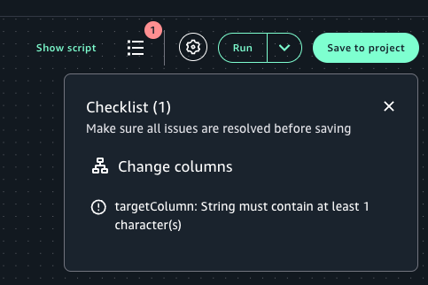

# Creating

a Visual ETL job

To create a job using Visual ETL in Amazon SageMaker Unified Studio:

1. Log in to Amazon SageMaker Unified Studio and select a project.
2. Navigate to the Visual ETL tool using the dropdown "Build" menu, selecting
   "Visual ETL jobs".
3. Click "Create Visual ETL job" to open the Visual ETL editor.

If this is your first time using Visual ETL jobs in Amazon SageMaker Unified Studio, you are asked to
choose a default compute permission mode option based on your data access preference. For
more information, see [Configuring permission mode for Glue ETL in Amazon SageMaker Unified Studio](compute-permissions-mode-glue.md "compute-permissions-mode-glue.md"). 4. Give the job a name when you begin authoring the job. 5. From the dropdown menu next to the Run button, choose the compute permission mode
option that supports the data you will be using in the job.

    * Select **project.spark.fineGrained** for data managed using fine-grained access,
     meaning the compute engine can only access specific rows and columns from the full dataset. Choosing this option configures your compute
     to work with data asset subscriptions from Amazon SageMaker Catalog.
    * Select **project.spark.compatibility** to configure permission mode
     to be compatible with data managed using full-table access,
     meaning the compute engine can access all rows and columns in the data.
     Choosing this option configures your compute to work with data assets from AWS and from external systems that you
     connect to from your project.

6. Select the "Add nodes" button and select a node, chooing your node from one of the
   three tabs: "Data sources", "Transforms", or "Data targets".
7. Drag a source component onto the canvas.
8. Configure the component by clicking on the node and editing the configurations, to
   connect to your data source.
9. Add transformation components as needed, connecting them in the desired order.
10. Drag a data target onto the canvas and configure it to specify where the processed
    data should be stored.
11. Connect the components to create a complete job.

 12. Click the "Checklist" button to check for any configuration errors. 13. To make the job accessible for all project members to view and edit, select "Save to
project". 14. Select "Run" to execute it immediately or run it on a schedule with the instructions
at [Scheduling and running visual jobs](schedule-visual-etl.md "schedule-visual-etl.md").
