# Set up your domain as an administrator

**Time:** 10 minutes

**Prerequisites:** An AWS account with administrator
access. If you don't have an account, see the prerequisites section.

**Outcome:** You create a SageMaker Unified Studio domain,
set up a project, and add a member so your team can start working with data and AI.

## What you will do

In this tutorial, you will:

- Open the SageMaker Unified Studio setup in the AWS console
- Configure login and execution IAM roles
- Set up data storage and encryption options
- Create your domain
- Create a project and add a team member

This tutorial walks you through setting up an IAM-based domain in SageMaker Unified
Studio. An IAM-based domain uses AWS Identity and Access Management (IAM) roles for
authentication and access control. Only one IAM-based domain is available per AWS
account per Region.

## Step 1: Open SageMaker Unified Studio in the console

1. Sign in to the AWS Management Console.
2. In the search bar at the top, type `SageMaker` and choose
   **Amazon SageMaker** from the results.
3. On the SageMaker landing page, choose
   **Get started**.

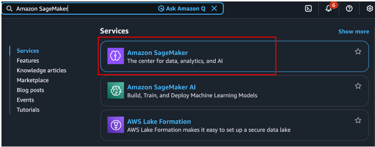

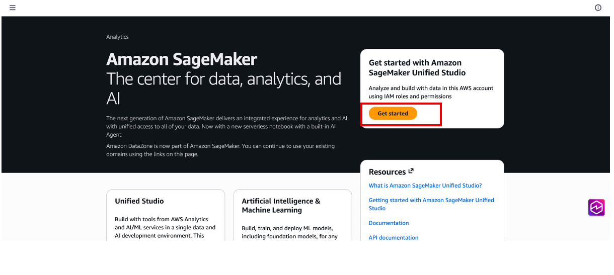

The setup flow opens and guides you through configuring your domain.

## Step 2: Configure the login role

The login role authenticates the administrator and provides access to SageMaker
Unified Studio. The setup flow shows your current IAM role.

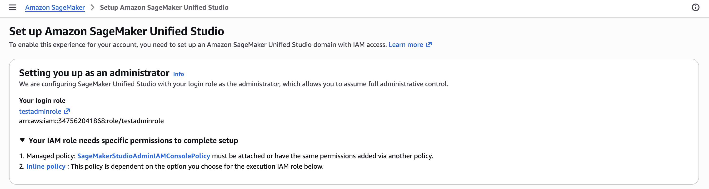

1. Review the login role shown. This is the IAM role that you will use
   to sign in to SageMaker Unified Studio as an administrator.
2. The login role must have the [SageMakerStudioAdminIAMConsolePolicy](../adminguide/security-iam-awsmanpol-SageMakerStudioAdminIAMConsolePolicy.md "../adminguide/security-iam-awsmanpol-SageMakerStudioAdminIAMConsolePolicy.md")
   managed policy attached.

###### Note

The login role also requires an inline policy based on your choice of execution
role in the next step.

## Step 3: Configure the execution role

The execution role defines which AWS services and data can be accessed through
SageMaker Unified Studio projects.

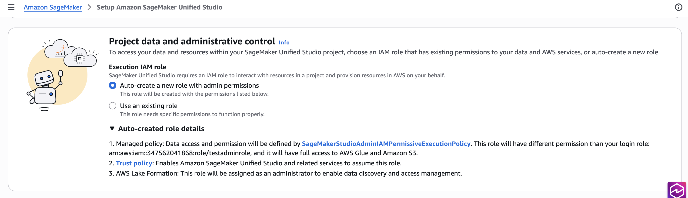

1. Choose whether to let SageMaker Unified Studio auto-create an execution
   role, or select an existing IAM role.
2. If you use an existing role, it must have the [SageMakerStudioAdminIAMPermissiveExecutionPolicy](../adminguide/security-iam-awsmanpol-SageMakerStudioAdminIAMPermissiveExecutionPolicy.md "../adminguide/security-iam-awsmanpol-SageMakerStudioAdminIAMPermissiveExecutionPolicy.md")
   managed policy attached.

###### Note

The execution role needs a trust policy that allows SageMaker Unified Studio
and related AWS services to assume it. The execution role is also assigned
administrator permissions for AWS Lake Formation. The execution role can be the
same IAM role as the login role. If you use separate roles, make sure each has the
appropriate managed policy attached.

## Step 4: Configure storage and encryption

Choose your data storage and encryption settings.

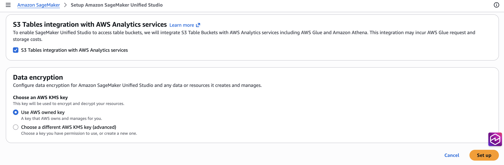

1. Choose whether to enable S3 tables integration for your
   domain.
2. For data encryption, choose **AWS owned
   key** (default) or provide your own AWS KMS key.
3. Choose **Set up** to create your
   domain.

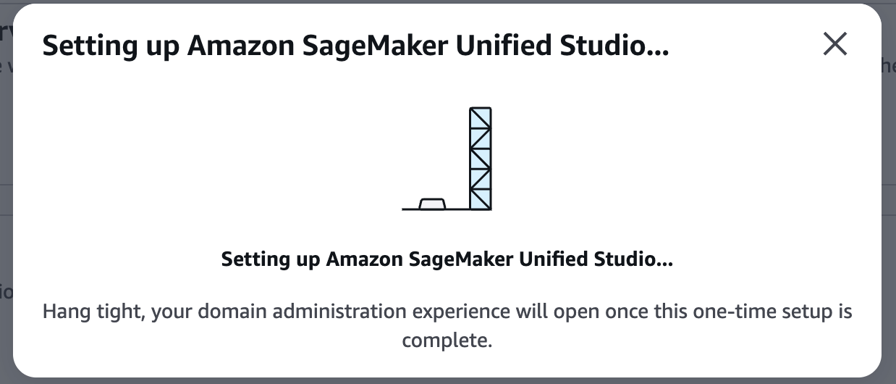

Domain creation takes a few minutes. When it completes, you see the default
project screen.

## Step 5: Explore your new domain

After the domain is created, you land on the default project screen.

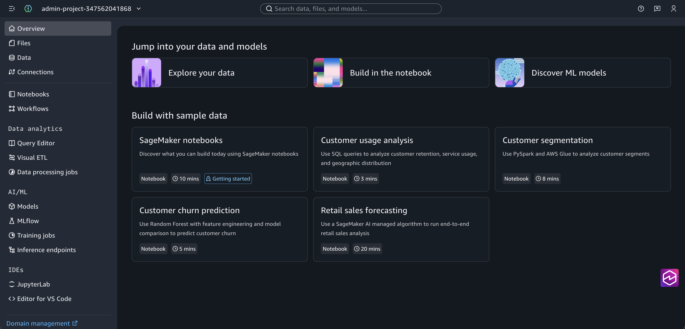

You can customize the appearance of SageMaker Unified Studio to your
preference.

1. Choose the **Customize appearance**
   option.
2. Choose **Light** if you prefer a lighter
   interface.

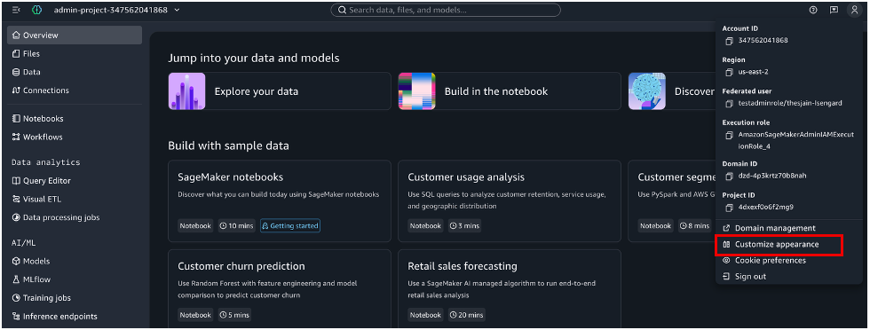

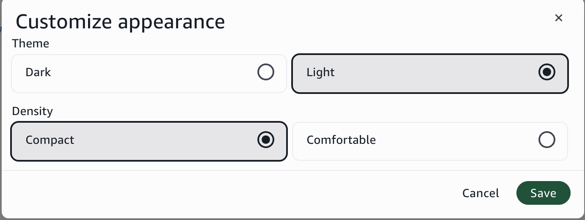

## Step 6: Create a project and add a member

Projects are where your team collaborates on data and AI tasks. Create a project
and add a member so they can start working.

1. Choose **Domain management** to access
   project and member settings.

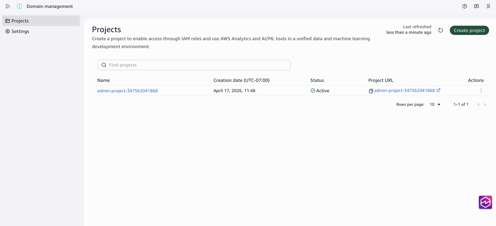 2. Choose **Create project**. 3. Enter a project name and description.

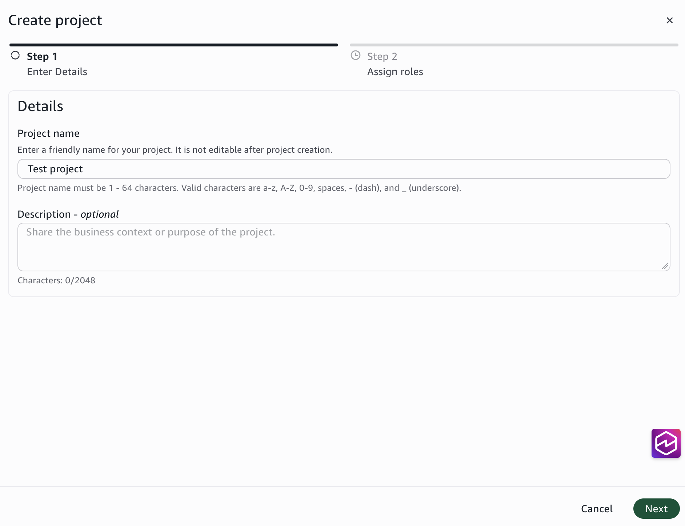 4. Add a member to the project. For each IAM role or user, specify:

    * The IAM role or user with [SageMakerStudioUserIAMConsolePolicy](../adminguide/security-iam-awsmanpol-SageMakerStudioUserIAMConsolePolicy.md "../adminguide/security-iam-awsmanpol-SageMakerStudioUserIAMConsolePolicy.md")
     attached for signing in and accessing the project.
    * The IAM role or user with [SageMakerStudioUserIAMDefaultExecutionPolicy](../adminguide/security-iam-awsmanpol-SageMakerStudioUserIAMDefaultExecutionPolicy.md "../adminguide/security-iam-awsmanpol-SageMakerStudioUserIAMDefaultExecutionPolicy.md")
     attached for accessing data and resources within the project.

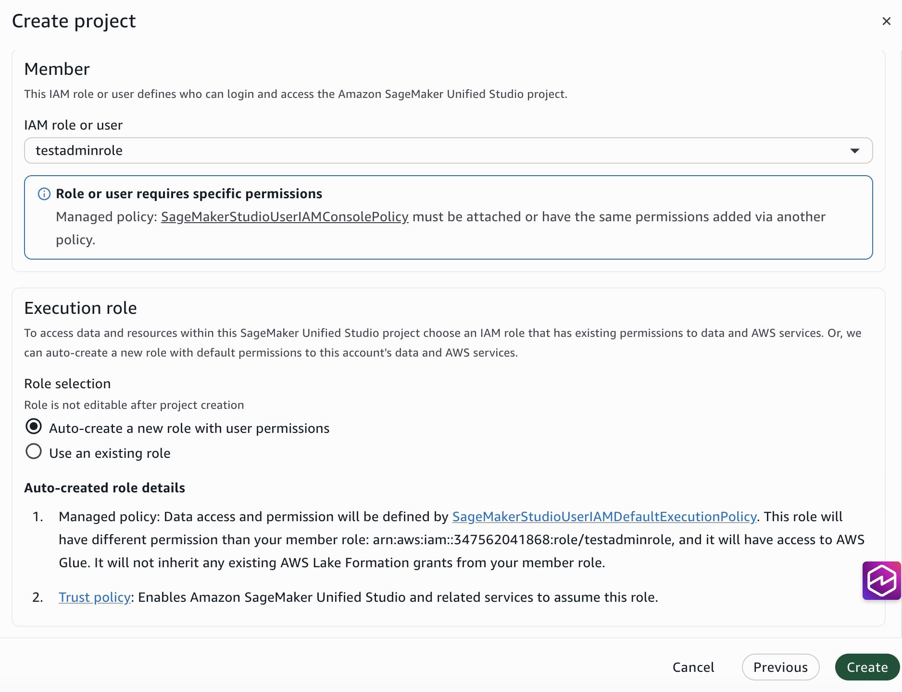 5. Choose whether to create a new S3 bucket for project code or use an
existing one.

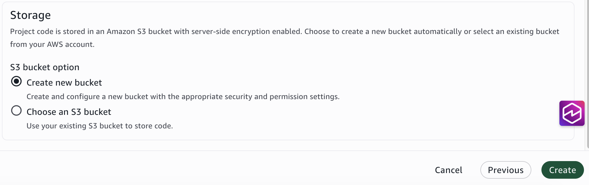 6. Choose **Create** to finish.

## What you learned

In this tutorial, you:

- Created an IAM-based SageMaker Unified Studio domain
- Configured login and execution IAM roles with the required managed
  policies
- Set up data storage and encryption for your domain
- Created a project and added a team member with the appropriate
  permissions

Your team members can now sign in to SageMaker Unified Studio and start using the
tutorials in this guide.
