# Analyze and visualize data

**Time:** 10 minutes

**Prerequisites:** As a member of a SageMaker Unified Studio
project, your IAM role needs the following managed policies:

- [SageMakerStudioUserIAMConsolePolicy](../adminguide/security-iam-awsmanpol-SageMakerStudioUserIAMConsolePolicy.md "../adminguide/security-iam-awsmanpol-SageMakerStudioUserIAMConsolePolicy.md")
  to sign in and access the project.
- [SageMakerStudioUserIAMDefaultExecutionPolicy](../adminguide/security-iam-awsmanpol-SageMakerStudioUserIAMDefaultExecutionPolicy.md "../adminguide/security-iam-awsmanpol-SageMakerStudioUserIAMDefaultExecutionPolicy.md")
  to access data and resources within the project.
  If you don't have access, contact your administrator. If you are the administrator
  who set up the project, you already have the required permissions. Completing "Run your
  first SQL query" is helpful, but not required.

**Outcome:** You load data into a notebook, calculate summary
statistics with Python, analyze patterns across states, and create a visualization.

## What you will do

In this tutorial, you will:

- Open a notebook in your project
- Load sample data into a DataFrame for analysis
- Calculate summary statistics
- Analyze patterns by grouping data
- Create a chart to visualize the results

SageMaker Unified Studio notebooks give you a single environment for Python, SQL, and
data visualization with serverless compute that scales automatically. The notebook connects
directly to your project's data through the lakehouse, so the same tables you queried with
SQL in the previous tutorial are available here too.

## Step 1: Open a notebook

1. When you first sign in to SageMaker Unified Studio, you are in your
   default project. If you need to switch projects, use the project selector at the top
   of the page.
2. On the project overview page, choose **Build in the
   notebook**. Alternatively, choose **Notebooks** in the
   left navigation pane and choose **Create notebook**. A new
   notebook opens with an empty Python cell.

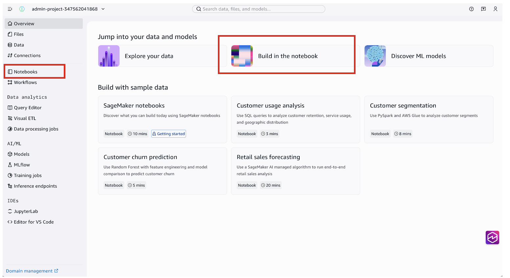

The notebook opens with a Python cell ready for input. You can also add SQL, Markdown,
Table, and Charts cells using the options at the bottom of the notebook.

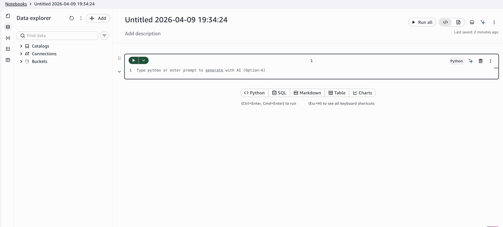

###### What runs your code?

Notebooks run on serverless compute powered by Amazon Athena for Apache Spark by
default. Your
code runs on managed infrastructure that scales automatically, without you provisioning
anything.

## Step 2: Load the data

The same `sagemaker_sample_db.churn` table you browsed in the data catalog
is available directly from your notebook. Load it into a pandas DataFrame so you can
analyze it with Python. Paste the following code into the first Python cell and run
it:

```
import pandas as pd

df = spark.sql("SELECT * FROM sagemaker_sample_db.churn").toPandas()
print(f"Rows: {len(df)}, Columns: {len(df.columns)}")
df.head()
```

The output shows the first few rows of the dataset, including columns for state,
account length, call minutes, service calls, and churn status.

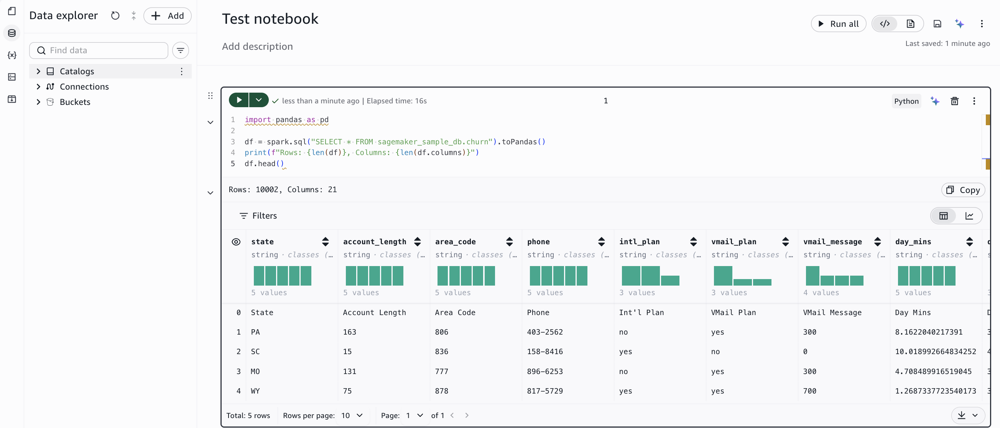

The dataset contains telecom customers with attributes including call minutes,
service calls, charges, and whether the customer churned.

###### Work with DataFrames using SQL

Once you create a DataFrame, you can also query it using SQL cells in the
notebook. This means you can use Python for some steps and SQL for others,
depending on which is more convenient for the task.

## Step 3: Clean the data and calculate statistics

Before analyzing the data, you need to handle a few issues. The first row contains
duplicate header values, some numeric columns are stored as strings, and the churn column
uses `"True."` and `"False."` instead of standard booleans. The following
code removes the extra header row, converts the numeric columns to the correct data type,
and maps the churn values to booleans. Add a new Python cell and paste it:

```
# Clean the data
df_clean = df.iloc[1:].copy()

# Convert numeric columns to float
numeric_cols = ['day_mins', 'eve_mins', 'custserv_calls']
for col in numeric_cols:
    df_clean[col] = pd.to_numeric(df_clean[col], errors='coerce')

# Convert churn to boolean for percentage calculation
df_clean['churn'] = df_clean['churn'].map({'True.': True, 'False.': False})

print(f"Total customers: {len(df_clean)}")
print(f"Avg daytime minutes: {df_clean['day_mins'].mean():.2f}")
print(f"Avg evening minutes: {df_clean['eve_mins'].mean():.2f}")
print(f"Avg service calls: {df_clean['custserv_calls'].mean():.2f}")
print(f"Churn rate: {df_clean['churn'].mean():.1%}")
```

This gives you a quick overview of the dataset: 10,001 customers with an average of
5.52 daytime minutes, 5.03 evening minutes, 5.53 service calls, and a 50% churn rate.

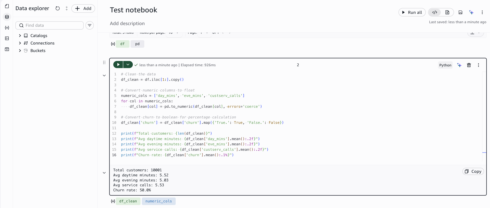

## Step 4: Analyze patterns by state

Group the data by state to find which states have the most customer service calls.
Add a new Python cell:

```
top_states = (
    df_clean.groupby('state')
    .agg(total_customers=('state', 'count'),
         avg_day_mins=('day_mins', 'mean'),
         avg_eve_mins=('eve_mins', 'mean'),
         avg_service_calls=('custserv_calls', 'mean'))
    .round(2)
    .sort_values('avg_service_calls', ascending=False)
    .head(10)
)
top_states
```

The results show the top 10 states sorted by average service calls, along with customer
counts and usage patterns. This is the same analysis from the SQL tutorial, now done with
pandas.

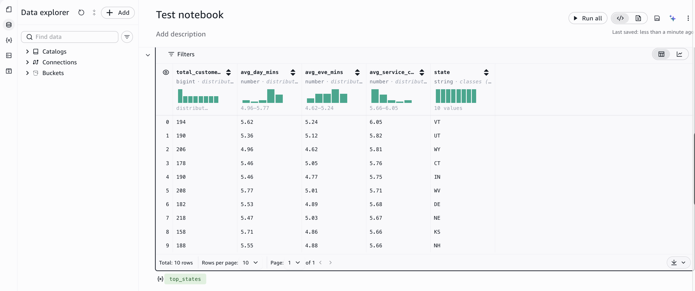

## Step 5: Create a visualization

Tables show the numbers, but a chart makes it easier to spot patterns at a glance.
Create a grouped bar chart that compares average daytime and evening call minutes across
the top 10 states. Add a new Python cell:

```
import matplotlib.pyplot as plt

usage = df_clean.groupby('state')[['day_mins', 'eve_mins']].mean()
usage.columns = ['Day', 'Evening']
top10 = usage.sort_values('Day', ascending=False).head(10)

top10.plot(kind='bar', figsize=(10, 5), color=['#0073bb', '#ff9900'])
plt.title('Average Call Minutes by Time of Day \u2014 Top 10 States')
plt.ylabel('Minutes')
plt.xlabel('State')
plt.xticks(rotation=0)
plt.legend(title='Time of Day')
plt.tight_layout()
plt.show()
```

The chart renders inline, directly below the cell. Each state shows two bars comparing
daytime and evening call minutes.

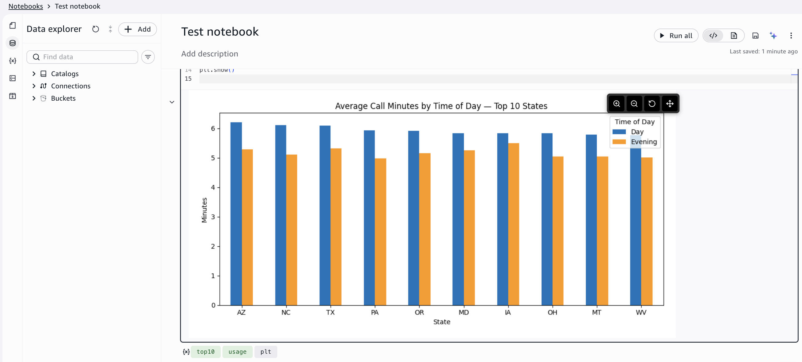

###### Create charts without code

Instead of writing plotting code, you can use the built-in **Charts**
cell type. Choose **Charts** from the cell type options at the
bottom of the notebook, then configure your chart visually:

1. For **Data frame**, select
   `top_states`.
2. For **Type**, choose
   **Bar chart**.
3. For **X-axis**, select
   **state**.
4. For **Y-axis**, select
   **total_customers**.
   The chart updates automatically as you change the configuration.

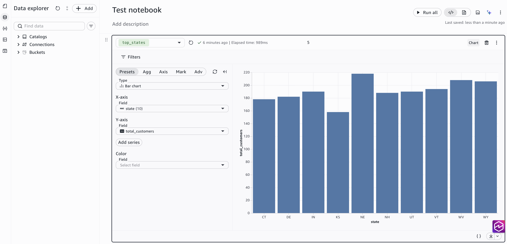

The chart shows that call patterns vary across states, which could inform regional
support staffing or targeted retention campaigns. From here, you could extend this analysis
by correlating call minutes with churn rates, segmenting customers by international plan
usage, or building a predictive model to identify customers at risk of churning.

## Use the Data Agent to generate code

Instead of writing code yourself, you can ask the
**Data Agent** to generate it for you. The Data Agent
can create transformations, aggregations, and visualizations from natural language
descriptions.

1. In the notebook, choose the **Chat with AI**
   icon in the top navigation bar.
2. In the **Ask a question** text box at the
   bottom of the panel, type what you want in plain English, for example:
   _"Create a bar chart showing average daytime minutes by state for the
   top 10 states"_

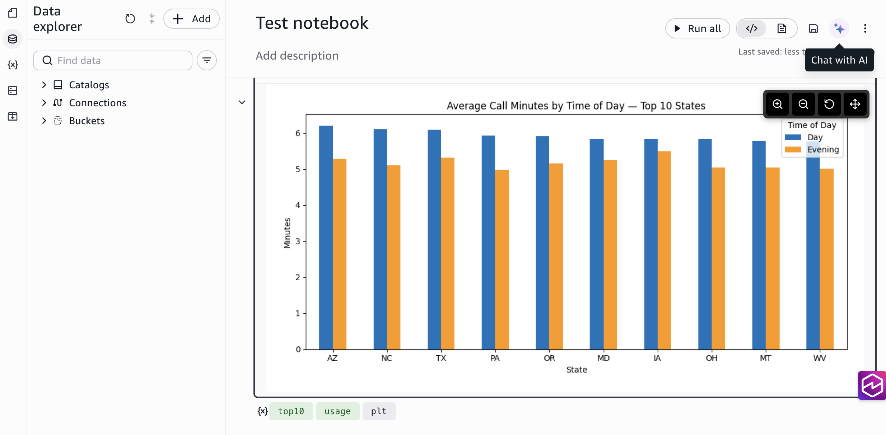

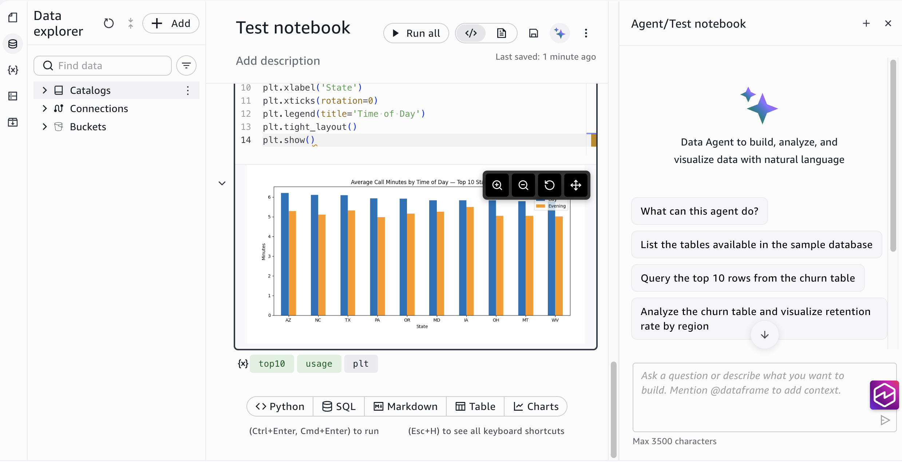

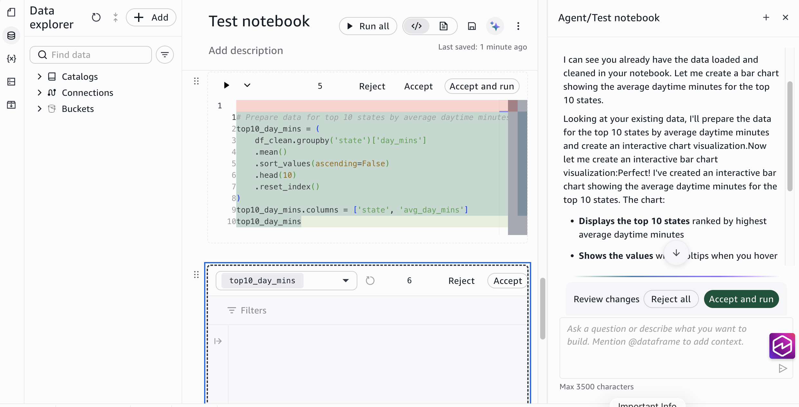

The Data Agent generates the code for you. Review it, then run it.

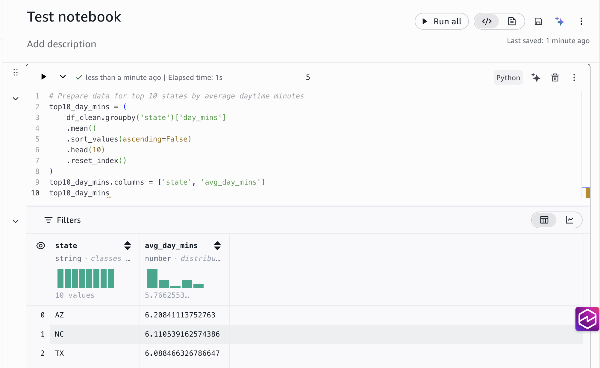

The chart renders inline in the notebook.

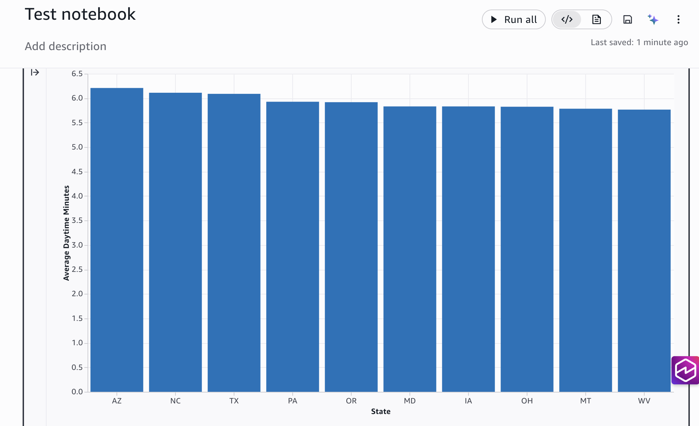

## What you learned

In this tutorial, you:

- Created a notebook and loaded lakehouse data into a pandas
  DataFrame
- Cleaned sample data and calculated summary statistics
- Grouped data by state to analyze customer service patterns
- Created a visualization with Python code and with the no-code Charts
  feature
- Used the Data Agent to generate Python code from natural language
