# Build a data pipeline with visual ETL

**Time:** 10 minutes

**Prerequisites:** As a member of a SageMaker Unified Studio
project, your IAM role needs the following managed policies:

- [SageMakerStudioUserIAMConsolePolicy](../adminguide/security-iam-awsmanpol-SageMakerStudioUserIAMConsolePolicy.md "../adminguide/security-iam-awsmanpol-SageMakerStudioUserIAMConsolePolicy.md")
  to sign in and access the project.
- [SageMakerStudioUserIAMDefaultExecutionPolicy](../adminguide/security-iam-awsmanpol-SageMakerStudioUserIAMDefaultExecutionPolicy.md "../adminguide/security-iam-awsmanpol-SageMakerStudioUserIAMDefaultExecutionPolicy.md")
  to access data and resources within the project.
  If you don't have access, contact your administrator. If you are the administrator
  who set up the project, you already have the required permissions. Completing "Run your
  first SQL query" is helpful, but not required.

###### Note

You can use your identity-based permissions to create a pipeline. However, you need
an IAM role to run the pipeline on a schedule.

**Outcome:** You create a visual ETL job that reads sample
data, filters and reshapes it, and writes clean output to Amazon S3 without writing any
code.

## What you will do

In this tutorial, you will:

- Create a Visual ETL job in your project
- Add a data source node that reads from the AWS Glue Data Catalog
- Apply filter and select transformations to reshape the data
- Write the transformed output to Amazon S3
- Run the job and verify the results

ETL (Extract, Transform, Load) is how you prepare raw data for analysis. SageMaker
Unified Studio provides a visual ETL editor where you build data pipelines by dragging and
connecting nodes on a canvas. No code required. Under the hood, it runs on AWS Glue, a
serverless data integration service, but you don't need to know Glue to use it.

## Step 1: Create a visual ETL job

1. Go to your project using the menu at the top of the page.
2. In the left navigation pane, choose **Visual ETL**
   under **Data analytics**.
3. Choose **Create visual job**.

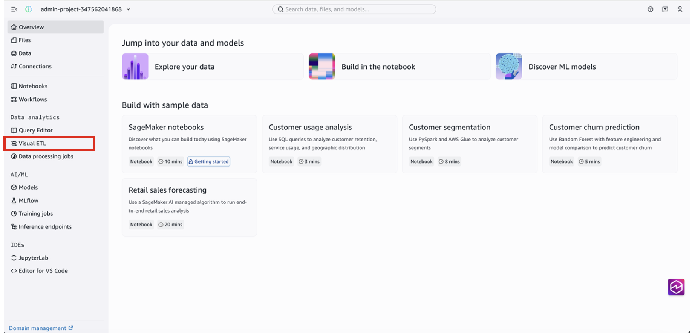

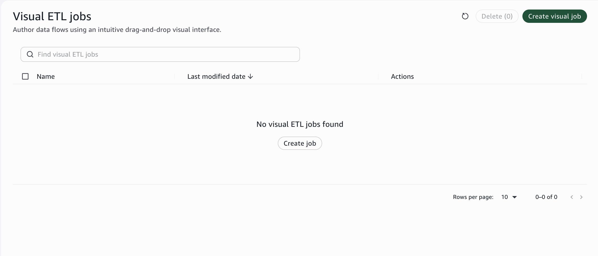

The visual ETL canvas opens with an empty workspace.

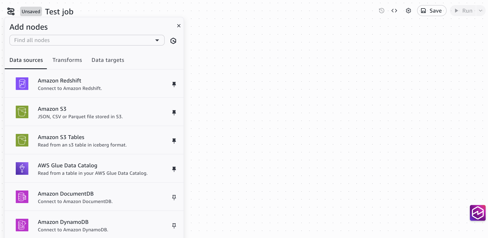

The canvas is where you design your pipeline. You add nodes for data sources,
transformations, and targets, then connect them to define the data flow.

###### What is ETL?

ETL stands for Extract, Transform, Load. _Extract_ reads data from
a source. _Transform_ cleans, filters, or reshapes it.
_Load_ writes the result to a destination. It's the standard pattern
for preparing data before analysis or machine learning.

## Step 2: Add a data source

1. On the canvas, choose the **Add Nodes**
   (+) button on the left. Under **Data sources**, choose
   **AWS Glue Data Catalog** and click on the canvas to
   place the node.
2. Choose the node to open its configuration panel.
3. For **Database**, choose
   `sagemaker_sample_db`.
4. For **Table**, choose
   `churn`.

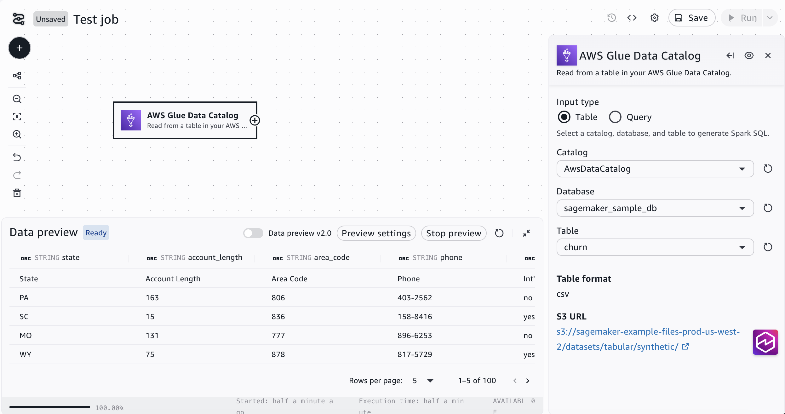

###### Other data sources

You can also read from Amazon S3, Amazon Redshift, JDBC connections, and other
sources. For this tutorial, you use the sample data that's already available in your
project's data catalog.

## Step 3: Add transformations

Now clean and reshape the data. You add two transformation nodes.

###### Filter rows

1. Choose the **+** icon on the right edge of the
   source node, or choose the **+** icon on the left of the
   canvas to **Add Nodes** and choose
   **Transforms**.
2. Choose **Filter**. A filter node appears on the
   canvas, connected to the source node.
3. Choose the filter node to open its configuration panel.
4. Set the filter condition: `custserv_calls > 5`. This keeps only
   customers who contacted customer service more than 5 times.

After you set the filter condition, the data preview updates to show only the rows
that match.

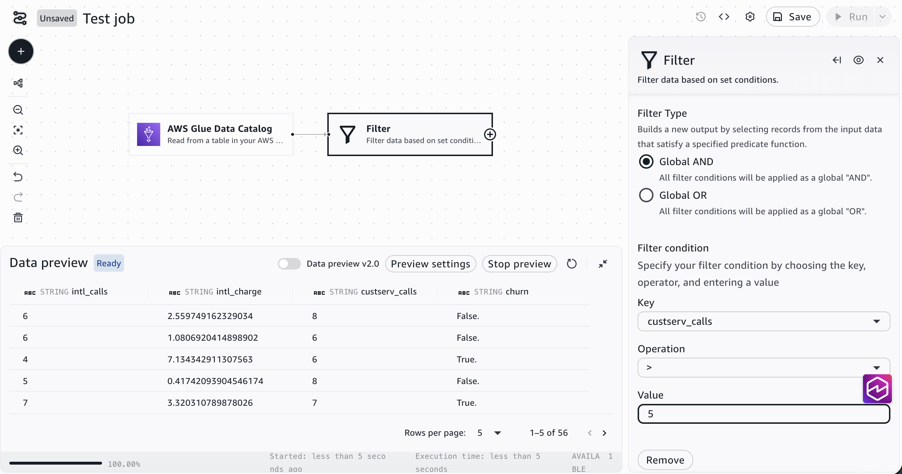

###### Select columns

1. Choose the **+** icon on the right edge of the
   filter node, or choose the **+** icon on the left of the
   canvas to **Add Nodes** and choose
   **Transforms**.
2. Choose **Select Columns**. A select columns node
   appears on the canvas.
3. Choose the select columns node to open its configuration panel.
4. Choose the columns to keep: `state`,
   `day_mins`, `eve_mins`, `custserv_calls`,
   and `churn`.

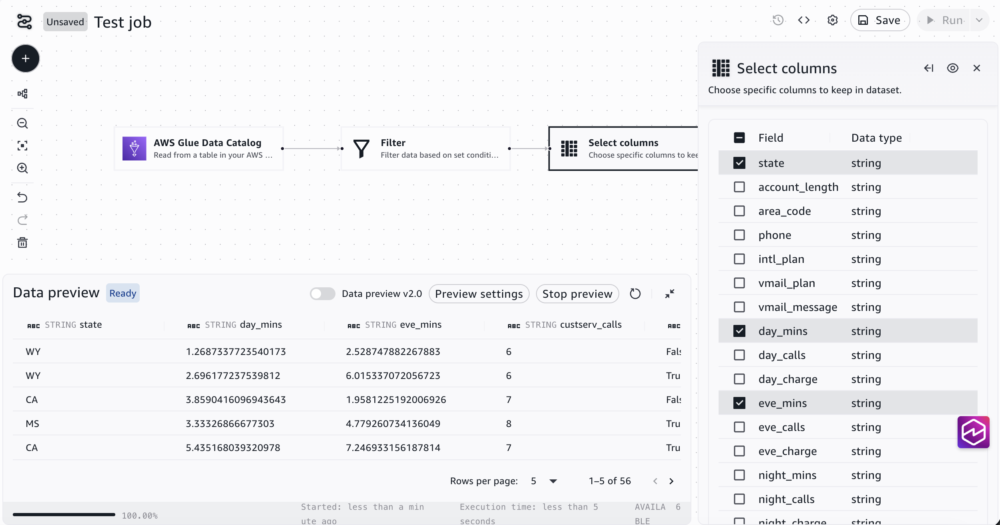

###### More transforms available

The visual ETL editor includes dozens of built-in transforms: joins, aggregations,
derived columns, deduplication, and more. For example, if you noticed in the previous
tutorial that the `churn` column contains `True.` instead of
`True`, you could add a **Derived Column**
transform to clean those values as part of your pipeline. You can also write custom
transforms using SQL or Python.

## Step 4: Add a target

1. Choose the **+** icon on the right edge of the
   select columns node, or choose the **+** icon on the left
   of the canvas to **Add Nodes** and choose
   **Data targets**.
2. Choose **Amazon S3**. A target node appears on
   the canvas.
3. Choose the target node to open its configuration panel.
4. For **Format**, choose
   **Parquet**.
5. For **S3 Target Location**, choose
   **Browse S3**, select your project's S3 bucket, select
   the `shared/` folder, and then add `filtered-churn/` at the end
   of the path in the S3 URI field.

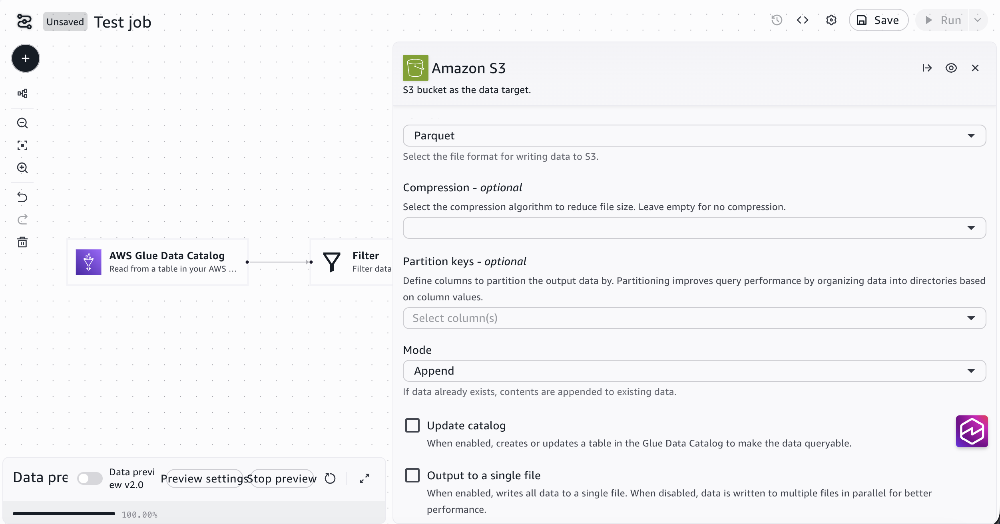

Your pipeline now reads sample data from the AWS Glue Data Catalog, filters for
customers with more than 5 service calls, selects specific columns, and writes the result
to Amazon S3.

## Step 5: Save and run the job

1. Enter a name for your job in the title field at the top of the
   canvas.
2. Choose **Save** to save your job.
3. Choose **Run**.
4. Choose the **View runs** tab at the top of
   the canvas to see the job progress. A job on this sample data typically completes in
   2 to 3 minutes.

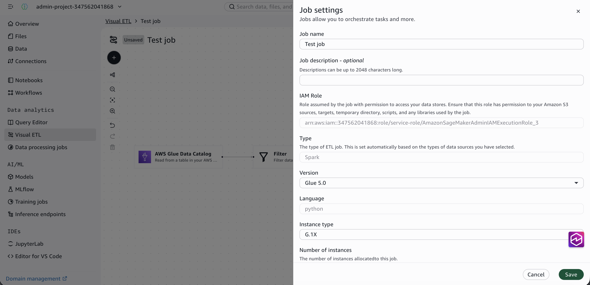

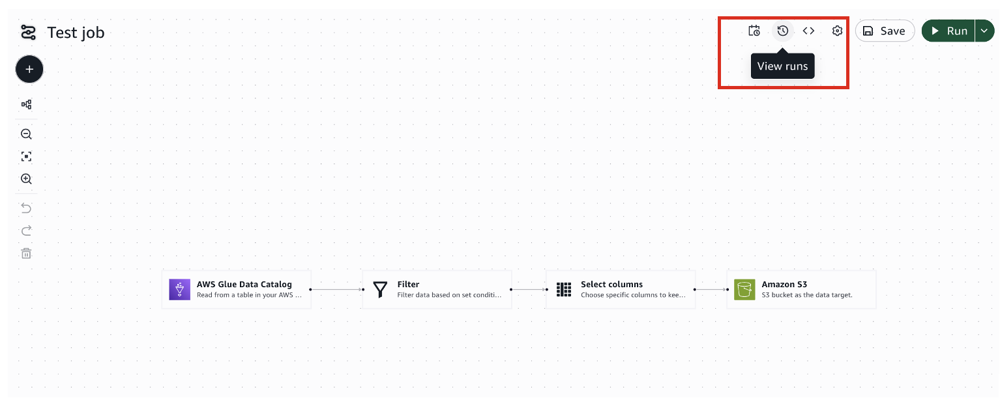

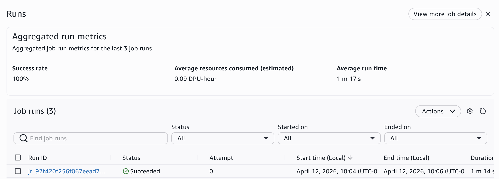

###### Scheduling

In production, you'd schedule this job to run on a recurring basis (hourly, daily,
or triggered by new data arriving). You can set up schedules directly from the job
configuration.

## Step 6: Verify the output

After the job completes, you can find it listed under
**Data processing jobs** in the left navigation pane.

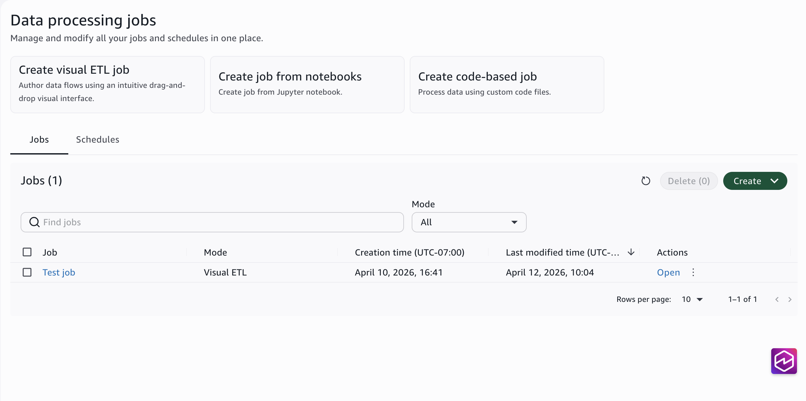

Choose the job to view its details, including run history, status, and
configuration.

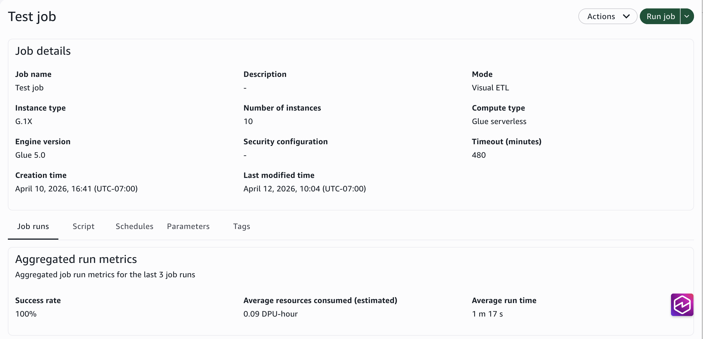

To verify the output:

1. In the left navigation pane, choose **Data**.
2. Under **S3 buckets**, expand your project's
   bucket.
3. Navigate to the output folder you specified in the target node (for example,
   `shared/filtered-churn/`).
4. You should see Parquet files containing only the filtered rows and selected
   columns.

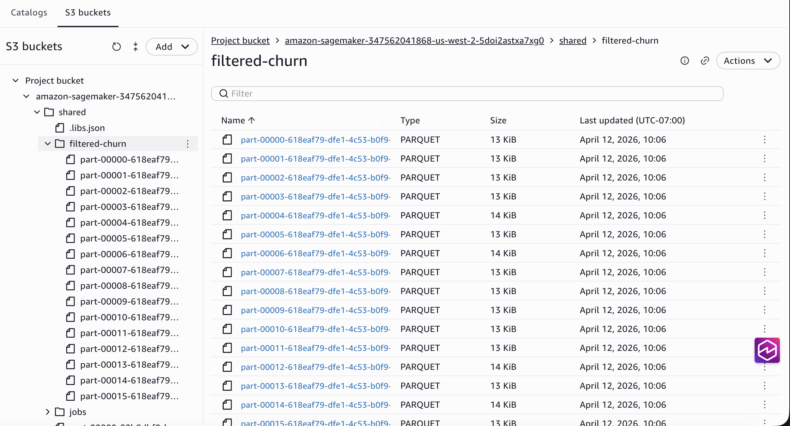

###### Viewing the output data

Parquet is a compressed columnar format optimized for analytics. To view the
contents of these files, you can create an external table pointing to the S3 location
and query it using the query editor, or load the files into a notebook using
pandas or Spark.

You now have a clean, filtered dataset in Amazon S3. This prepared data is ready for
downstream use: analysts can query it directly with SQL, data scientists can load it into
a notebook for deeper analysis, or it can serve as input for machine learning
training.

## What you learned

In this tutorial, you:

- Created a visual ETL job without writing code
- Connected an AWS Glue Data Catalog source to read sample data
- Applied filter and select column transformations to reshape the data
- Wrote transformed data to Amazon S3
- Ran the job and verified the output in the Data explorer
