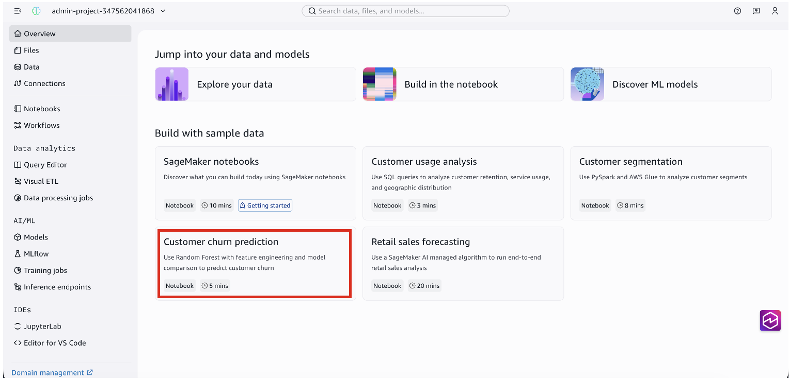
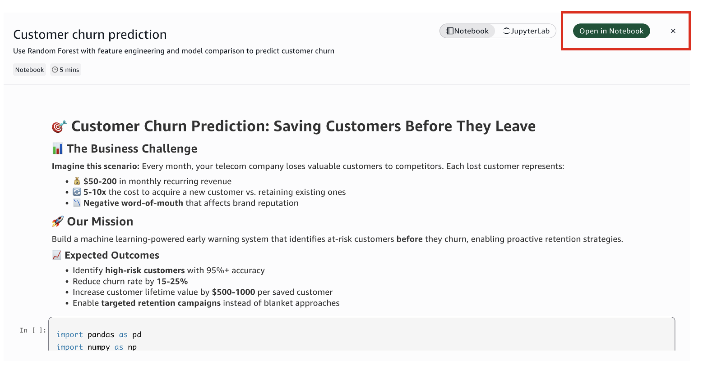
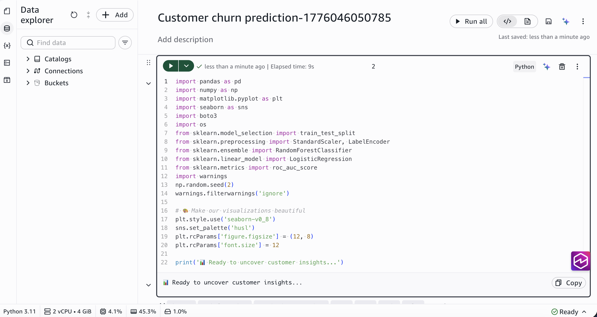
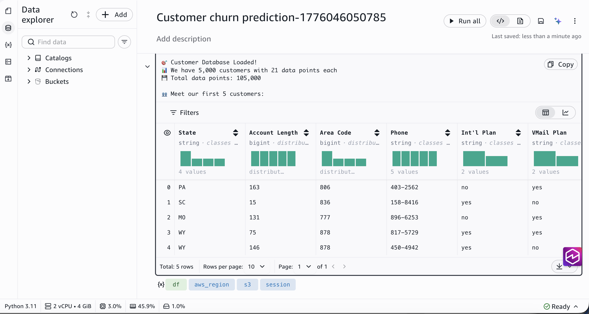
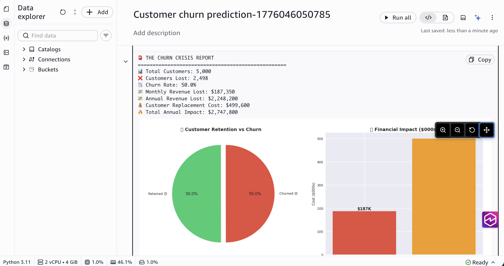
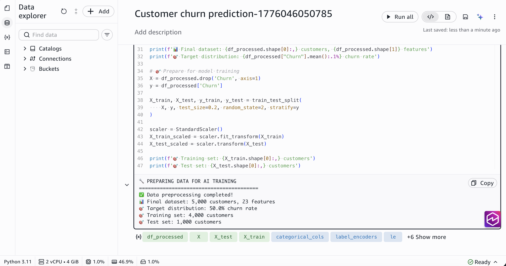
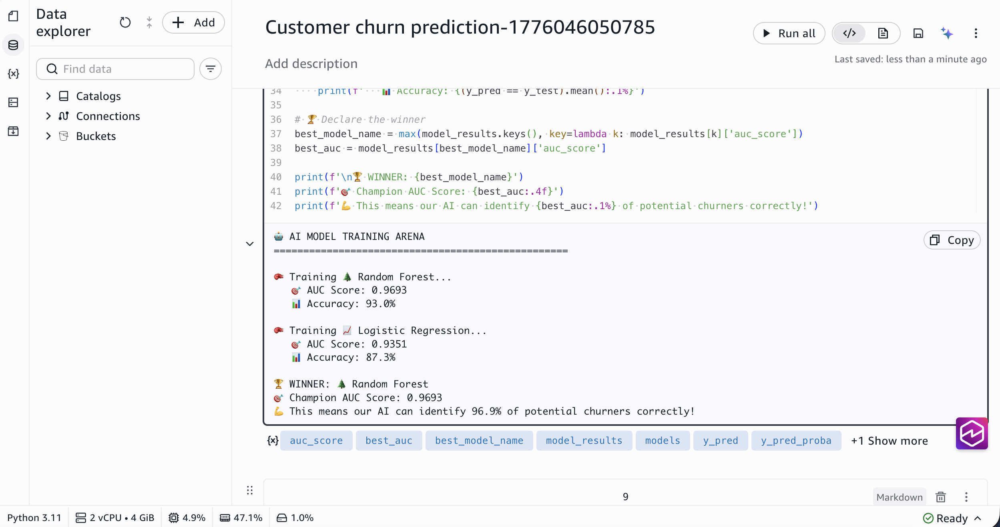
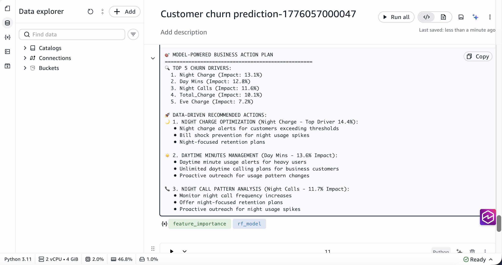
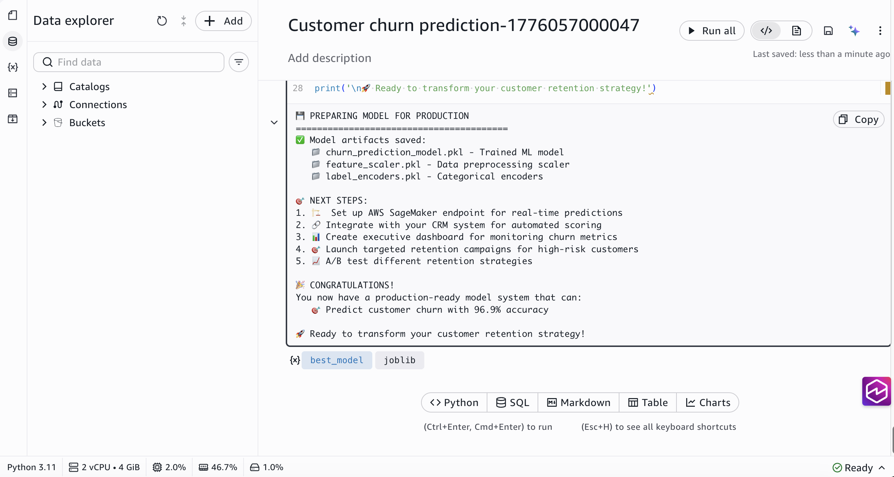

# Train an ML model

**Time:** 15 minutes

**Prerequisites:** As a member of a SageMaker Unified Studio
project, your IAM role needs the following managed policies:

- [SageMakerStudioUserIAMConsolePolicy](../adminguide/security-iam-awsmanpol-SageMakerStudioUserIAMConsolePolicy.md "../adminguide/security-iam-awsmanpol-SageMakerStudioUserIAMConsolePolicy.md")
  to sign in and access the project.
- [SageMakerStudioUserIAMDefaultExecutionPolicy](../adminguide/security-iam-awsmanpol-SageMakerStudioUserIAMDefaultExecutionPolicy.md "../adminguide/security-iam-awsmanpol-SageMakerStudioUserIAMDefaultExecutionPolicy.md")
  to access data and resources within the project.
  If you don't have access, contact your administrator. If you are the administrator
  who set up the project, you already have the required permissions. Completing "Analyze
  and visualize data" is helpful, but not required.

**Outcome:** You open a sample notebook, explore a customer
churn dataset, train a classification model, and identify the key factors that predict
churn.

## What you will do

In this tutorial, you will:

- Open a sample notebook in your project
- Load and explore a customer churn dataset
- Prepare features for model training
- Train and compare two classification models
- Identify the top factors that drive customer churn
- Save the trained model for future use

Machine learning uses historical data to find patterns and make predictions.
In this tutorial, you train a model to predict which telecom customers are likely to
cancel their service (churn). SageMaker Unified Studio provides a notebook environment
with popular ML libraries pre-installed, so you can start training models immediately
without any setup.

## Step 1: Open the sample notebook

1. Go to your project using the menu at the top of the page.
2. On the project overview page, find the **Customer Churn
   Prediction** sample notebook.
3. Choose the notebook to open it.
4. Choose **Open in notebook**.





The notebook contains pre-written code cells that walk through the complete ML
workflow. You run each cell in order.

###### What is a sample notebook?

Sample notebooks are pre-built tutorials included in your project. They contain
working code and explanations for common ML and data science tasks. You can run them
as-is or modify them to use your own data.

## Step 2: Set up and load the data

Run the first cell to import the required libraries. Choose the
**Run** button (▶) in the top left corner of the cell:

```
import pandas as pd
import numpy as np
import matplotlib.pyplot as plt
import seaborn as sns
import boto3
import os
from sklearn.model_selection import train_test_split
from sklearn.preprocessing import StandardScaler, LabelEncoder
from sklearn.ensemble import RandomForestClassifier
from sklearn.linear_model import LogisticRegression
from sklearn.metrics import roc_auc_score
import warnings
np.random.seed(2)
warnings.filterwarnings('ignore')
```

In this cell, `np.random.seed(2)` sets a random seed so you get the
same results each time you run the notebook. The `warnings.filterwarnings`
line suppresses deprecation warnings for cleaner output.



Run the next cell to load the customer churn dataset:

###### How to know when a cell finishes running

When a cell completes, a check mark appears next to it along with the elapsed
time. Wait for this before running the next cell.

```
session = boto3.Session()
aws_region = session.region_name or 'us-west-2'

s3 = boto3.client('s3')
os.makedirs('notebook_outputs', exist_ok=True)

s3.download_file(
    f'sagemaker-example-files-prod-{aws_region}',
    'datasets/tabular/synthetic/churn.txt',
    'notebook_outputs/churn.txt'
)

df = pd.read_csv('notebook_outputs/churn.txt')
print(f'Dataset: {df.shape[0]:,} customers with {df.shape[1]} data points each')
df.head()
```

###### Note

The `sagemaker-example-files-prod` bucket is an AWS-managed public
bucket that contains sample datasets. You do not need to create this bucket. The code
downloads the dataset from this bucket to your notebook's local storage.



The dataset contains telecom customers with attributes including call minutes,
service calls, charges, and whether the customer churned.

## Step 3: Explore the churn problem

Run the next cell to calculate the churn rate and visualize the problem:

```
total_customers = len(df)
churned_customers = len(df[df['Churn?'] == 'True.'])
churn_rate = churned_customers / total_customers

print(f'Total Customers: {total_customers:,}')
print(f'Customers Lost: {churned_customers:,}')
print(f'Churn Rate: {churn_rate:.1%}')

fig, axes = plt.subplots(1, 2, figsize=(15, 6))

churn_counts = df['Churn?'].value_counts()
colors = ['#2ecc71', '#e74c3c']
axes[0].pie(churn_counts.values, labels=['Retained', 'Churned'],
           autopct='%1.1f%%', colors=colors, startangle=90,
           explode=(0, 0.1))
axes[0].set_title('Customer Retention vs Churn')

plt.tight_layout()
plt.show()
```



The visualization shows the split between retained and churned customers.
Understanding this distribution helps you choose the right approach for training
your model.

###### Why explore before training?

Understanding your data before building a model helps you choose the right
approach. For example, if the classes are heavily imbalanced (far more retained
than churned customers), that affects how you evaluate model performance.

## Step 4: Prepare features and train models

Before training, you need to convert the data into a format that ML algorithms
can process. The following code encodes text columns as numbers, creates new features,
and splits the data into training and test sets. Run the next cell:

```
df_processed = df.copy()
df_processed['Churn'] = (df_processed['Churn?'] == 'True.').astype(int)
df_processed.drop('Churn?', axis=1, inplace=True)
df_processed.drop('Phone', axis=1, inplace=True)

categorical_cols = ['State', "Int'l Plan", 'VMail Plan']
label_encoders = {}
for col in categorical_cols:
    le = LabelEncoder()
    df_processed[col] = le.fit_transform(df_processed[col])
    label_encoders[col] = le

df_processed['Total_Charge'] = (df_processed['Day Charge'] +
                               df_processed['Eve Charge'] +
                               df_processed['Night Charge'] +
                               df_processed['Intl Charge'])

df_processed['High_Service_Calls'] = (df_processed['CustServ Calls'] >= 4).astype(int)

X = df_processed.drop('Churn', axis=1)
y = df_processed['Churn']

X_train, X_test, y_train, y_test = train_test_split(
    X, y, test_size=0.2, random_state=2, stratify=y
)

scaler = StandardScaler()
X_train_scaled = scaler.fit_transform(X_train)
X_test_scaled = scaler.transform(X_test)

print(f'Training samples: {X_train.shape[0]:,}')
print(f'Test samples: {X_test.shape[0]:,}')
```



Now train two different classification models and compare their performance.
Run the next cell:

```
models = {
    'Random Forest': RandomForestClassifier(n_estimators=100, random_state=2),
    'Logistic Regression': LogisticRegression(random_state=2, max_iter=1000)
}

model_results = {}

for name, model in models.items():
    print(f'Training {name}...')

    if 'Logistic' in name:
        model.fit(X_train_scaled, y_train)
        y_pred = model.predict(X_test_scaled)
        y_pred_proba = model.predict_proba(X_test_scaled)[:, 1]
    else:
        model.fit(X_train, y_train)
        y_pred = model.predict(X_test)
        y_pred_proba = model.predict_proba(X_test)[:, 1]

    auc_score = roc_auc_score(y_test, y_pred_proba)

    model_results[name] = {
        'model': model,
        'predictions': y_pred,
        'probabilities': y_pred_proba,
        'auc_score': auc_score
    }

    print(f'  AUC Score: {auc_score:.4f}')
    print(f'  Accuracy: {(y_pred == y_test).mean():.1%}')

best_model_name = max(model_results.keys(),
                      key=lambda k: model_results[k]['auc_score'])
print(f'\nBest model: {best_model_name}')
print(f'AUC Score: {model_results[best_model_name]["auc_score"]:.4f}')
```



###### What are these models?

A _Random Forest_ builds many decision trees and combines their
predictions. A _Logistic Regression_ finds a mathematical boundary
between the two classes. AUC (Area Under the Curve) measures how well the model
distinguishes between churners and non-churners, where 1.0 is perfect and 0.5 is
random guessing.

## Step 5: Understand what drives churn

The model can tell you which customer attributes are the strongest predictors of
churn. Run the next cell to see the top churn drivers:

```
rf_model = model_results['Random Forest']['model']
feature_importance = pd.DataFrame({
    'feature': X.columns,
    'importance': rf_model.feature_importances_
}).sort_values('importance', ascending=False)

print('Top 5 churn drivers:')
for i, (_, row) in enumerate(feature_importance.head(5).iterrows(), 1):
    print(f'  {i}. {row["feature"]} (Impact: {row["importance"]:.1%})')
```



Feature importance reveals which factors have the biggest impact on churn
predictions. These insights help the business focus retention efforts on the areas
that matter most.

###### Use the Data Agent for deeper analysis

You don't need ML expertise to interpret these results. The
**Data Agent** can help you understand feature importance,
suggest next steps, and generate code for additional analysis. Open the Data Agent
from the top navigation bar and ask questions like _"Why is night charge the
top predictor of churn?"_ or _"Write code to plot feature
importance as a bar chart."_

## Step 6: Save the model

Run the final cell to save the trained model and its supporting artifacts. You
can use these artifacts to load the model later for batch predictions, deploy it to
a real-time SageMaker endpoint, or share it with your team through the model
registry.

```
import joblib

best_model = model_results[best_model_name]['model']
joblib.dump(best_model, 'notebook_outputs/churn_prediction_model.pkl')
joblib.dump(scaler, 'notebook_outputs/feature_scaler.pkl')
joblib.dump(label_encoders, 'notebook_outputs/label_encoders.pkl')

print('Model artifacts saved:')
print('  churn_prediction_model.pkl - Trained ML model')
print('  feature_scaler.pkl - Data preprocessing scaler')
print('  label_encoders.pkl - Categorical encoders')
```



To reuse this model later, load the saved `.pkl` files using
`joblib.load()` and call `model.predict()` on your data. For
production use cases like real-time predictions or sharing the model with your team,
see the What's next section below.

## What's next

You trained a model using a sample notebook. Here are ways to go further:

- **Track experiments with MLflow**: Log
  your model parameters, metrics, and artifacts so you can compare runs and reproduce
  results. To set up MLflow for your project, see
  [Track experiments using MLflow](sagemaker-experiments.xml.md "sagemaker-experiments.xml.md").
- **Deploy the model**: Serve your trained
  model as a real-time endpoint for predictions. To learn about model deployment, see
  [Machine learning](sagemaker.md "sagemaker.md").
- **Use your own data**: Use similar techniques
  to load data from your lakehouse tables instead of the sample dataset. The Data Agent
  is already aware of the tables available in your catalog and can help you build and
  train your models.

## What you learned

In this tutorial, you:

- Opened a sample notebook and loaded a customer churn dataset
- Explored the data and visualized the churn problem
- Prepared features and split data into training and test sets
- Trained and compared two classification models
- Identified the top factors that drive customer churn
- Saved the trained model for future use
