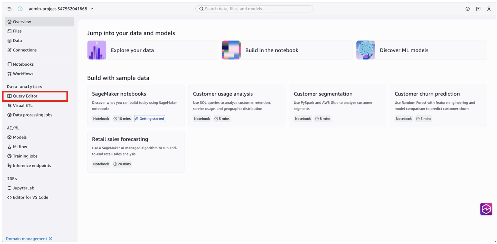
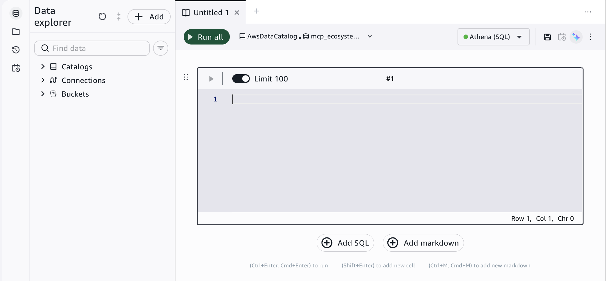
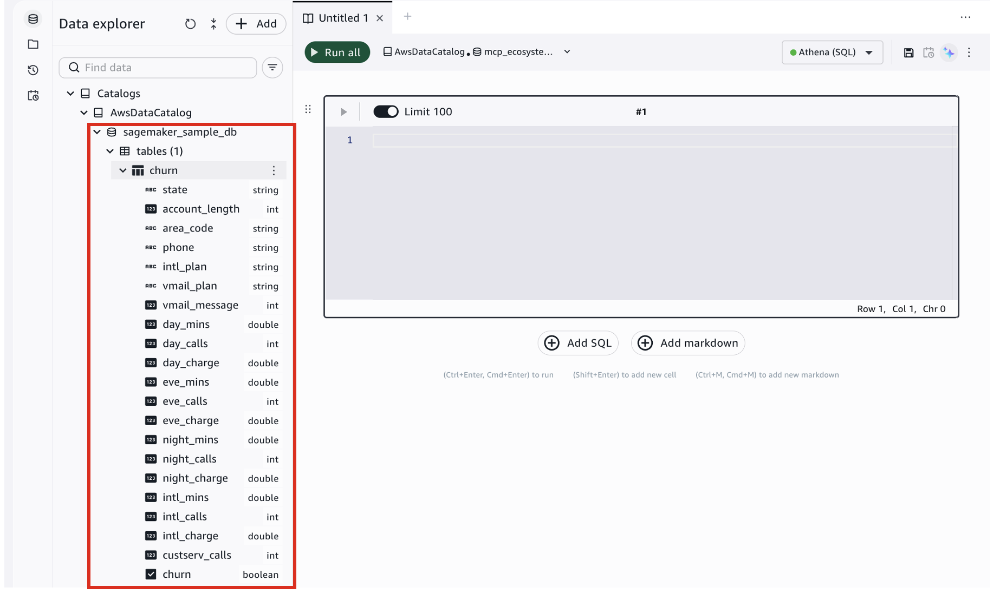
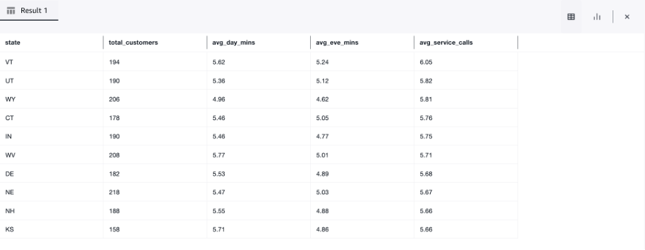
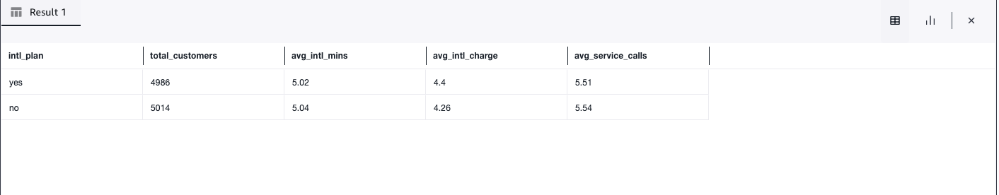
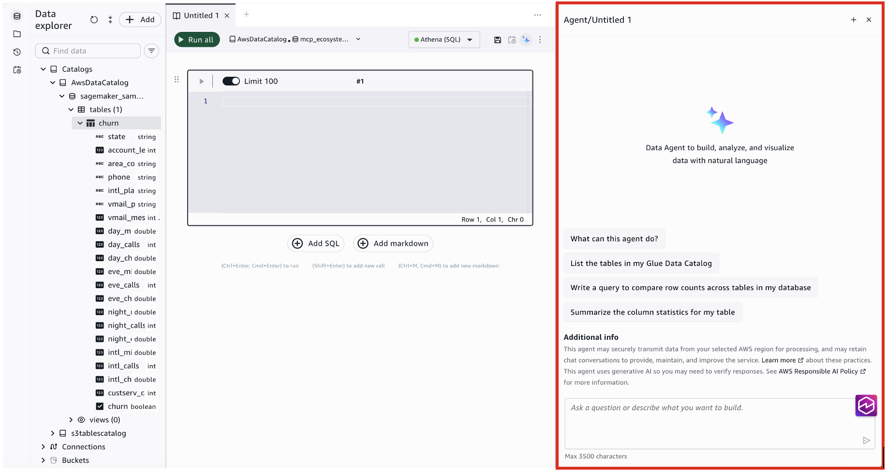
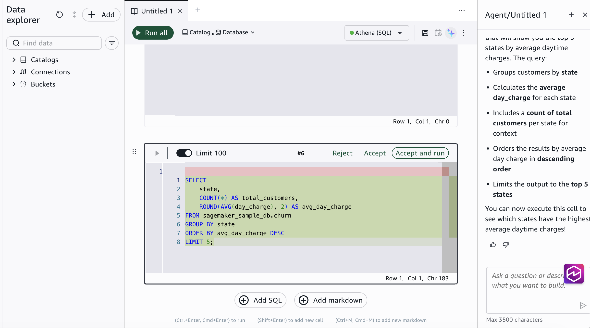
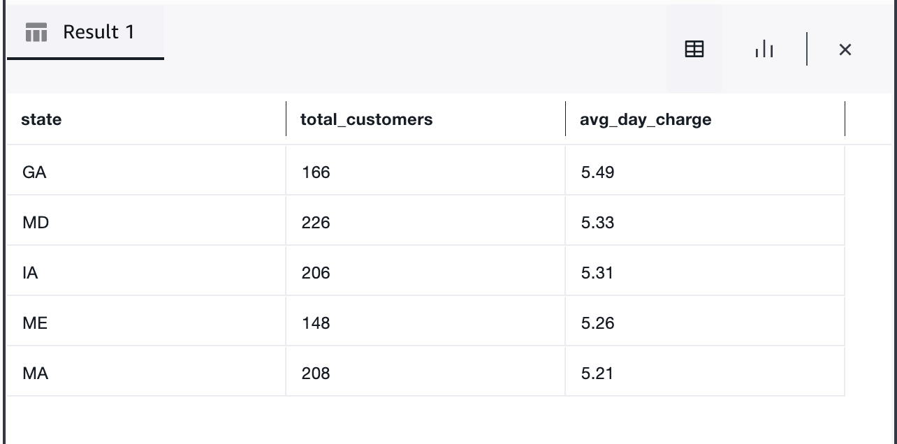

# Run your first SQL query

**Time:** 5 minutes

**Prerequisites:** As a member of a SageMaker Unified Studio
project, your IAM role needs the following managed policies:

- [SageMakerStudioUserIAMConsolePolicy](../adminguide/security-iam-awsmanpol-SageMakerStudioUserIAMConsolePolicy.md "../adminguide/security-iam-awsmanpol-SageMakerStudioUserIAMConsolePolicy.md")
  to sign in and access the project.
- [SageMakerStudioUserIAMDefaultExecutionPolicy](../adminguide/security-iam-awsmanpol-SageMakerStudioUserIAMDefaultExecutionPolicy.md "../adminguide/security-iam-awsmanpol-SageMakerStudioUserIAMDefaultExecutionPolicy.md")
  to access data and resources within the project.
  If you don't have access, contact your administrator. If you are the administrator
  who set up the project, you already have the required permissions.

**Outcome:** You query sample data using the built-in
query editor, see results inline, and understand how to browse your data catalog.

## What you will do

In this tutorial, you will:

- Open the query editor in your project
- Browse available tables in the data catalog
- Write and run a SQL query on sample data
- View and explore the results

SageMaker Unified Studio includes a built-in query editor that lets you write SQL queries
against data stored in your lakehouse. The data can be in Amazon S3, Amazon Redshift, or
other connected sources. You don't need to set up a separate query tool or configure
credentials. Everything is already connected through your project.

## Step 1: Open the query editor

1. When you first sign in to SageMaker Unified Studio, you are in your
   default project. If you need to switch projects, use the project selector at the top
   of the page.
2. In the left navigation bar, choose **Query editor**
   under **Data analytics**.



This opens a _querybook_, an interactive SQL notebook where you can
write multiple queries, add notes in markdown, and visualize results in one place.



###### What is a querybook?

A querybook is like a notebook for SQL. Each cell contains a SQL query or markdown
text. You can run cells individually or all at once, and results appear inline below each
query.

## Step 2: Browse your data

Before writing a query, review what data is available.

1. In the data explorer panel on the left side, expand
   **Catalogs**, then expand
   **AWSDataCatalog**.
2. Expand the **sagemaker_sample_db** database to see
   its tables. You should see a **churn** table.
3. Choose the **churn** table and review its columns
   and data types. This is sample data that was pre-configured in your
   project.



## Step 3: Run a SQL query

Now query the sample data. Copy the following SQL into a querybook cell:

```
SELECT
    state,
    COUNT(*) AS total_customers,
    ROUND(AVG(day_mins), 2) AS avg_day_mins,
    ROUND(AVG(eve_mins), 2) AS avg_eve_mins,
    ROUND(AVG(custserv_calls), 2) AS avg_service_calls
FROM sagemaker_sample_db.churn
GROUP BY state
ORDER BY avg_service_calls DESC
LIMIT 10;
```

This query analyzes customer usage patterns by state. For each state, it calculates the
total number of customers, their average daytime and evening minutes, and how often they
contact customer service. The results show the top 10 states with the highest
average service calls.

1. Paste the query into the SQL cell.
2. Choose **Athena (SQL)** from the engine
   selector dropdown at the top of the querybook.
3. Choose the **Run** button (▶) next to the
   cell.
4. Results appear in a table directly below the cell.

###### Which query engine is running this?

By default, your query runs on _Amazon Athena_, a serverless query
engine that reads data directly from Amazon S3 without requiring you to load it into a
database first. You can also switch to Amazon Redshift for data warehouse workloads using
the engine selector in the querybook. You do not need to know the details of either engine
to get started. Write standard SQL.

## Step 4: Explore your results

After your query runs, the results table shows each state with its usage metrics. You
can:

- **Sort columns** by choosing column
  headers.
- **Download results** as a CSV file using the
  download button.
- **Add another query** by choosing the
  **+** button to add a new SQL cell.



Try a different query. For example, compare usage patterns for customers with and without
an international plan:

```
SELECT
    intl_plan,
    COUNT(*) AS total_customers,
    ROUND(AVG(intl_mins), 2) AS avg_intl_mins,
    ROUND(AVG(intl_charge), 2) AS avg_intl_charge,
    ROUND(AVG(custserv_calls), 2) AS avg_service_calls
FROM sagemaker_sample_db.churn
GROUP BY intl_plan;
```

This shows whether customers with an international plan use more international minutes
and how their support call patterns compare.



## Ask in natural language

Instead of writing SQL yourself, you can ask the **Data Agent**
to generate a query for you.

1. In the querybook, choose the **Chat with AI**
   icon in the top navigation bar. The Data Agent panel opens on the right
   side.
2. In the **Ask a question** text box at the
   bottom of the panel, type what you want in plain English, for example:
   _"Show me the top 5 states by average daytime charges"_
3. The Data Agent generates the SQL for you. Review it, then run it. The Data
   Agent has access to your project's data catalog, so it can identify which tables and columns are
   available.



After the Data Agent generates a query, choose **Accept**
to insert it into a querybook cell, then choose **Run**.



The results appear in a table below the cell.



###### SQL in notebooks

You can also run SQL queries in a notebook using SQL cells. Notebooks let you
combine SQL with Python code, visualizations, and markdown notes in a single
document.

## What you learned

In this tutorial, you:

- Opened the query editor and browsed available data in the catalog
- Wrote and ran a SQL query to analyze customer usage by state
- Explored results and ran a second query to compare international plan
  usage
- Used the Data Agent to generate SQL from natural language
