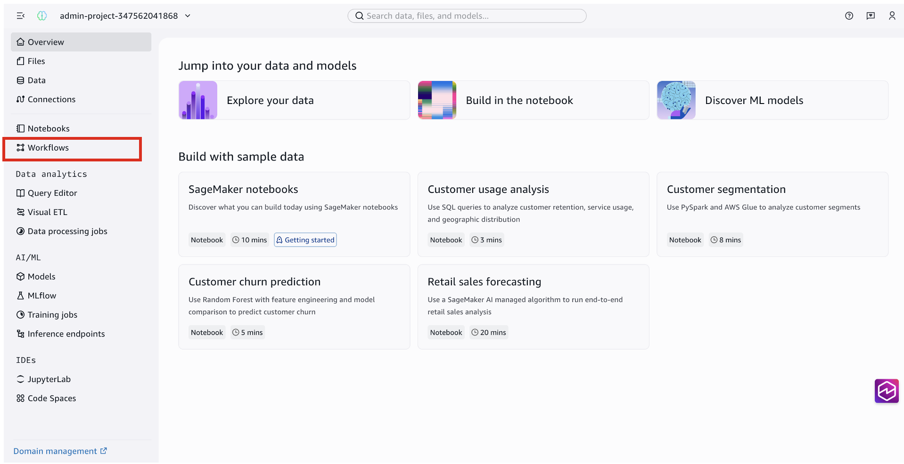
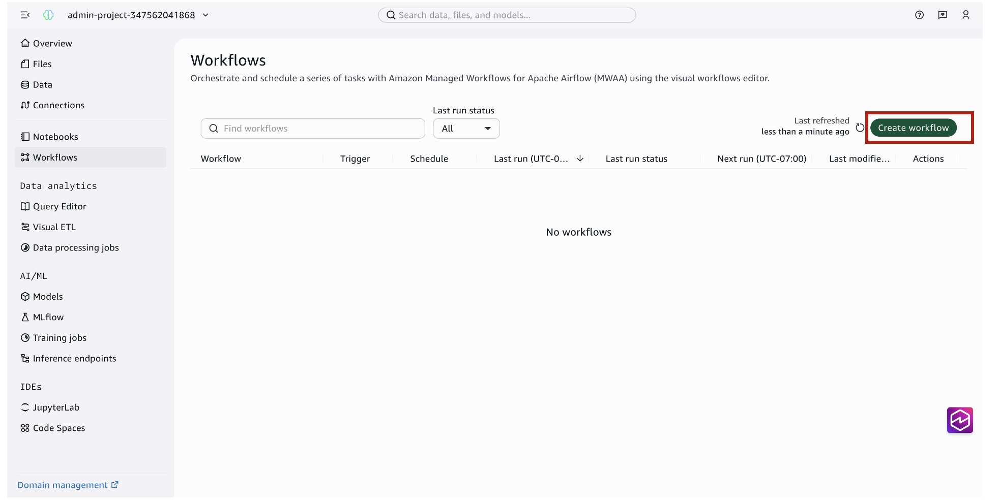
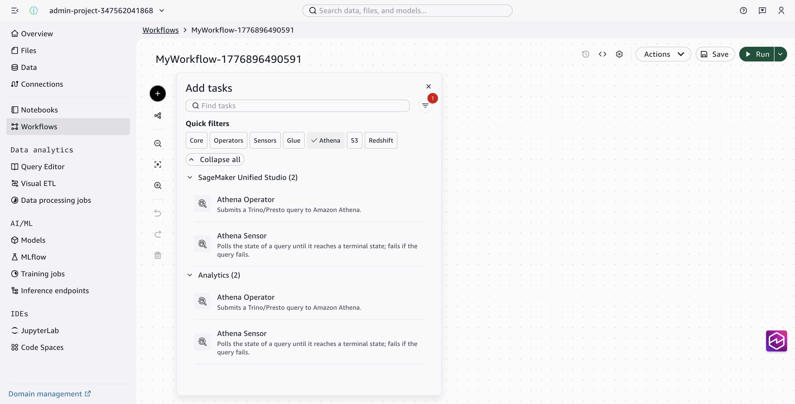
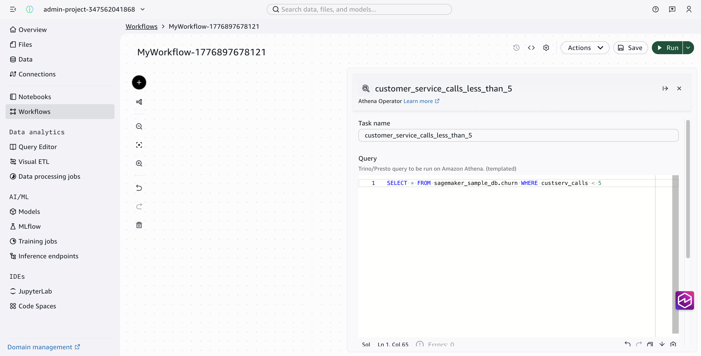
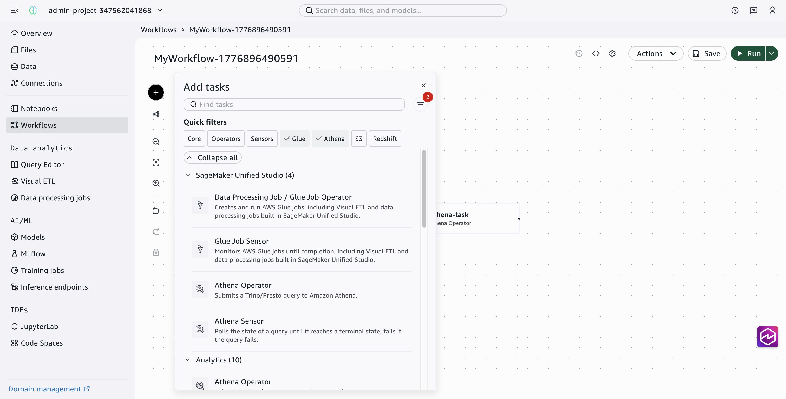
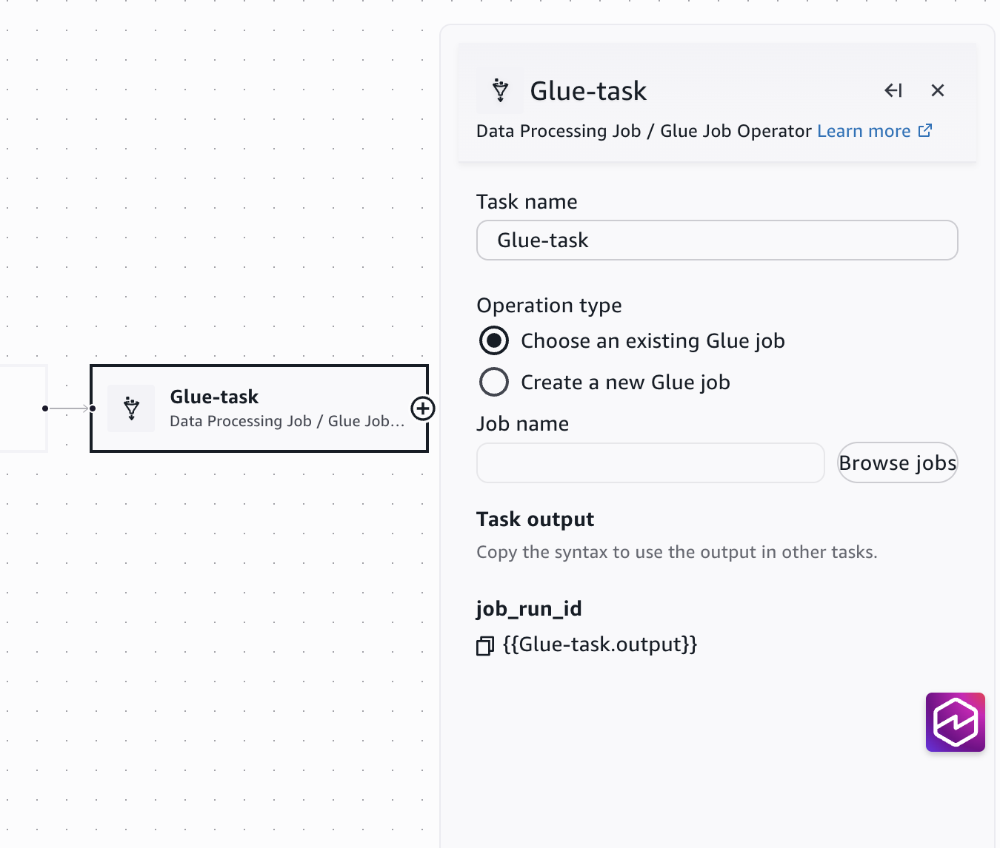
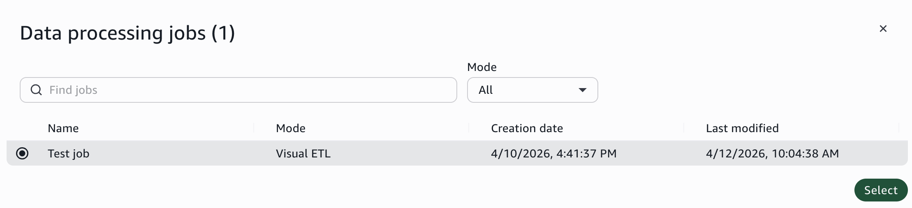
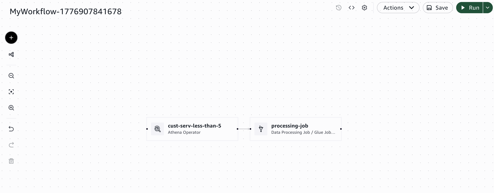
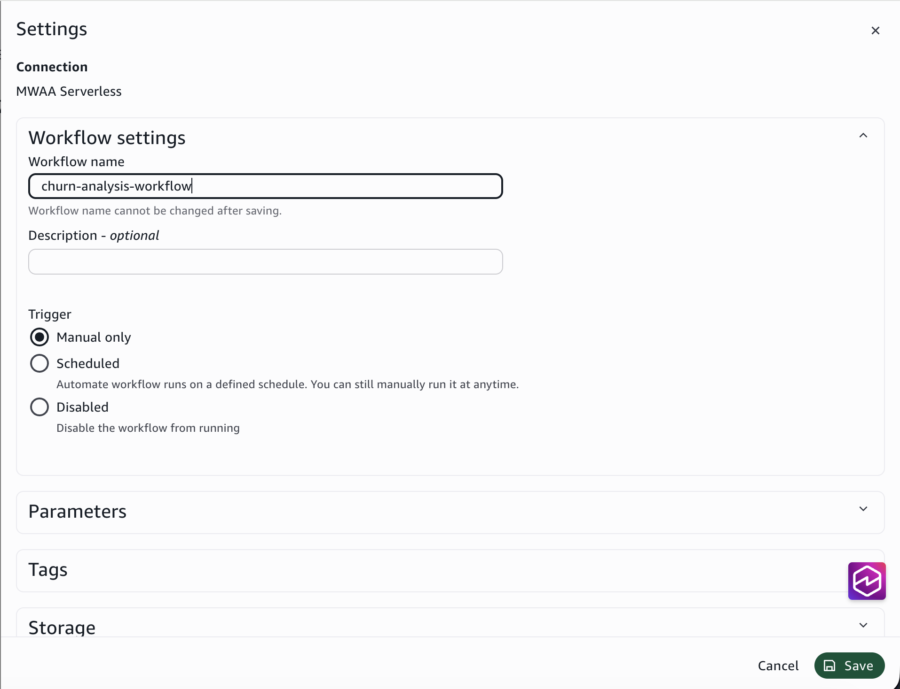
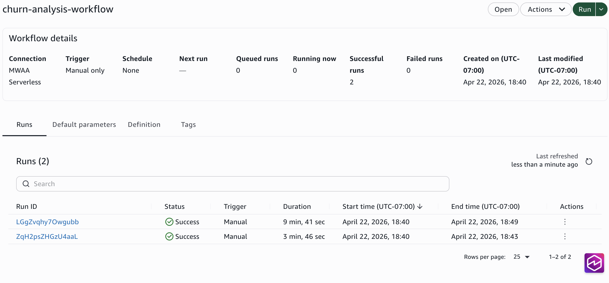

# Automate a data pipeline with workflows

**Time:** 10 minutes

**Prerequisites:** As a member of a SageMaker Unified Studio
project, your IAM role needs the following managed policies:

- [SageMakerStudioUserIAMConsolePolicy](../adminguide/security-iam-awsmanpol-SageMakerStudioUserIAMConsolePolicy.md "../adminguide/security-iam-awsmanpol-SageMakerStudioUserIAMConsolePolicy.md")
  to sign in and access the project.
- [SageMakerStudioUserIAMDefaultExecutionPolicy](../adminguide/security-iam-awsmanpol-SageMakerStudioUserIAMDefaultExecutionPolicy.md "../adminguide/security-iam-awsmanpol-SageMakerStudioUserIAMDefaultExecutionPolicy.md")
  to access data and resources within the project.
  If you don't have access, contact your administrator. If you are the administrator
  who set up the project, you already have the required permissions.

###### Important

Before you begin, complete
[Build a data pipeline with visual ETL](gs-etl.md "gs-etl.md"). You need the visual ETL job you
created in that tutorial.

**Outcome:** You create a workflow that chains together an
Athena query and a visual ETL job into an automated, multi-step data pipeline — without
writing orchestration code.

## What you will do

In this tutorial, you will:

- Create a workflow in your project
- Add an Athena operator that queries the sample churn table
- Add a visual ETL job task that runs the pipeline you built in the previous
  tutorial
- Run the workflow and verify that all tasks complete successfully

A workflow lets you chain multiple tasks — queries, ETL jobs, notebooks — into a
single automated pipeline. Each task runs in order, so downstream steps can depend on the
output of earlier ones. Workflows run on Amazon Managed Workflows for Apache Airflow
(Amazon MWAA), but you don't need to know Airflow to use the visual workflow
editor.

## Step 1: Create a workflow

1. Go to your project using the menu at the top of the page.
2. In the left navigation pane, choose **Workflows**.

 3. Choose **Create workflow**.



The workflow editor opens with an empty canvas and an
**Add tasks** panel on the left. This is where you define
the sequence of tasks that make up your pipeline.

## Step 2: Add an Athena query task

The first task in the workflow checks the original churn table for rows where
`custserv_calls` is less than 5. This gives you a baseline before the ETL
job runs.

1. In the **Add tasks** panel, use the
   **Athena** quick filter to narrow the task
   list.
2. Under **SageMaker Unified Studio**, choose
   **Athena Operator**.

 3. Choose the task node on the canvas to open its configuration
panel. 4. For **Task name**, enter
`customer_service_calls_less_than_5`. 5. In the **Query editor**, enter the following
SQL:

```
SELECT * FROM sagemaker_sample_db.churn WHERE custserv_calls < 5
```



###### Why this query?

In the visual ETL tutorial, you filtered the churn table to keep only rows where
`custserv_calls > 5`. This Athena query checks the complement — rows where
`custserv_calls < 5` — so you can confirm both halves of the data are
accounted for.

## Step 3: Add a visual ETL job task

Next, add the visual ETL job you created in the previous tutorial as the second task
in the workflow.

1. Choose the **+** button to open the
   **Add tasks** panel again.
2. Use the **Glue** quick filter to narrow the
   task list.
3. Under **SageMaker Unified Studio**, choose
   **Data Processing Job / Glue Job Operator**.

 4. Choose the task node on the canvas to open its configuration
panel.

 5. For **Task name**, enter
`processing_job`. 6. In the configuration panel, choose
**Use existing job**. 7. Choose **Browse jobs** and select the visual
ETL job you created in the
[Build a data pipeline with visual ETL](gs-etl.md "gs-etl.md") tutorial.



###### Create or reuse

You can either create a new job directly within the workflow or reuse an existing
one. Reusing a job is a good practice when you've already tested and validated a
pipeline — it avoids duplication and keeps your project organized.

- Connect the two tasks by dragging from the output handle (right dot) of the
  Athena task to the input handle (left dot) of the Glue task.



Your workflow canvas now shows two tasks connected in sequence: Athena query →
Visual ETL job.

## Step 4: Save and run the workflow

1. Enter a name for your workflow in the title field at the top of the canvas:
   `churn-analysis-workflow`.
2. Choose **Save** to save the
   workflow.
3. Choose **Run**.

The workflow begins executing. Each task runs in sequence — the Athena query first,
then the visual ETL job. The visual ETL job step might take several minutes to complete,
similar to when you ran it on its own.

###### Scheduling

In production, you can schedule this workflow to run on a recurring basis — for
example, daily or triggered by new data. You can configure a schedule from the
**Settings** panel, where you can choose
**Manual only**,
**Scheduled**, or
**Disabled**.



## Step 5: Verify the output

After the workflow run completes, verify that both tasks succeeded.

1. Check the workflow run status. Both tasks show a
   **Succeeded** status.
2. To verify the ETL output, navigate to the S3 output folder (for example,
   `shared/filtered-churn/`) in the **Data
   explorer** and confirm Parquet files are present with the filtered
   data.



###### Troubleshooting

If a task fails, choose the failed task in the workflow canvas to view its error
details. Common issues include IAM permission errors or incorrect S3 paths.

## What you learned

In this tutorial, you:

- Created a workflow that chains multiple task types into a single
  pipeline
- Used an Athena operator to query sample data directly
- Reused an existing visual ETL job as a workflow task
- Ran the workflow and verified end-to-end execution

Workflows let you combine queries, ETL jobs, notebooks, and more into repeatable,
automated pipelines. As your data processing needs grow, you can add more tasks, set up
schedules, and build dependencies between steps — all from the visual workflow
editor.
