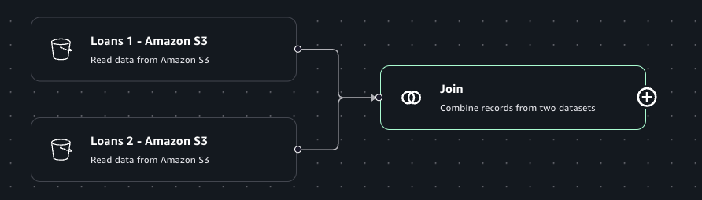

# Join transform

The Join transform allows you to combine two datasets into one. You specify the key
names in the schema of each dataset to compare. The output frame contains rows where keys
meet the join condition. The rows in each dataset that meet the join condition are combined
into a single row in the output from that contains all the columns found in either dataset.
You can select from one of the following join types: Inner, Left, Right, Full, Cross, Semi,
and Anti.

###### To add a Join node to your job diagram

1. Open the menu and then choose Join to add a new transform to your job diagram, if
   needed.
2. (Optional) Click on the rename node icon to enter a new name for the node in the job
   diagram.
3. Optional) Ensure two data sources are connected to the Join node.
4. Modify the input schema:
   1. Select a join type from the "Join type" dropdown menu.Optional).
   2. Select a column for the "Left data source" using the dropdown menu.
   3. Select a column for the "Right data source" using the dropdown menu.

5. (Optional) After configuring the node properties and transform properties, you can
   preview the modified dataset by choosing the Data preview tab in the node details
   panel.

###### Note

If you have columns using the same names in your data sources, the join will result
in a COLUMN_ALREADY_EXISTS error. To avoid this error, either: (1) use Rename columns
before the join for one of your data sources or (2) use Drop Columns after the join to
remove both duplicated columns.
