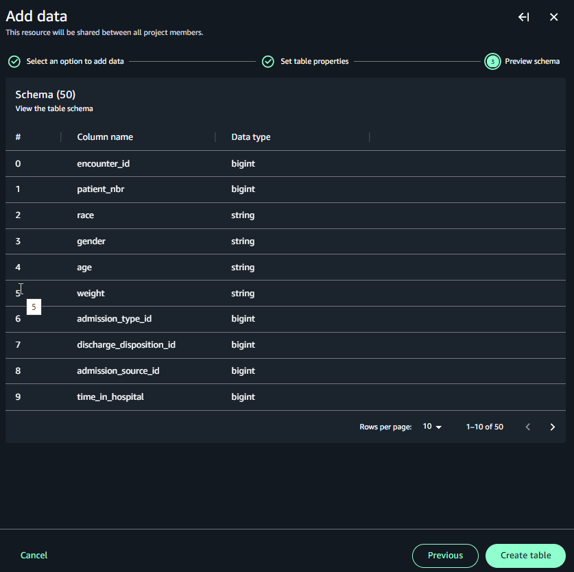
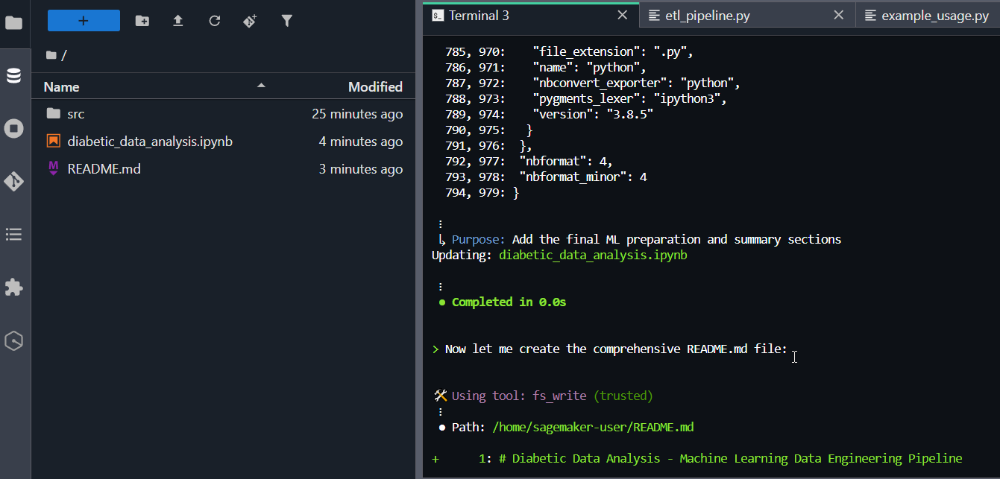
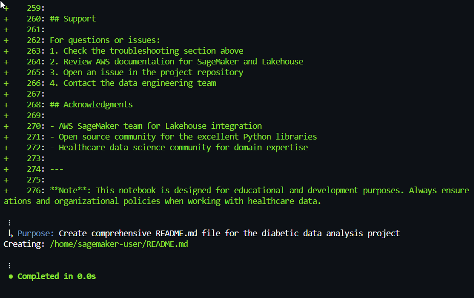
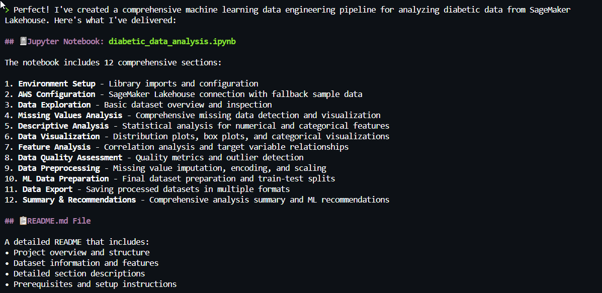
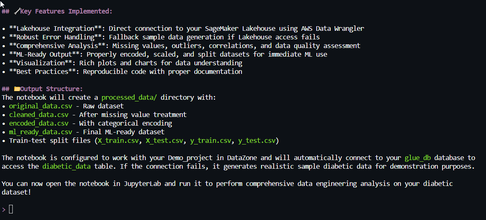

# Getting started with Q CLI

Use Q CLI as follows. Make sure you are signed in with an ID that is configured for Q CLI
access. For more information about signing up, see [About signing up](q-actions.md#q-actions-aboutsignup "q-actions.md#q-actions-aboutsignup").

1. Log in to your AWS account and navigate to the access portal, such as with your SSO
   login.

Open the SageMaker Unified Studio through the access portal, and then navigate to your
project. 2. Open a Jupyter notebook by choosing **Build,** and then
choosing **JupyterLab**. Choose the icon for the python or
console interface. A Jupyter notebook cell page opens. 3. Open a terminal window by choosing **New**, and then
**Terminal**. 4. Type the following to open Q CLI.

```
q chat
```

You can get started using Q CLI with the following examples.

## Example 1: Create a Glue table and

create a python notebook for analysis

This example shows how Q CLI can perform complex command line procedures for you, such
as creating and visualizing data for a sample python notebook for a data engineer analyzing
a Glue table in your project Lakehouse sample data source.

1. Download the diabetic data sample data set from the [sample data](https://archive.ics.uci.edu/dataset/296/diabetes+130-us+hospitals+for+years+1999-2008 "https://archive.ics.uci.edu/dataset/296/diabetes+130-us+hospitals+for+years+1999-2008") site.
2. Create a new Glue table named `diabetic_data` and add the sample data
   that you just downloaded as a data source. Choose **Create table**. A
   schema shows for the sample table.

 3. In the terminal for Q CLI, enter the following.

```
You are a machine learning engineer, and you are working with data from the data engineer. Your responsibility is to analyze the output data in your notebook. Can you help me to create a python notebook for the following.
		- Use the diabetic_data dataset in SageMaker Lakehouse.
		- Create a notebook to perform typical data engineering tasks for the machine learning experience in JupyterLab.
		- Make sure to handle missing values, perform descriptive analysis, feature analysis
              - Create a comprehensive README.md file

```

The following diagram shows the response where Q CLI asks questions and creates
sample files.

 4. The following diagram shows the response where Q CLI interacts with you while
creating the files.

 5. The following diagram shows the response where Q CLI provides the outline and
description of what will be created.

 6. The following diagram shows the response where Q CLI summarizes the files and their
purpose.



## Example 2: Ask Q CLI to list

project information

This example shows how Q CLI can provide context aware and complex command line help for
your projects and data.

- In the terminal, enter the following.

```
Can you tell me my project and domain information?
```

The response provides you with project information.
