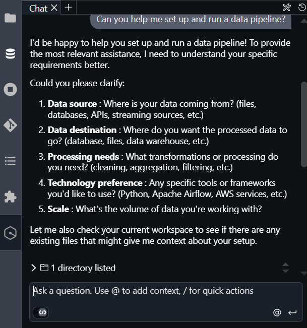
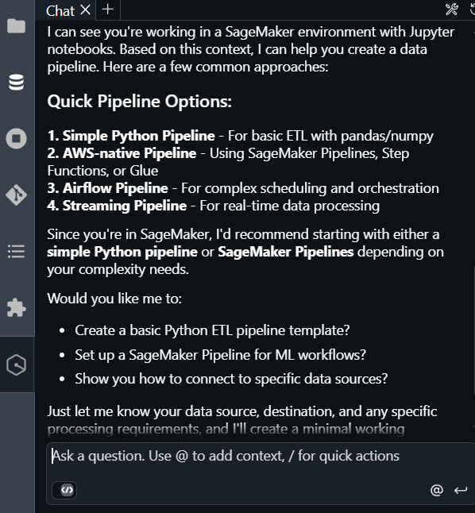
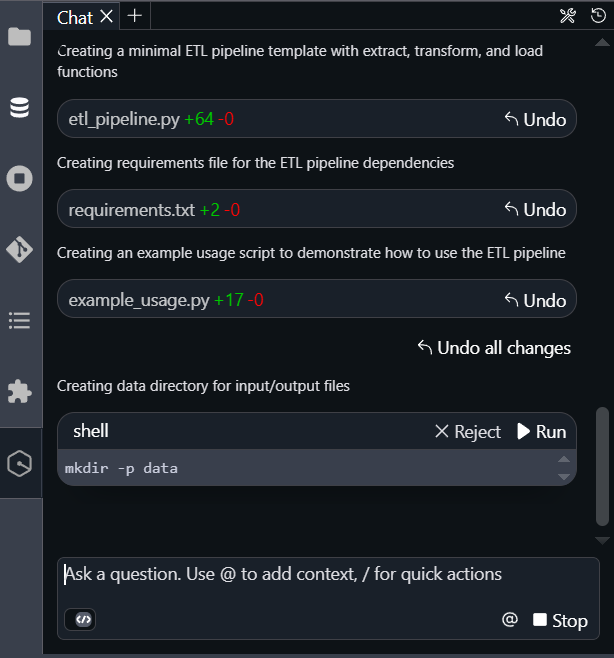
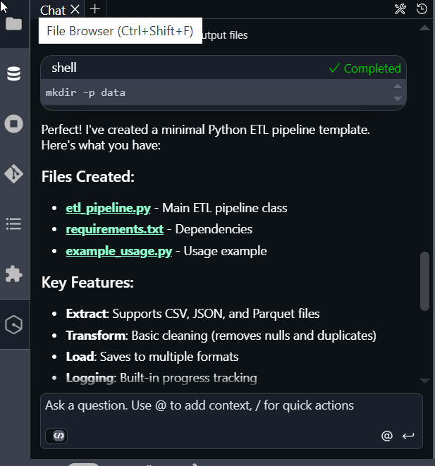
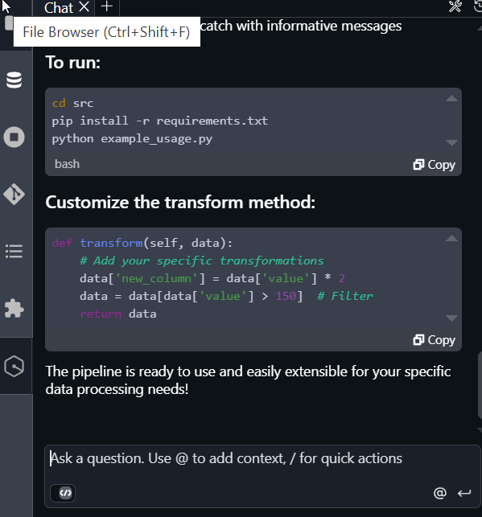
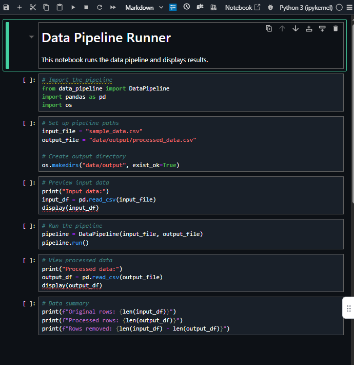

# Getting started using Q chat

Use Q chat as follows. Make sure you are signed in with an ID that is configured for Q
chat access.

1. Log in to your AWS account and navigate to the access portal, such as with your SSO
   login.

Open the SageMaker Unified Studio console through the access portal, and then navigate
to your project. 2. Open a Jupyter notebook by choosing **Build**, and then
choosing **JupyterLab**. A Jupyter notebook cell page
opens. 3. Choose the icon on the left for Q chat with Amazon Q Developer. If this is the first time, a
message displays for you to acknowledge the AWS policies for responsible AI.

 4. Keep the toggle for **Agentic coding** ON. 5. Type questions to interact with Q chat. Type over the **Ask a
question...** line.
You can get started using Q chat with the following examples.

## Example 1: Ask for information about your project

This example shows how Q chat can provide context aware responses for your project
resources.

1. To open JupyterLab, choose **Build**, and then choose
   **JupyterLab**. If you are in JupyterLab, you can chat with Q with
   additional Amazon Q chat contextual awareness.
2. In the Q chat field, enter the following.

```
Can you tell me about my project?
```

The response returns where Q asks follow-up questions and shows your files.

## Example 2: Create and run a data

pipeline

This example shows how Q chat can perform complex tasks for you, such as creating and
running a data pipeline in your project.

1. To open JupyterLab, choose **Build**, and then choose
   **JupyterLab**. If you are in JupyterLab, you can chat with Q with
   additional Amazon Q chat contextual awareness.
2. In the Q chat field, enter the following.

```
Can you help me set up and run a data pipeline?
```

The following diagram shows the response.



The following image shows Q asking questions and explaining the task.



The following image shows Q creating the shell file for you in your
workspace.



The following image shows Q creating the files and describing them.



The following image shows Q providing the instructions to run the pipeline.



The following image shows the notebook file that Q created for you in your
workspace.

 3. ###### Get access to data

Before visualizing data, you might need to request access to the data by subscribing
to data in Amazon SageMaker Catalog. 4. ###### Create new connections

You can create connections directly to Amazon Redshift and other third party sources like
Oracle and Snowflake from Amazon SageMaker Unified Studio. You configure connection details and credentials
securely, and you can manage them within the project. For detailed steps, see [Amazon Redshift compute
connections](compute-redshift.md "compute-redshift.md") and [Data
connections in lakehouse architecture](lakehouse-data-connection.md "lakehouse-data-connection.md").
