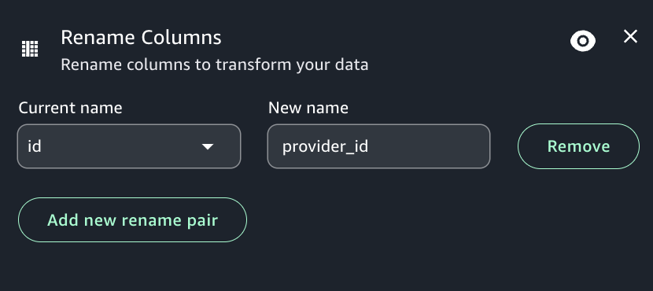

# Rename columns transform

You can use the Rename columns transform to change the name of multiple columns in the
dataset. You select a column that you want to rename from a list of available columns and
provide the string that you want to update the column name to.

###### To add a Rename columns node to your job diagram

1. Open the menu and then choose Rename columns to add a new transform to your job
   diagram, if needed.
2. (Optional) Click on the rename node icon to enter a new name for the node in the job
   diagram.
3. Modify the input schema:
   1. Select "Add new rename pair".
   2. Select the current column to rename from the "Current name" column.
   3. Provide a name for the column in the "New name" box.

4. (Optional) After configuring the node properties and transform properties, you can
   preview the modified dataset by choosing the Data preview tab in the node details
   panel.

