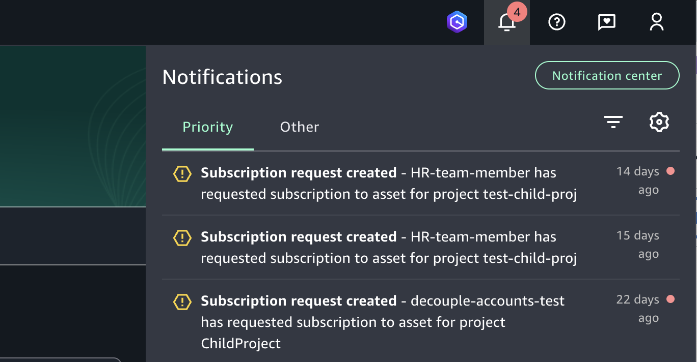
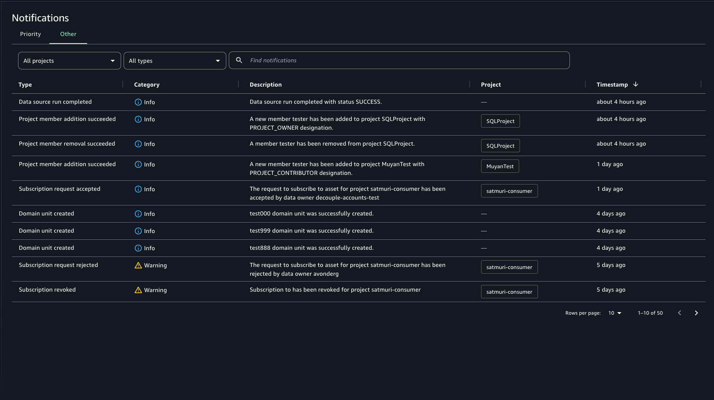

# Amazon SageMaker Unified Studio events and notifications

SageMaker Unified Studio keeps you informed of important activities within the Amazon SageMaker Unified Studio using categories, such as critical workflow, info, error, and warning. This mechanism informs stakeholders about activities within SageMaker Unified Studio using events, like a subscription requested, task/job completion, while notifications alert users about these events in the portal, or customized via emails or in-app alerts. With events and notifications, SageMaker Unified Studio provides you updates on various activities across projects and users by delivering messages in the dedicated inbox in the data portal.

## Events via the dedicated inbox in the Amazon SageMaker Unified Studio

SageMaker Unified Studio provides a dedicated inbox in the SageMaker Unified Studio where you can see and take action on your messages. Recent messages will surface regardless of which page the user is viewing. For example, if a user requests access to a data asset, publishing project's owners and contributors of that asset see the request in the data portal and once an action is taken, project members of the subscribing project related to this request see the notification in the data portal. There are four categories of events:

- Error - Signal critical issues that halt progress requiring immediate intervention to restore functionality or resolve the problem. Trigger: System event.
- Critical workflow - these messages inform the recipient that there is action needed somewhere. They have an optional status field which you can use for tracking. Trigger: User action or system event.
- Info - these messages are informational and have no assigned status. Events provide an audit trail of recent updates. Trigger: User action or system event.
- Warning - these messages alert users of potential problems that need attention to prevent future failures but does not require immediate action. Trigger: System event.

In Amazon SageMaker Unified Studio, notifications are generated for the following events with detail types:

| Notification Component    | Event Detail Type                   | Event Description                                                                                  |
| ------------------------- | ----------------------------------- | -------------------------------------------------------------------------------------------------- |
| Domain unit               | Domain Unit Created                 | Event is generated when domain unit creation succeeds                                              |
| Domain unit               | Domain Unit Updated                 | Event is generated when domain unit update succeeds                                                |
| Domain unit               | Domain Unit Deleted                 | Event is generated when domain unit deletion succeeds                                              |
| Domain unit               | Domain Unit Owner Added             | Event is generated when domain unit owner is added successfully                                    |
| Domain unit               | Domain Unit Owner Removed           | Event is generated when domain unit owner is added successfully                                    |
| Policy grant              | Policy Grant Added                  | Event is generated when domain unit policy grant is added successfully                             |
| Policy grant              | Policy Grant Removed                | Event is generated when domain unit policy grant is removed successfully                           |
| Project membership        | Project Member Addition Succeeded   | Event is generated when a new member is added to a project                                         |
| Project membership        | Project Member Removal Succeeded    | Event is generated when a member is removed to a project                                           |
| Data source run           | Data Source Run Complete            | Event is generated when a new data source is created                                               |
| Catalog asset             | Business Name Generation Succeeded  | Event is generated when the automated business name generated job completes successfully           |
| Catalog asset             | Business Name Generation Failed     | Event is generated when the automated business name generated job fails                            |
| Catalog asset             | Metadata Generation Succeeded       | Event is generated when asset metadata automatic generation succeeds                               |
| Catalog asset             | Metadata Generation Failed          | Event is generated when asset metadata automatic generation fails                                  |
| Catalog asset             | Metadata Generation Canceled        | Event is generated when automatically generated metadata is canceled                               |
| Catalog asset             | Metadata Generation Accepted        | Event is generated when automatically generated metadata is approved                               |
| Catalog asset             | Metadata Generation Rejected        | Event is generated when automatically generated metadata is rejected                               |
| Subscription              | Subscription Request Created        | Event is generated when a subscription request is created                                          |
| Subscription              | Subscription Request Accepted       | Event is generated when a subscription request is accepted                                         |
| Subscription              | Subscription Request Rejected       | Event is generated when a subscription request is rejected                                         |
| Subscription              | Subscription Request Deleted        | Event is generated when a subscription request is deleted                                          |
| Subscription              | Subscription Revoked                | Event is generated when a subscription is rejected by the publlishing project owner or contributor |
| Subscription              | Subscription Auto Fulfill Completed | Event is generated when a subscription request is automatically fulfilled successfully             |
| Search                    | Invalid Filter Detected             | Event is generated when an asset schema changed and invalid filter detected                        |
| Data Product              | Data Product Added To Catalog       | Event is generated when an data product is published to catalog                                    |
| Data Product Subscription | Subscribed Data Product Updated     | Event is generated when an subscribed data product is updated                                      |

To view priority items in your data portal inbox, complete the following steps:

1. Navigate to the Amazon SageMaker Unified Studio using the data portal URL and log in using your SSO or AWS credentials. If you’re an SageMaker Unified Studio administrator, you can obtain the data portal URL by accessing the SageMaker Unified Studio console at [https://console.aws.amazon.com/datazone](https://console.aws.amazon.com/datazone "https://console.aws.amazon.com/datazone") in the AWS account where the SageMaker Unified Studio domain was created.
2. In the portal, to view a pop up with the recent set of notifications, select the bell icon in the top-right corner of the header.
3. Select Notification Center to view all notifications. You can change views and see all priority items by selecting the Priority tab.
4. You can filter the search by the notification subject, project scope, or category.
5. Choose any individual priority notification to navigate to the location where you can respond to the task.

To view other informative events in your data portal inbox, complete the following steps:

1. Navigate to the Amazon SageMaker Unified Studio using the portal URL and log in using your SSO or AWS credentials. If you’re an SageMaker Unified Studio administrator, you can obtain the data portal URL by accessing the SageMaker Unified Studio console at [https://console.aws.amazon.com/datazone](https://console.aws.amazon.com/datazone "https://console.aws.amazon.com/datazone") in the AWS account where the SageMaker Unified Studio domain was created.
2. In the data portal, to view the pop up for the recent set of events, select the bell icon in the top-right corner of the header.
3. Select Notification Center to view all events. You can change views and see all tasks by selecting the "Other" tab.
4. Filter the search by the notification subject, project scope, or category.
5. Choose any individual notification to navigate to the location where you can view details about that event.
