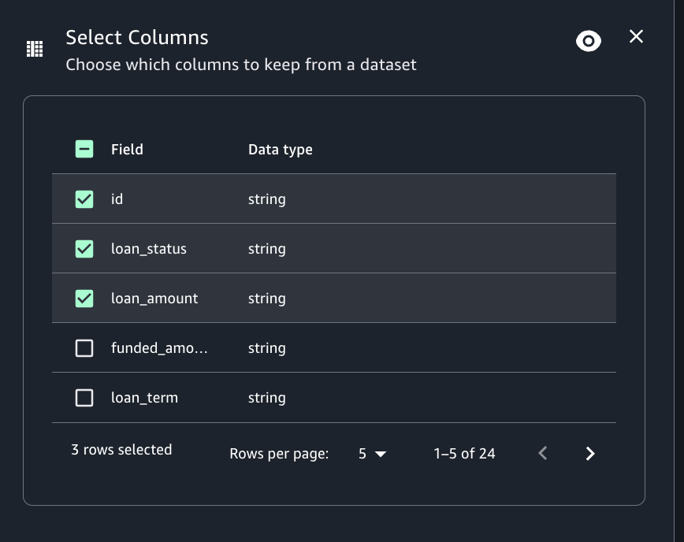

# Select columns transform

You can create a subset of columns in a dataset using the Select columns transform. You
indicate which columns you want to keep and the rest are removed from the dataset.

###### To add a Select columns node to your job diagram

1. Open the menu and then choose Filter to add a new transform to your job diagram, if
   needed.
2. (Optional) Click on the rename node icon to enter a new name for the node in the job
   diagram.
3. Modify the input schema:
   1. Select the columns you want to keep in the output frame by checking the
      corresponding box under the "Field" option.

4. (Optional) After configuring the node properties and transform properties, you can
   preview the modified dataset by choosing the Data preview tab in the node details
   panel.

