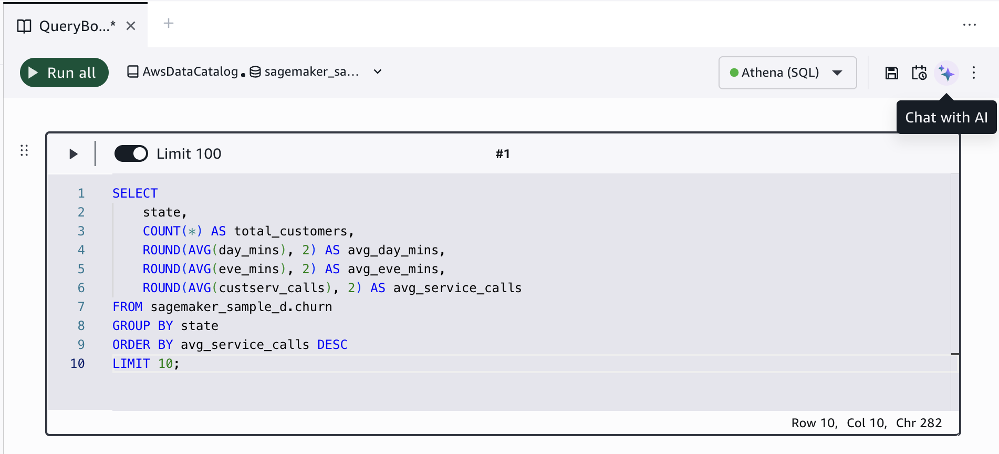
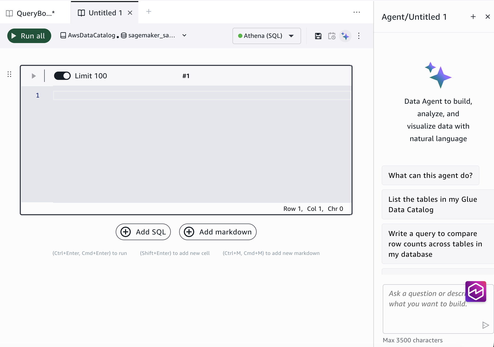
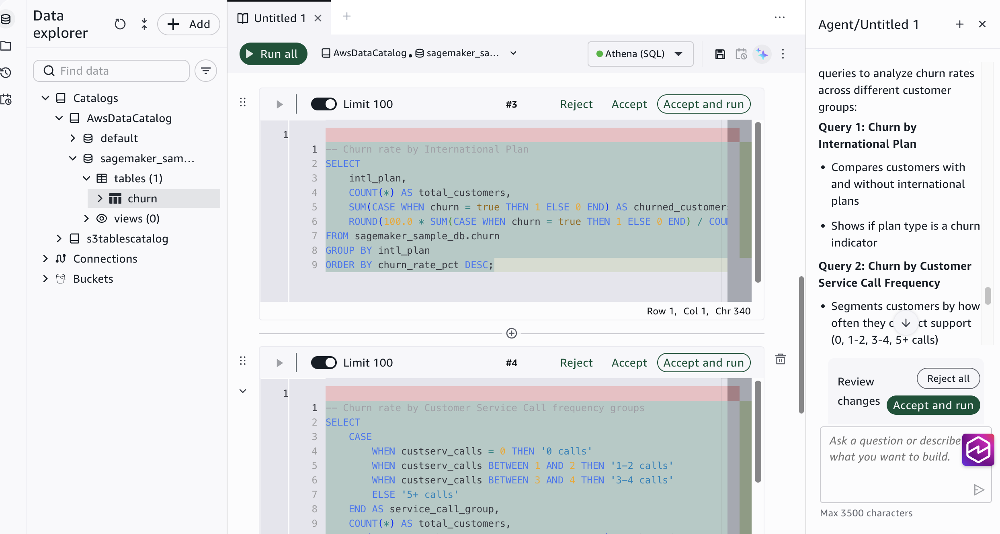
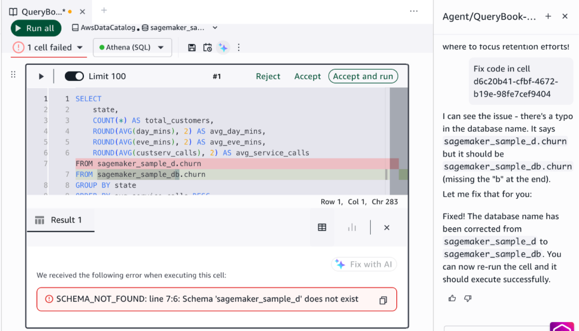

# Generate SQL with the Data Agent

The SageMaker Data Agent is a conversational SQL assistant built into the query
editor. Describe what you want to analyze in plain language, and the agent generates
SQL queries based on your data catalog. The agent supports multi-turn conversations,
so you can ask follow-up questions, request modifications, and get help fixing
errors.

## Open the Data Agent panel

1. In the query editor, choose the **Chat with
   AI** icon in the top-right action bar.

The agent panel opens on the right side of the editor with sample prompts and
a chat input.

## Ask a question and generate SQL

Type a natural language description of what you want to query. The agent
analyzes your data catalog and generates SQL.

Example prompts:

- "What are the columns in the churn table?"
- "Which tables in the analytics schema have columns related to
  customer churn?"
- "Which customer groups have the highest churn?"

For complex analytical tasks, the agent proposes a step-by-step plan before
generating SQL. You can review and approve the plan, or ask the agent to modify
it.

## Add generated SQL to your querybook

After the agent generates SQL, it automatically creates new cells in your
querybook with the generated code. You can:

- **Accept** the generated SQL and run it
  in place.
- **Reject** the generated SQL to discard
  it.
- **Accept and run** to insert the SQL and
  run it immediately.

## Multi-turn conversations

The Data Agent maintains context across messages within a conversation. You can
build on previous queries by asking follow-up questions.

## Fix errors with the Data Agent

When a query fails, the agent can analyze the error and suggest
corrections.

1. Run a query that returns an error.
2. Choose **Fix with AI** on the failed
   cell.
3. The agent diagnoses the error and generates a corrected
   query.

