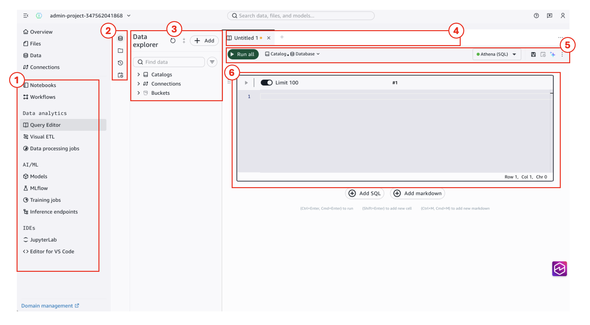
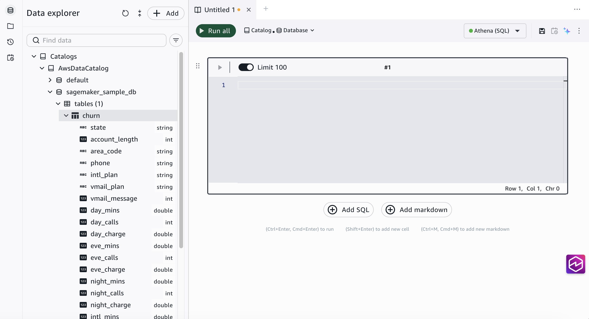
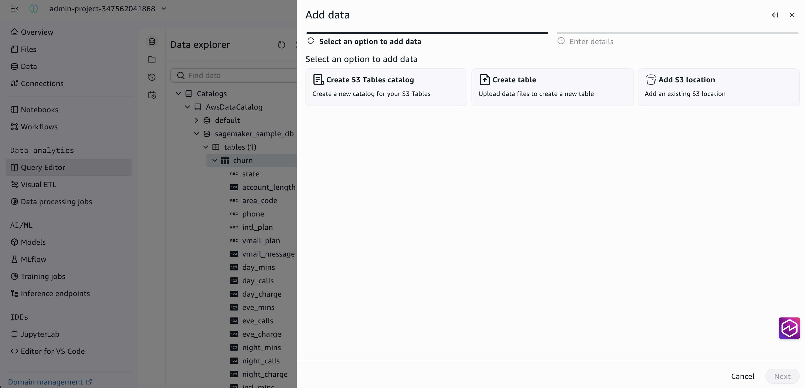
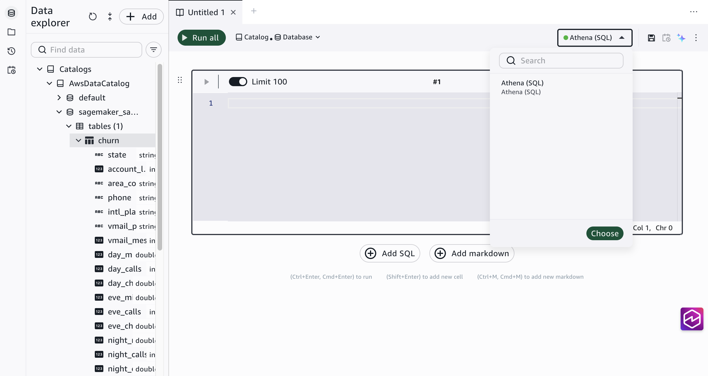

# Get started with the query editor

The query editor is where you write SQL, run queries, and visualize results in
Amazon SageMaker Unified Studio. This section walks you through opening the editor, understanding the
interface, and connecting to your data.

## Prerequisites

As a member of a Amazon SageMaker Unified Studio project, your IAM role needs the following managed
policies:

- [SageMakerStudioUserIAMConsolePolicy](../adminguide/security-iam-awsmanpol-SageMakerStudioUserIAMConsolePolicy.md "../adminguide/security-iam-awsmanpol-SageMakerStudioUserIAMConsolePolicy.md")
  to sign in and access the project.
- [SageMakerStudioUserIAMDefaultExecutionPolicy](../adminguide/security-iam-awsmanpol-SageMakerStudioUserIAMDefaultExecutionPolicy.md "../adminguide/security-iam-awsmanpol-SageMakerStudioUserIAMDefaultExecutionPolicy.md")
  to access data and resources within the project.

If you don't have access, contact your administrator. If you are the administrator
who set up the project, you already have the required permissions.

## Open the query editor

1. Go to your project using the project selector at the top of the
   page.
2. In the left navigation pane, choose
   **Query Editor**.

The query editor opens with an empty querybook tab.

## Query editor orientation

The following screenshot shows the main areas of the query editor
interface.

| #   | Element             | Description                                                                                     |
| --- | ------------------- | ----------------------------------------------------------------------------------------------- |
| 1   | Navigation sidebar  | Access project tools including Query Editor, Visual ETL, Notebooks, Workflows, and more.     |
| 2   | Panel icons         | Switch between the data explorer, file explorer, query history, and scheduled queries views. |
| 3   | Data explorer       | Browse catalogs, connections, and buckets. Search for data assets and add new data sources.  |
| 4   | Querybook tabs      | Each tab is a separate querybook. Choose + to create a new one.                                 |
| 5   | Run all and toolbar | Run all SQL cells in the querybook. Set the default catalog, database, and query engine.     |
| 6   | SQL cell            | Write SQL statements here. Each querybook can contain multiple SQL and markdown cells.       |

## Browse data in the data explorer

The data explorer panel on the left side of the query editor shows all data
assets available in your project. Use it to find tables, view column names and
types, and run sample queries.

To browse your data:

1. In the data explorer, expand a catalog to see its
   databases.
2. Expand a database to see its tables.
3. Expand a table to see its columns and data types.

Use the search bar at the top of the data explorer to find specific tables or
columns by name.

## Connect to a data source

You can add data sources to the query editor using the
**Add** button (+) in the data explorer panel.

There are three ways to add a data source:

- **Create S3 tables catalog**: Create a
  new catalog for your S3 tables.
- **Create table**: Upload data files to
  create a new table.
- **Add S3 location**: Add an existing S3
  location as a data source.

You can also add data sources from the **Connections**
page in the left navigation pane. Connections configured there are available across all
project tools, including the query editor. For more information, see
[Data and catalog connections in IAM-based domains](data-connections-iam-based-domains.md "data-connections-iam-based-domains.md").

## Choose a query engine

Each querybook uses a single query engine at a time. You can switch engines
using the engine selector dropdown in the upper-right corner of the querybook
toolbar.

1. Choose the engine selector dropdown in the upper-right corner of
   the querybook.
2. Choose the query engine you want to use (for example,
   **Athena (SQL)**).
3. Under **Catalogs**, choose the catalog
   for your data.
4. Under **Databases**, choose the database
   you want to query.
5. Choose **Choose** to confirm your
   selection.

###### Note

The catalogs and databases available depend on which engine you select. Athena
connects to AWS Glue Data Catalog resources, while Redshift connects to
Redshift-managed catalogs. To use Amazon Redshift as a query engine, you must first
add a Redshift connection to your project from the
**Connections** page in the left navigation pane.
