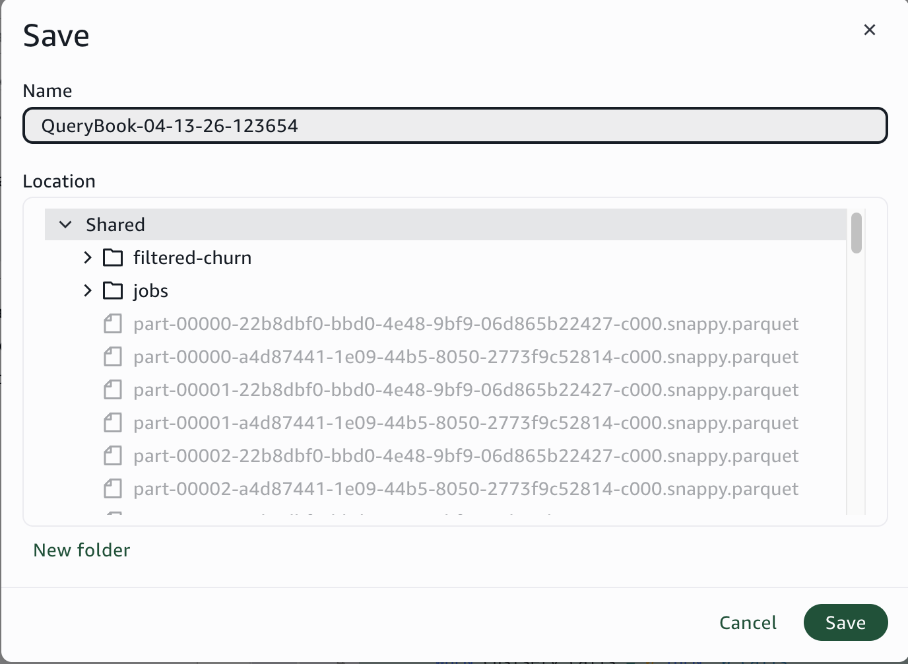
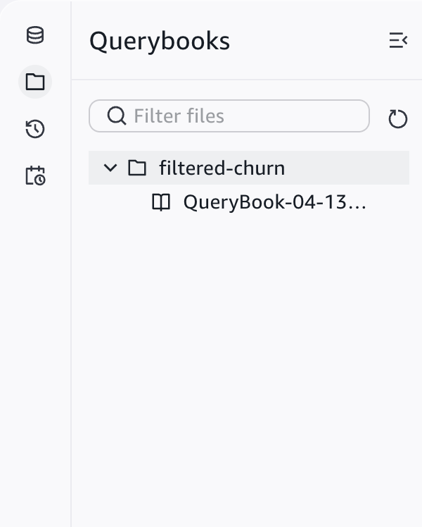
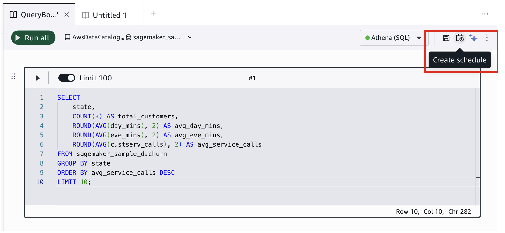
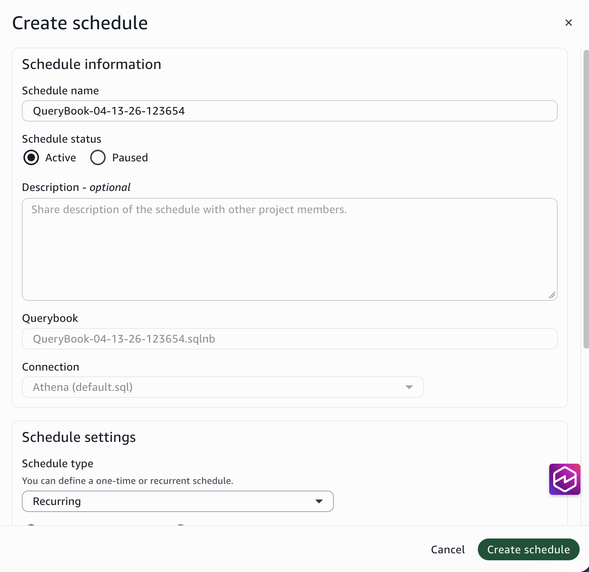
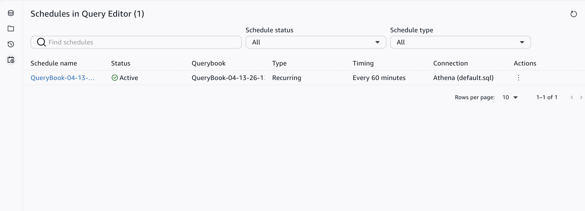
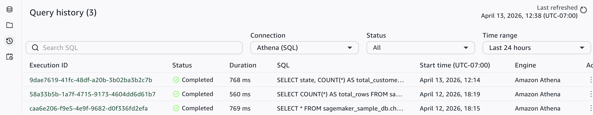
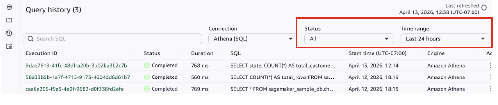
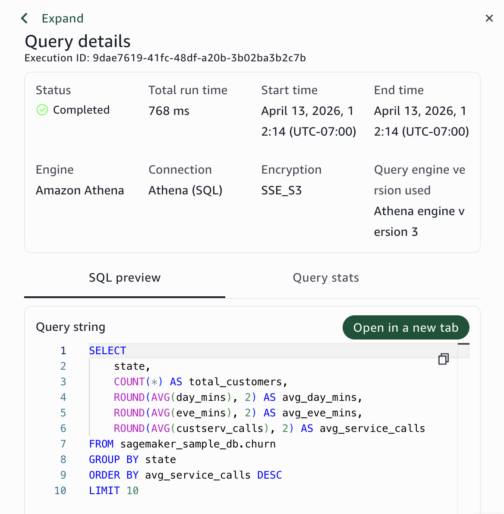

# Save, schedule, and review queries

After you write and run queries, you can save your querybook to the project
repository, share it with project members, create schedules to run queries
automatically, and review past query executions.

## Save a querybook to the project

Querybooks are saved as .sqlnb files in your project repository. Saving makes
the querybook available to other project members and preserves it across
sessions.

1. Choose **Save** in the top-right
   toolbar.
2. Enter a name for the querybook.
3. Choose **Save** to confirm.

###### Note

Unsaved querybooks exist only in your current session. If you close the
browser without saving, your work is lost.

## Share with project members

When you save a querybook to the project, it becomes visible to all project
members in the file explorer panel. Other members can open, edit, and run the
saved querybook.

To view saved querybooks:

1. Choose the **Querybooks** icon in the
   left panel.
2. Browse the project repository to find saved .sqlnb
   files.

## Create a schedule

You can schedule a querybook to run automatically at specific times. There are
two ways to schedule queries:

- **From the query editor**: Schedule a
  single querybook directly from the editor interface.
- **Using workflows**: Combine multiple
  elements (queries, notebooks, ETL jobs) into a single scheduled workflow. For more
  information, see [Serverless
  workflows](serverless-workflows.md "serverless-workflows.md").

###### Schedule from the query editor

###### Note

You must have a data source connection selected and your querybook must be
saved before you can create a schedule. Your project profile must also have
scheduling enabled in the Tooling blueprint parameters.

1. Choose **Create schedule** in the
   top-right toolbar.

317. Under **Schedule name**, enter a name
     for the schedule.
318. Under **Schedule status**, choose
     **Active** (starts running immediately) or
     **Paused** (created but does not run until you
     activate it).
319. (Optional) Enter a description.
320. Choose a schedule type:
     **One-time** (runs once at a specific date and time)
     or **Recurring** (runs on a repeating
     schedule).
321. Set the days and times for the schedule to run. You can use a
     rate-based expression (for example, every 1 hour) or a cron expression for more
     complex schedules.
322. Choose **Create schedule**.

###### Keep schedules up to date

Enable the project repository auto sync flag when creating or updating your
project. This makes scheduled queries always run the latest saved version of the
querybook. Test your query in draft mode before saving to avoid running untested
SQL on a schedule.

## Review and manage scheduled queries

To view your scheduled queries, choose the
**Scheduled queries** icon in the left panel of the
query editor.

From the scheduled queries page, you can:

| Action            | How                                                                                      |
| ----------------- | ---------------------------------------------------------------------------------------- |
| Pause a schedule  | Choose the three-dot menu next to the schedule and choose Pause.                      |
| Edit a schedule   | Choose the three-dot menu and choose Edit.                                               |
| Delete a schedule | Choose the three-dot menu and choose Delete.                                             |
| View run history  | Choose the schedule name to see the Runs section with execution history.              |
| View run details  | In the Runs section, choose a run name to see the querybook output and execution log. |

## Review query history

The query history page shows all queries you have run in the query editor, sorted
with the most recent queries first. Use it to find past queries, check execution
status, review errors, and re-open queries in the editor.

To open the query history page, choose the
**Query history** icon in the left panel of the query
editor. Then select a data source to view queries from that source.

###### Query history columns

| Column       | Description                                                                       |
| ------------ | --------------------------------------------------------------------------------- |
| Execution ID | A unique identifier for the query execution. Choose the ID to view details.    |
| Status       | The current state of the query: Completed, Failed, Canceled, or Running.       |
| Duration     | How long the query took to run.                                                   |
| SQL          | A preview of the SQL statement. Choose the execution ID to see the full query. |
| Start time   | The date and time the query started running.                                      |
| Engine       | The query engine used (Amazon Athena or Amazon Redshift).                         |

###### Filter query history

You can filter the query history by data source, status, and time range. By
default, the page shows queries of all statuses from the past 24 hours.

- **Filter by status**: Choose Status and
  select a status type (Completed, Failed, Canceled, Running), or choose All to see
  all statuses.
- **Filter by time range**: Choose
  **Time range**, select a predefined range or custom
  date range, and choose **Apply**.

###### View query details

To see the full SQL, execution statistics, and error information for a
query:

1. Choose the **Execution ID** of the query
   you want to inspect.
2. A side panel opens with the full query details.

The details shown depend on the query engine:

- **Amazon Athena queries**: Include S3
  encryption information and query stats with a visual breakdown of execution
  time.
- **Amazon Redshift queries**: Include
  cluster-specific execution details.

To re-open the query in the editor with its full results, choose
**Open in a new tab**.
