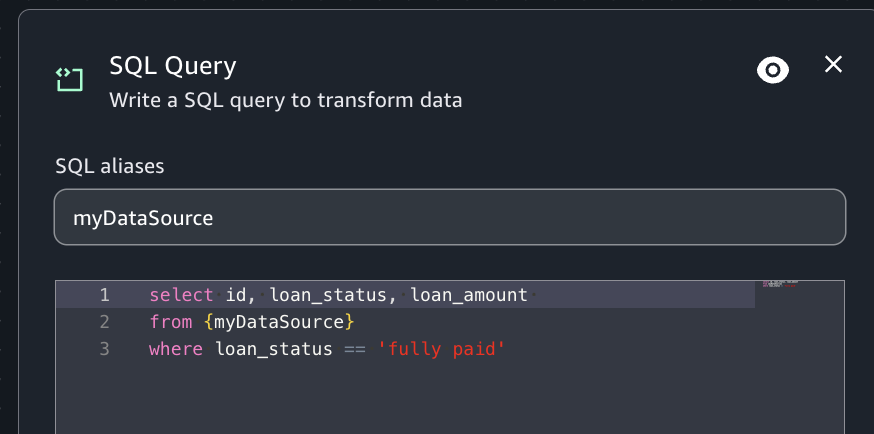

# SQL query transform

You can use a SQL query transform to write your own transform in the form of a SQL
query. Writing the SQL query in Visual ETL creates a subset of the data corresponding
to the query. A SQL transform node can have multiple datasets as inputs, but produces only a
single dataset as output. It contains a text field, where you enter the SQL query.

###### To add an SQL query node to your job diagram

1. Open the menu and then choose SQL query to add a new transform to your job diagram,
   if needed.
2. (Optional) Click on the rename node icon to enter a new name for the node in the
   job diagram.
3. Modify the input schema:
   1. Ensure the alias in the "SQL aliases" box is appropriate. Visual ETL will
      autopopulate this field, but you can change it.
   2. Write an SQL statement that queries the data to suit your needs

4. (Optional) After configuring the node properties and transform properties, you can
   preview the modified dataset by choosing the Data preview tab in the node details
   panel.

