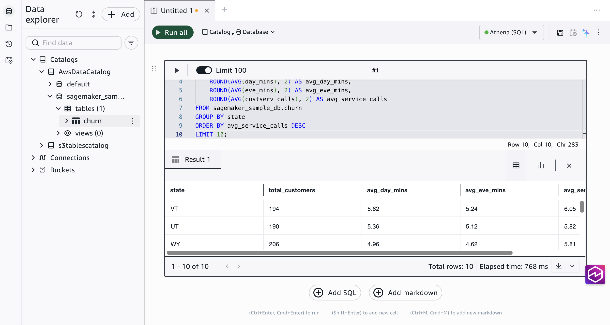
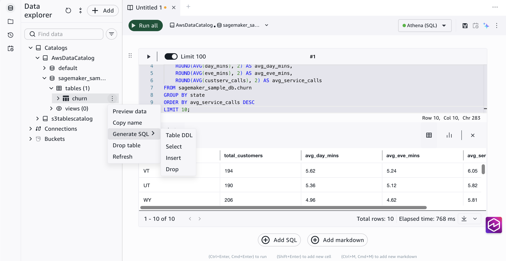
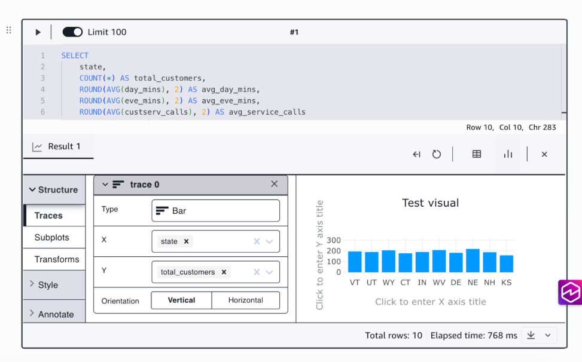
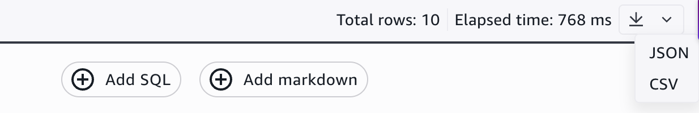

# Write, run, and view query results

A querybook is a SQL notebook where you write, organize, and run queries. Each
querybook can contain multiple SQL cells and markdown cells, and you can use different
query engines across querybooks within the same project.

## Create a querybook

To create a new querybook, choose the **+** icon at
the top of the editor window. This opens a new tab with an empty SQL cell.

Each querybook tab operates independently with its own engine selection, cells,
and results.

## Write a query

Type SQL directly into a SQL cell. The editor provides autocomplete suggestions
for table names, column names, and SQL keywords as you type. Press
**Tab** to accept a suggestion.

To add more cells to your querybook:

- Choose **Add SQL** to add a new SQL
  cell.
- Choose **Add markdown** to add a
  documentation cell for notes, descriptions, or context.

###### Document your analysis

Use markdown cells to add context about what each query does, why you are
running it, and what the results mean. This is especially useful when sharing
querybooks with project members.

## Run a sample query from the data explorer

You can run a quick sample query on any table directly from the data explorer,
without writing SQL manually.

1. In the data explorer, find the table you want to query.
2. Choose the three-dot menu next to the table name.
3. Choose **Generate SQL** and then
   **Select**.

The editor creates a new cell with a SELECT query for that table.

## Run a query

There are two ways to run queries:

- **Run a single cell**: Choose the Run
  icon (▶) on the cell you want to run.
- **Run all cells**: Choose
  **Run all** at the top of the querybook. This runs
  every SQL cell in order.

###### Note

By default, Limit 100 is turned on. This caps query results at 100 rows.
Toggle Limit 100 off on the cell toolbar if you need the full result set.

###### Keyboard shortcuts

| Action           | Windows / Linux  | Mac           |
| ---------------- | ---------------- | ------------- |
| Run current cell | Ctrl+Enter       | ⌘+Enter       |
| Run all cells    | Ctrl+Shift+Enter | ⌘+Shift+Enter |

###### Stop a running query

To cancel a query that is in progress, choose the
**Stop** button that appears on the cell while the query
is running. The query status changes to Canceled in your query history.

###### Query limits

- Query results display up to 64,000 rows in the editor.
- The **Limit 100** toggle on each cell caps
  results at 100 rows by default. Turn it off to retrieve more rows.
- Long-running queries may time out depending on your engine
  configuration.

## View results

When a query finishes running, the **Results** tab
displays the output as a table. Each column from your query maps to a column in the
results table, and rows are displayed in the order returned by the query engine.

###### Note

The results table displays up to 64,000 rows. If your query returns more rows,
only the first 64,000 are shown. Use a LIMIT clause in your SQL to control the
number of rows returned.

## Create a visualization

You can create charts directly from your query results without leaving the
query editor.

1. In the **Results** tab, choose the
   **Chart view** icon.
2. For **Type**, choose a chart type (line,
   scatter, bar, area, pie, histogram, and others).
3. Choose which data columns to represent in the X and Y
   axis.
4. Browse the **Style** and
   **Annotate** options for additional chart
   customization.

###### Experiment with chart types

Try different chart types to find the best way to represent your data. You
can switch between chart types without re-running the query.

## Export query results

You can download query results for use in other tools.

1. Run your query.
2. In the **Results** tab, choose the
   download icon.
3. Choose the export format:
   - **CSV**: Comma-separated values.
     Works with spreadsheet applications and data tools.
   - **JSON**: JavaScript Object Notation.
     Works with programming languages and APIs.

