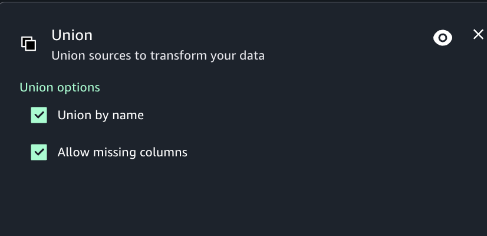

# Union transform

You use the Union transform node when you want to combine rows from more than one data
source that have the same schema. When applying Union transformations you can select to
"Union by name" to have the union done on columns with the same name (rather than by
position). Selecting this option also lets you select "Allow missing columns", which will
produce a frame that has missing columns filled with Null values.

###### To add a Union transform node to your job diagram

1. Open the menu and then choose "Union transform" to add a new transform to your job
   diagram, if needed.
2. (Optional) Click on the union node icon to enter a new name for the node in the job
   diagram.
3. Modify the input schema:
   1. Select "Union by name" if you want the union to be done on columns with the same
      name.
   2. If you have enabled Union by name, select "Allow missing columns" if you want to
      fill missing columns with null values.

4. (Optional) After configuring the node properties and transform properties, you can
   preview the modified dataset by choosing the Data preview tab in the node details
   panel.

