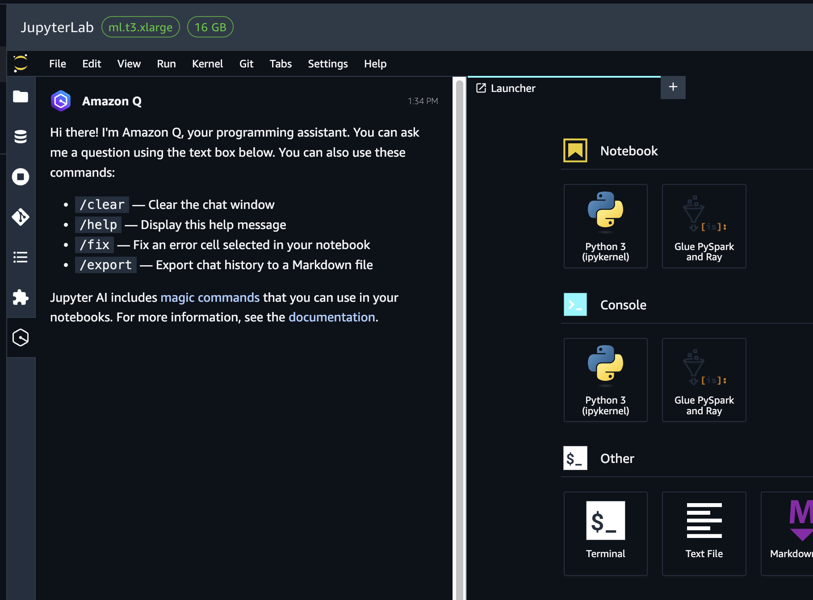
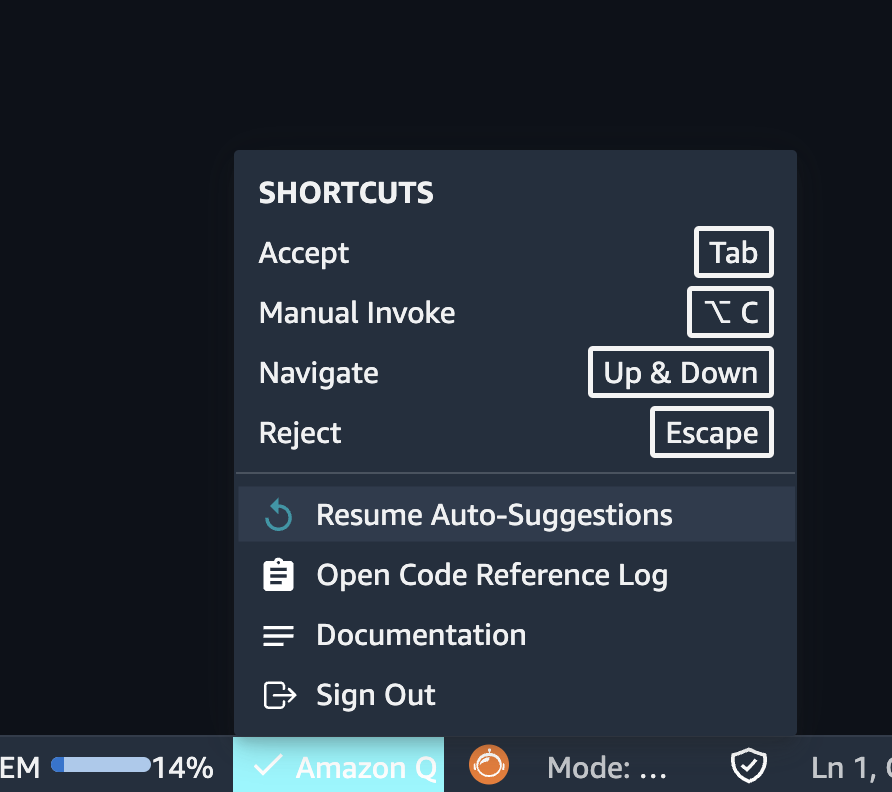

# Using the coding assistant

The Amazon SageMaker Unified Studio is integrated with Amazon Q. Amazon Q Developer is a coding assistant that can chat
about code, provide inline code completions, or generate net new code.

For more information about Amazon Q Developer, see [What is Amazon Q
Developer](../../../amazonq/latest/qdeveloper-ug/what-is.md "../../../amazonq/latest/qdeveloper-ug/what-is.md") in the Amazon Q Developer User Guide.

To use the Amazon Q Developer model for chat:

1. Ensure your admin must has subscribed to Amazon Q Developer and added Amazon Q Developer as an
   application to your domain in the Amazon Q Developer console, as described in the Amazon Amazon SageMaker Unified Studio
   Administrator Guide.

###### Note

When you enable Amazon Q, you can choose between the free or paid tiers of the
service. JupyterLab in the default space supports both the free and paid tiers. However,
in additional spaces, JupyterLab and Code Editor support the free tier only.

When using the free tier, request limits are shared at the account level,
meaning that one customer can potentially use up all requests. The pro tier of Amazon Q is
charged at the user level, with limits set at the user level as well. The pro tier also
lets you manage users and policies with enterprise access control. 2. After adding Amazon Q Developer , you can access the chat interface by navigating to the
JupyterLab or Code Editor experience and choosing the chat icon in the left navigation panel of your notebook
in Amazon SageMaker Unified Studio.

 3. You are now able to see code completions powered by Amazon Q Developer in your notebook.
Amazon Q Developer makes code recommendations automatically as you write your code, based on your
existing code and comments. For more information about how inline suggestions work in
Amazon Q Developer, see [Generating inline suggestions](../../../amazonq/latest/qdeveloper-ug/inline-suggestions.md "../../../amazonq/latest/qdeveloper-ug/inline-suggestions.md") in the Amazon Q Developer User Guide.

Amazon Q Developer provides automatic suggestions for your code by default. To pause or resume
automatic suggestions:

    1. Choose "Amazon Q" from the navigation bar at the bottom of the JupyterLab or Code Editor IDE.
     Then choose Pause Auto-Suggestions or Resume Auto-Suggestions, as desired.

If you want to opt out of Amazon Q data sharing, see the [opt-out section of the Amazon Q developer guide.](../../../amazonq/latest/qdeveloper-ug/service-improvement.md#opt-out "../../../amazonq/latest/qdeveloper-ug/service-improvement.md#opt-out")
