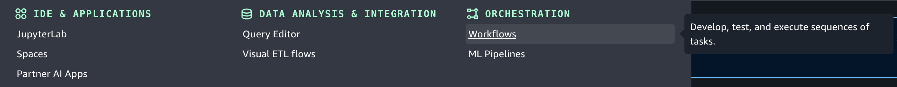
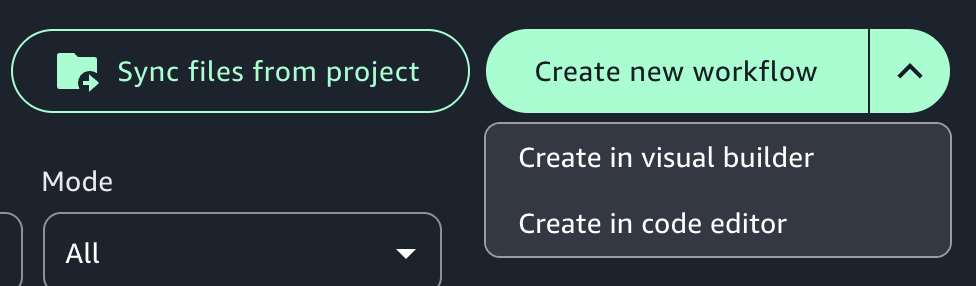
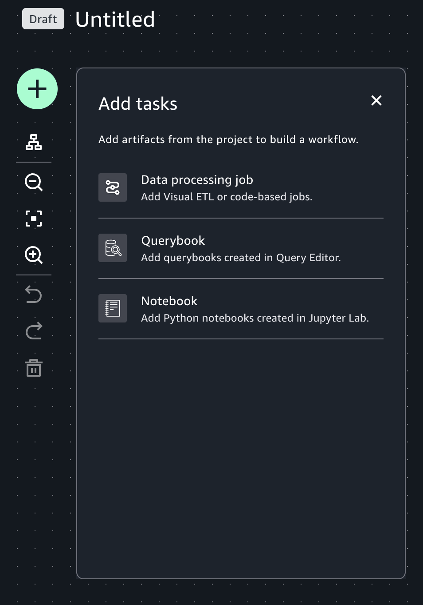
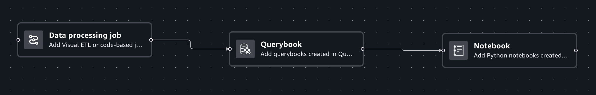
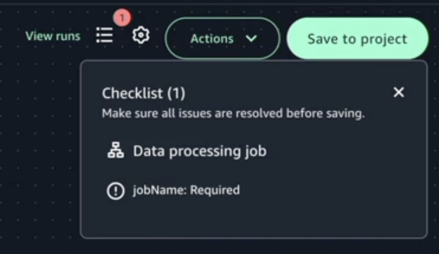

# Create a visual workflow in Amazon SageMaker Unified Studio

Use visual workflows to orchestrate data processing jobs, notebooks, and querybooks in your project repositories.
With visual workflows, you can define a collection of tasks organized as a directed acyclic graph (DAG) that can run on a user-defined schedule.

## Prerequisites

- Amazon SageMaker Unified Studio project created with the **All capabilities** project profile
- Instance with at least 4GiB memory and 4vCPUs provisioned
- Access to the **Workflows** page in your project

## Environment status

Use a shared workflow environment to share workflows with other project members. Workflow environments must
be created by project owners. To update or delete a workflow environment, you must be an owner of the project that
the workflow environment is in. After a workflow environment has been created by a project owner, any project member
can sync their files to share them in the environment.

| Environment Statuses | Local environment | Shared environment |
| -------------------- | ----------------- | ------------------ |
| Active               | Active            |
| Stopping             | Missing           |
| Loading              | Loading           |
| Not Running          | Creating          |
| Failed               | Failed            |

## Create a workflow

To create a workflow, complete the following steps:

1. Navigate to Amazon SageMaker Unified Studio using the URL from your admin and log in using your SSO or AWS credentials.
2. Navigate to a project that was created with the **All capabilities** project profile. You can do this
   by using the center menu at the top of the page and choosing **Browse all projects**, then choosing the name
   of the project that you want to navigate to.
3. In the **Build** menu, choose **Workflows**. This takes you to the Workflows page.

 4. Choose the **Create new workflow** button or in the **Create new workflow** dropdown
menu, choose **Create in visual builder**. This takes you to the **Visual canvas workflow**.

 5. Provide a name to your workflow. 6. Choose a task from one of the three tabs: "Data processing job", "Querybook", or "Notebook". The selected task appears in the
canvas. Configure the task by giving it a name and editing the prepopulated fields.

 7. Click on the "+" symbol to add more tasks. You can drag the tasks to fit your workflow. 8. Complete the workflow by connecting the tasks. To connect the tasks, click the "+" symbol of one task to
the "+" symbol of another task. The arrows represent the execution order and data flow.

 9. Once you've created your workflow, you can configure its settings. Click on the settings gear.

    1. In the **Workflow settings** tab you can:

    	* Edit the Workflow name if the workflow has never been saved to a project.
    	* Provide an optional description to the workflow.
    	* Toggle the **Run on schedule** button and set the Schedule status to Active or Paused.
    	* Choose an option from the Schedule dropdown menu to set a schedule for your workflow or specify a CRON expression
    	 in the **Start date and time in UTC** and **End date and time in UTC** fields below.
    Once the settings are set, choose **Apply** to save them.
    2. In the **Default parameters** tab, choose Add parameter and provide a name and a default value to the
     parameter and choose Apply to save them.
    3. In the **Tags** tab, choose Add tag to create an airflow tag to your workflow and provide a name to the
     tag, then choose Apply to save it. Airflow tags help in filtering the workflows. This step is optional.

10. Choose **Save to project** to save the current workflow to the project. If there are any validation errors, the
    notifications symbol next to the settings gear will show a number next to it which indicates the number of errors. You must fix them
    before you can successfully save the workflow to the project.

