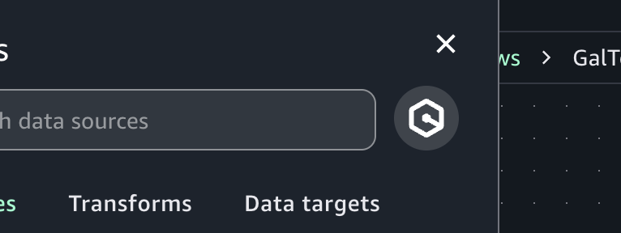
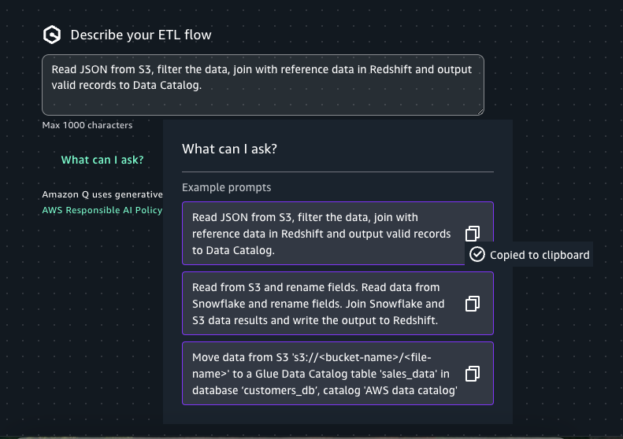

# Authoring a visual ETL job using generative

AI

To author a Visual ETL job using generative AI in Amazon SageMaker Unified Studio:

1. Verify Amazon Q is enabled for your domain.
2. Open the Visual ETL editor.
3. In the "Add nodes" panel click on the Amazon Q icon.

 4. (Optional) Click on “What can I ask?” and copy a prompt. 5. Enter the desired prompt in the chat box and click on ‘Submit’.

 6. Click on each node in the Visual ETL editor and configure its settings.

