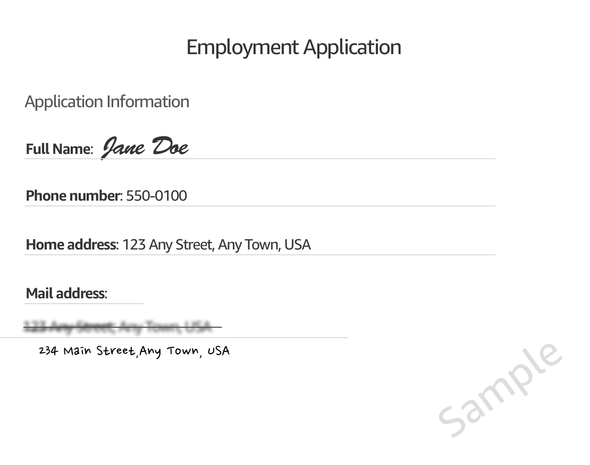
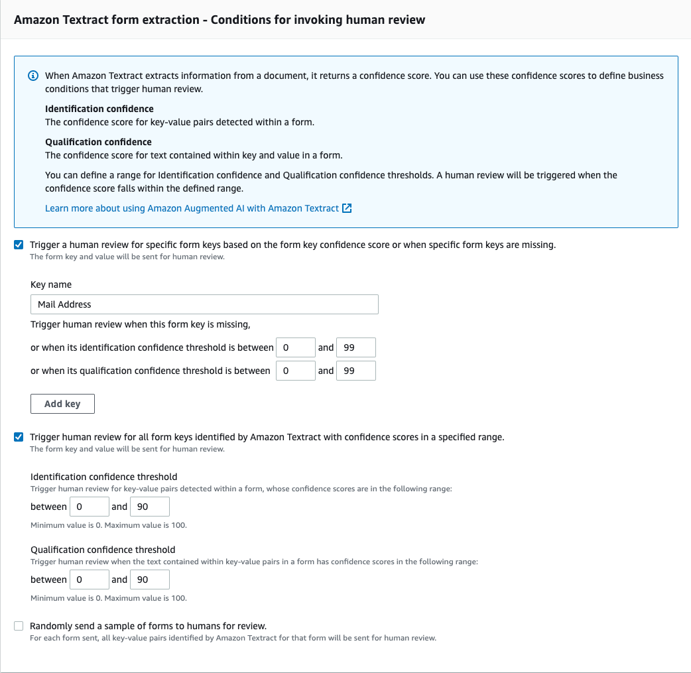
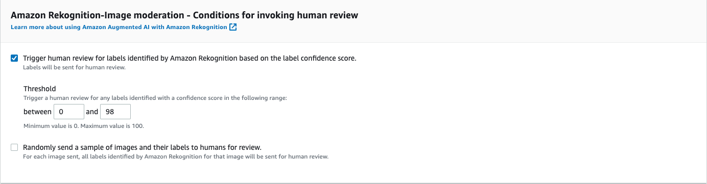
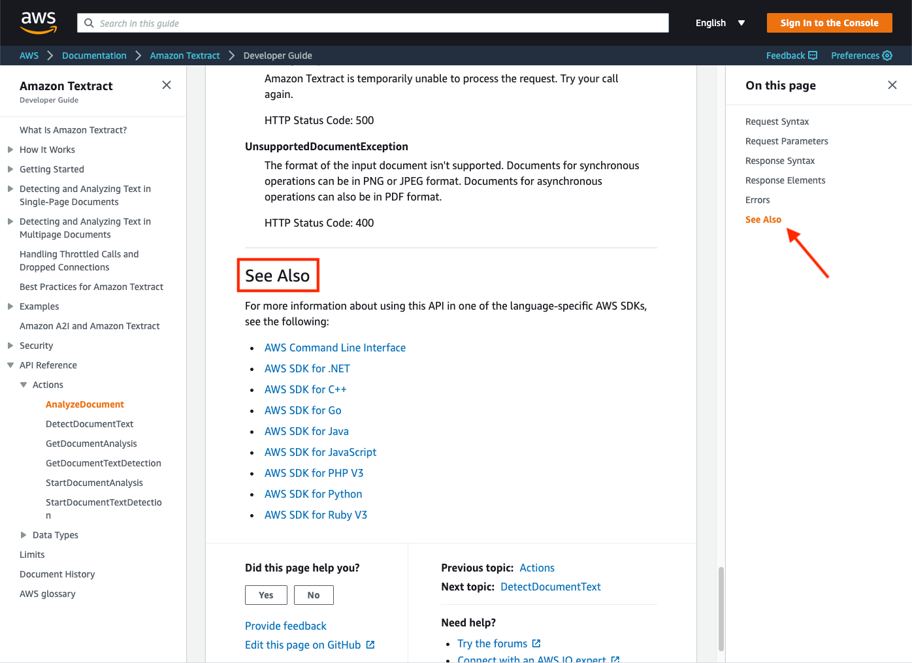

# Tutorial: Get Started in the Amazon A2I Console

The following tutorial shows you how to get started using Amazon A2I in the Amazon A2I
console.

The tutorial gives you the option to use Augmented AI with Amazon Textract for document review or
Amazon Rekognition for image content review.

## Prerequisites

To get started using Amazon A2I, complete the following prerequisites.

- Create an Amazon S3 bucket in the same AWS Region as the workflow for your
  input and output data. For example, if you are using Amazon A2I with
  Amazon Textract in us-east-1, create your bucket in us-east-1. To create a
  bucket, follow the instructions in [Create a
  Bucket](../../../AmazonS3/latest/user-guide/create-bucket.md "../../../AmazonS3/latest/user-guide/create-bucket.md") in the _Amazon Simple Storage Service Console
  User Guide_.
- Do one of the following:
  - If you want to complete the tutorial using Amazon Textract, download
    the following image and place it in your Amazon S3 bucket.

  
  - If you want to complete the tutorial using Amazon Rekognition, download the
    following image and place it in your Amazon S3 bucket.

  

###### Note

The Amazon A2I console is embedded in the SageMaker AI console.

## Step 1: Create a Work Team

First, create a work team in the Amazon A2I console and add yourself as a worker
so that you can preview the worker review task.

###### Important

This tutorial uses a private work team. The Amazon A2I private workforce is
configured in the Ground Truth area of the SageMaker AI console and is shared between
Amazon A2I and Ground Truth.

###### To create a private workforce using worker emails

1. Open the SageMaker AI console at [https://console.aws.amazon.com/sagemaker/](https://console.aws.amazon.com/sagemaker/ "https://console.aws.amazon.com/sagemaker/").
2. In the navigation pane, choose **Labeling workforces**
   under **Ground Truth**.
3. Choose **Private**, then choose **Create private
   team**.
4. Choose **Invite new workers by email**.
5. For this tutorial, enter your email and any others that you want to be
   able to preview the human task UI. You can paste or type a list of up to 50
   email addresses, separated by commas, into the email addresses box.
6. Enter an organization name and contact email.
7. Optionally, choose an Amazon SNS topic to which to subscribe the team so
   workers are notified by email when new Ground Truth labeling jobs become available.
   Amazon SNS notifications are supported by Ground Truth and are not supported by Augmented AI.
   If you subscribe workers to Amazon SNS notifications, they only receive
   notifications about Ground Truth labeling jobs. They do not receive notifications
   about Augmented AI tasks.
8. Choose **Create private team**.

If you add yourself to a private work team, you receive an email from
`no-reply@verificationemail.com` with login information. Use the link
in this email to reset your password and log in to your worker portal. This is where
your human review tasks appear when you create a human loop.

## Step 2: Create a Human Review Workflow

In this step, you create a human review workflow. Each human review workflow is
created for a specific [task type](a2i-task-types-general.md "a2i-task-types-general.md"). This
tutorial allows you to choose between the built-in task types: Amazon Rekognition and Amazon Textract.

###### To create a human review workflow:

1. Open the Augmented AI console at [https://console.aws.amazon.com/a2i](https://console.aws.amazon.com/a2i/ "https://console.aws.amazon.com/a2i/") to access the
   **Human review workflows** page.
2. Select **Create human review workflow**.
3. In **Workflow settings**, enter a workflow
   **Name**, **S3 bucket**, and the
   **IAM role** that you created for this tutorial, with
   the AWS managed policy `AmazonAugmentedAIIntegratedAPIAccess`
   attached.
4. For **Task type**, select **Textract –
   Key-value pair extraction** or **Rekognition –
   Image moderation**.
5. Select the task type that you chose from the following table for
   instructions for that task type.

Amazon Textract – Key-value pair extraction

1. Select
   **Trigger
   a human review for specific form keys based on the form key
   confidence score or when specific form keys are
   missing**.

2. For **Key name**, enter `Mail
Address`.

3. Set the identification confidence threshold between
   `0` and `99`.

4. Set the qualification confidence threshold between
   `0` and `99`.

5. Select
   **Trigger
   a human review for all form keys
   identified by Amazon Textract with confidence scores in a
   specific range**.

6. Set the identification confidence threshold between
   `0` and `90`.

7. Set the qualification confidence threshold between
   `0` and `90`.

This initiates a human review if Amazon Textract returns a
confidence score that is less than `99` for
`Mail Address` and its key, or if it returns a
confidence score less than `90` for any key value
pair detected in the document.

The following image shows the Amazon Textract form extraction -
Conditions for invoking human review section of the Amazon A2I
console. In the image, the check boxes for the two types of
triggers explained in the proceeding paragraph are checked, and
`Mail Address` is used as a **Key
name** for the first trigger. The identification
confidence threshold is defined using confidence scores for
key-value pairs detect within the form and is set between 0 and 99. The qualification confidence threshold is defined using
confidence scores for text contained within keys and values in a
form and is set between 0 and 99.



Amazon Rekognition – Image moderation

1. Select
   **Trigger
   human review for labels identified by Amazon Rekognition based on label
   confidence score**.

2. Set the **Threshold** between
   `0` and `98`.

This initiates a human review if Amazon Rekognition returns a confidence
score that is less than `98` for an image moderation
job.

The following image shows how you can select the
**Trigger human review for labels identified by
Amazon Rekognition based on label confidence score** option and
enter a **Threshold** between 0 and 98 in the
Amazon A2I console.

 6. Under **Worker task template creation**, select
**Create from a default template**. 7. Enter a **Template name**. 8. In **Task description** field, enter the following
text:

`Read the instructions carefully and complete the task.` 9. Under **Workers**, select
**Private**. 10. Select the private team that you created. 11. Choose **Create**.

Once your human review workflow is created, it appears in the table on the
**Human review workflows** page. When the
**Status** is `Active`, copy and save the Workflow
ARN. You need it for the next step.

## Step 3: Start a Human Loop

You must use an API operation to start a human loop. There are a variety of
language-specific SDKs that you can use to interact with these API operations. To
see documentation for each of these SDKs, refer to the **See Also**
section in the API documentation, as shown in the following image.



For this tutorial, you use one of the following APIs:

- If you chose the Amazon Textract task type, you use the `AnalyzeDocument` operation.
- If you chose the Amazon Rekognition task type, you use the `DetectModerationLabels` operation.

You can interact with these APIs using a SageMaker notebook instance (recommended for
new users) or the AWS Command Line Interface (AWS CLI). Choose one of the following to learn more about
these options:

- To learn more about and set up a notebook instance, see [Amazon SageMaker notebook instances](nbi.md "nbi.md").
- To learn more about and get started using the AWS CLI, see [What Is the AWS Command Line Interface?](../../../cli/latest/userguide/cli-chap-welcome.md "../../../cli/latest/userguide/cli-chap-welcome.md") in the _AWS Command Line Interface User Guide_.

Select your task type in the following table to see example requests for
Amazon Textract and Amazon Rekognition using the AWS SDK for Python (Boto3).

Amazon Textract – Key-value pair extraction
The following example uses the AWS SDK for Python (Boto3) to call
`analyze_document` in us-west-2. Replace the italicized
red text with your resources. Include the [`DataAttributes`](../../../augmented-ai/2019-11-07/APIReference/API_HumanLoopDataAttributes.md "../../../augmented-ai/2019-11-07/APIReference/API_HumanLoopDataAttributes.md") parameter if you are using
the Amazon Mechanical Turk workforce. For more information, see the `analyze_document` documention in the _AWS SDK for Python (Boto) API Reference_.

```

   response = client.analyze_document(
         Document={
                "S3Object": {
                    "Bucket": "`amzn-s3-demo-bucket`",
                    "Name": "`document-name.pdf`"
                }
         },
         HumanLoopConfig={
            "FlowDefinitionArn":"`arn:aws:sagemaker:us-west-2:111122223333:flow-definition/flow-definition-name`",
            "HumanLoopName":"`human-loop-name`",
            "DataAttributes" : {
                "ContentClassifiers":[`"FreeOfPersonallyIdentifiableInformation"`,`"FreeOfAdultContent"`]
            }
         },
         FeatureTypes=["TABLES", "FORMS"])

```

Amazon Rekognition – Image moderation
The following example uses the AWS SDK for Python (Boto3) to call
`detect_moderation_labels` in us-west-2. Replace the
italicized red text with your resources. Include the [`DataAttributes`](../../../augmented-ai/2019-11-07/APIReference/API_HumanLoopDataAttributes.md "../../../augmented-ai/2019-11-07/APIReference/API_HumanLoopDataAttributes.md") parameter if you are using
the Amazon Mechanical Turk workforce. For more information, see the `detect_moderation_labels` documentation in the
_AWS SDK for Python (Boto) API
Reference_.

```

   response = client.detect_moderation_labels(
            Image={
                "S3Object":{
                    "Bucket": "`amzn-s3-demo-bucket`",
                    "Name": "`image-name.png`"
                }
            },
            HumanLoopConfig={
               "FlowDefinitionArn":"`arn:aws:sagemaker:us-west-2:111122223333:flow-definition/flow-definition-name`",
               "HumanLoopName":"`human-loop-name`",
               "DataAttributes":{
                    ContentClassifiers:[`"FreeOfPersonallyIdentifiableInformation"`|`"FreeOfAdultContent"`]
                }
             })

```

## Step 4: View Human Loop Status in Console

When you start a human loop, you can view its status in the Amazon A2I console.

###### To view your human loop status

1. Open the Augmented AI console at [https://console.aws.amazon.com/a2i](https://console.aws.amazon.com/a2i/ "https://console.aws.amazon.com/a2i/") to access the
   **Human review workflows** page.
2. Select the human review workflow that you used to start your human
   loop.
3. In the **Human loops** section, you can see your human
   loop. View its status in the **Status** column.

## Step 5: Download Output Data

Your output data is stored in the Amazon S3 bucket you specified when you created a
human review workflow.

###### To view your Amazon A2I output data

1. Open the [Amazon S3 console](https://console.aws.amazon.com/s3/ "https://console.aws.amazon.com/s3/").
2. Select the Amazon S3 bucket you specified when you created your human review
   workflow in step 2 of this example.
3. Starting with the folder that is named after your human review workflow,
   navigate to your output data by selecting the folder with the following
   naming convention:

```
s3://`output-bucket-specified-in-human-review-workflow`/`human-review-workflow-name`/`YYYY`/`MM`/`DD`/`hh`/`mm`/`ss`/`human-loop-name`/output.json
```

4. Select `output.json` and choose **Download**.
