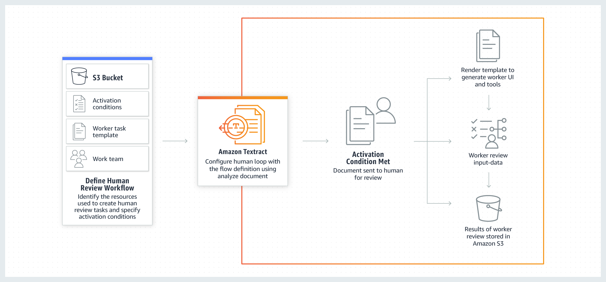
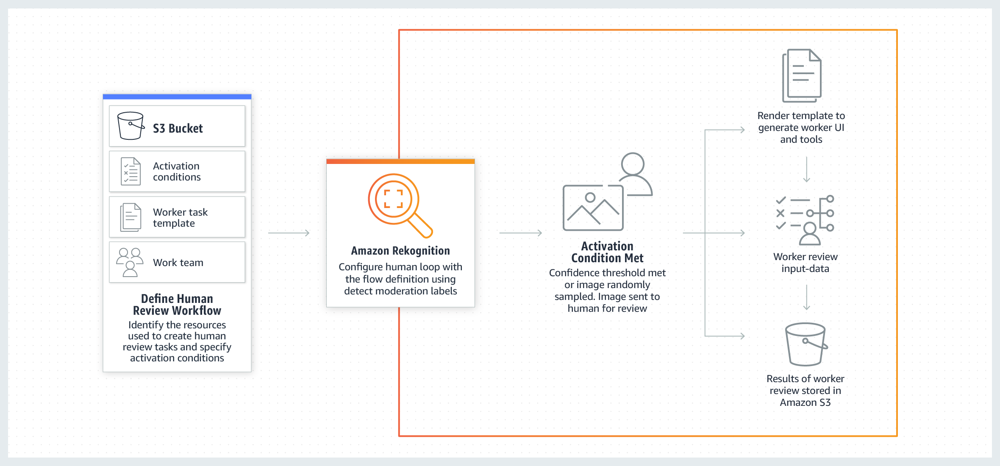
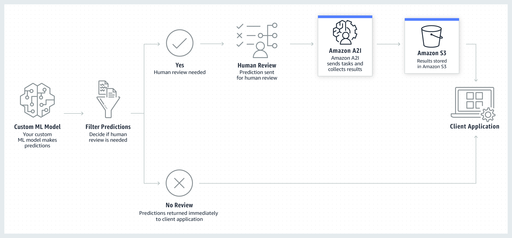

# Core Components of Amazon A2I

Review the following terms to familiarize yourself with the core components of Amazon A2I.

## Task Types

The AI/ML workflow into which you integrate Amazon A2I defines an Amazon A2I
_task type_.

Amazon A2I supports:

- Two _built-in task types_: [Amazon Textract
  key-value pair extraction](a2i-textract-task-type.md "a2i-textract-task-type.md") and [Amazon Rekognition image
  moderation](a2i-rekognition-task-type.md "a2i-rekognition-task-type.md").
- A [custom
  task type](a2i-task-types-custom.md "a2i-task-types-custom.md"): Use a custom task type to integrate a
  human review loop into _any_ machine
  learning workflow. You can use a custom task type to integrate Amazon A2I
  with other AWS services like Amazon Comprehend, Amazon Transcribe, and Amazon Translate, as well as your own
  custom machine learning workflows. To learn more, see [Use Cases and Examples Using Amazon A2I](a2i-task-types-general.md "a2i-task-types-general.md").

Select a tab in the following table to see diagrams that illustrate how Amazon A2I
works with each task type. Select the task type page using the links in the
preceding list to learn more about that task type.

Amazon Textract – Key-value pair extraction
This image depicts the Amazon A2I built-in workflow with Amazon Textract.
On the left, the resources that are required to create an Amazon Textract
human review workflow are depicted: an Amazon S3 bucket, activation
conditions, a worker task template, and a work team. These resources are
used to create a human review workflow, or flow definition. An arrow
points right to the next step in the workflow: using Amazon Textract to
configure a human loop with the human review workflow. A second arrow
points right from this step to the step in which activation conditions
specified in the human review workflow are met. This initiates the
creation of a human loop. On the right of the image, the human loop is
depicted in three steps: 1) the worker UI and tools are generated and
the task is made available to workers, 2) workers review input data, and
finally, 3) results are saved in Amazon S3.

Amazon Rekognition – Image moderation
This image depicts the Amazon A2I built-in workflow with Amazon Rekognition. On the
left, the resources that are required to create an Amazon Rekognition human review
workflow are depicted: an Amazon S3 bucket, activation conditions, a worker
task template, and a work team. These resources are used to create a
human review workflow, or flow definition. An arrow points right to the
next step in the workflow: using Amazon Rekognition to configure a human loop with
the human review workflow. A second arrow points right from this step to
the step in which activation conditions specified in the human review
workflow are met. This initiates the creation of a human loop. On the
right of the image, the human loop is depicted in three steps: 1) the
worker UI and tools are generated and the task is made available to
workers, 2) workers review input data, and finally, 3) results are saved
in Amazon S3.

Custom Task Type
The following image depicts the Amazon A2I custom workflow. A custom
ML model is used to generate predictions. The client application filters
these predictions using user-defined criteria and determines if a human
review is required. If so, these predictions are sent to Amazon A2I for
human review. Amazon A2I collects the results of human review in Amazon S3,
which can access by the client application. If the filter determines
that no human review is needed, predictions can be fed directly to the
client application.

## Human Review Workflow (Flow

Definition)

You use a human review workflow to specify your human _work
team_, to set up your worker UI using a _worker
task template_, and to provide information about how workers should
complete the review task.

For built-in task types, you also use the human review workflow to identify the
conditions under which a human loop is initiated. For example, Amazon Rekognition can perform
image content moderation using machine learning. You can use the human review
workflow to specify that an image is sent to a human for content moderation review
if Amazon Rekognition's confidence is too low.

You can use a human review workflow to create multiple human loops.

You can create a flow definition in the SageMaker AI console or with the SageMaker API. To learn
more about both of these options, see [Create a Human Review Workflow](a2i-create-flow-definition.md "a2i-create-flow-definition.md").

###### Work Team

A _work team_ is a group of human workers to whom
you send your human review tasks.

When you create a human review workflow, you specify a single work team.

Your work team can come from the [Amazon Mechanical Turk
workforce](sms-workforce-management-public.md "sms-workforce-management-public.md"), a [vendor-managed
workforce](sms-workforce-management-vendor.md "sms-workforce-management-vendor.md"), or your own [private workforce](sms-workforce-private.md "sms-workforce-private.md").
When you use the private workforce, you can create multiple work teams. Each work
team can be used in multiple human review workflows. To learn how to create a
workforce and work teams, see [Workforces](sms-workforce-management.md "sms-workforce-management.md").

###### Worker Task Template and Human Task UI

You use a _worker task template_ to create a worker UI (a
_human task UI_) for your human review
tasks.

The human task UI displays your input data, such as documents or images, and
instructions to workers. It also provides interactive tools that the worker uses to
complete your tasks.

For built-in task types, you must use the Amazon A2I worker task template
provided for that task type.

## Human Loops

A _human loop_ is used to create a single human review job. For
each human review job, you can choose the number of workers that are sent a
_task_ to review a single data object. For example, if you
set the number of workers per object to `3` for an image classification
labeling job, three workers classify each input image. Increasing the number of
workers per object can improve label accuracy.

A human loop is created using a human review workflow as follows:

- For built-in task types, the conditions specified in the human review
  workflow determine when the human loop is created.
- Human review tasks are sent to the work team specified in the human review
  workflow.
- The worker task template specified in the human review workflow is used to
  render the human task UI.

**When do human loops get created?**

When you use one of the _built-in task types_,
the corresponding AWS service creates and starts a human loop on your behalf when
the conditions specified in your human review workflow are met. For example:

- When you use Augmented AI with Amazon Textract, you can integrate Amazon A2I into a
  document review task using the API operation `AnalyzeDocument`. A
  human loop is created every time Amazon Textract returns inferences about
  key-value pairs that meet the conditions you specify in your human review
  workflow.
- When you use Augmented AI with Amazon Rekognition, you can integrate Amazon A2I into an image
  moderation task using the API operation `DetectModerationLabels`.
  A human loop is created every time Amazon Rekognition returns inferences about image
  content that meet the conditions you specify in your human review
  workflow.

When using a _custom task type_, you start a
human loop using the [Amazon Augmented AI Runtime
API](../../../augmented-ai/2019-11-07/APIReference/Welcome.md "../../../augmented-ai/2019-11-07/APIReference/Welcome.md"). When you call `StartHumanLoop` in your custom
application, a task is sent to human reviewers.

To learn how to create and start a human loop, see [Create and Start a Human Loop](a2i-start-human-loop.md "a2i-start-human-loop.md").

To generate these resources and create a human review workflow, Amazon A2I integrates
multiple APIs, including the Amazon Augmented AI Runtime Model, the SageMaker APIs, and APIs
associated with your task type. To learn more, see [Use APIs in Amazon Augmented AI](a2i-api-references.md "a2i-api-references.md").
