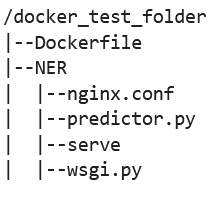

# Adapt your own inference container for

Amazon SageMaker AI

If you can't use any of the images listed in [Pre-built SageMaker AI Docker images](docker-containers-prebuilt.md "docker-containers-prebuilt.md") Amazon SageMaker AI for your use case, you can build your own Docker container and use it
inside SageMaker AI for training and inference. To be compatible with SageMaker AI, your container
must have the following characteristics:

- Your container must have a web server listing on port
  `8080`.
- Your container must accept `POST` requests to the
  `/invocations` and `/ping` real-time endpoints.
  The requests that you send to these endpoints must be returned with 60
  seconds for regular responses and 8 minutes for streaming responses, and have a maximum size of 25 MB.
  For more information and an example of how to build your own Docker container for
  training and inference with SageMaker AI, see [Building your own algorithm container](https://github.com/aws/amazon-sagemaker-examples/blob/main/advanced_functionality/scikit_bring_your_own/scikit_bring_your_own.ipynb "https://github.com/aws/amazon-sagemaker-examples/blob/main/advanced_functionality/scikit_bring_your_own/scikit_bring_your_own.ipynb").

The following guide shows you how to use a `JupyterLab` space with
Amazon SageMaker Studio Classic to adapt an inference container to work with SageMaker AI hosting. The
example uses an NGINX web server, Gunicorn as a
Python web server gateway interface, and Flask as
a web application framework. You can use different applications to adapt your
container as long as it meets the previous listed requirements. For more information
about using your own inference code, see [Custom Inference Code with Hosting
Services](your-algorithms-inference-code.md "your-algorithms-inference-code.md").

###### Adapt your inference container

Use the following steps to adapt your own inference container to work with
SageMaker AI hosting. The example shown in the following steps uses a pre-trained [Named
Entity Recognition (NER) model](https://spacy.io/universe/project/video-spacys-ner-model-alt "https://spacy.io/universe/project/video-spacys-ner-model-alt") that uses the [spaCy](https://spacy.io/ "https://spacy.io/") natural language processing (NLP)
library for `Python` and the following:

- A Dockerfile to build the container that contains the
  NER model.
- Inference scripts to serve the NER model.
  If you adapt this example for your use case, you must use a
  Dockerfile and inference scripts that are needed to deploy
  and serve your model.

1. Create JupyterLab space with Amazon SageMaker Studio Classic (optional).

You can use any notebook to run scripts to adapt your inference container
with SageMaker AI hosting. This example shows you how to use a
JupyterLab space within Amazon SageMaker Studio Classic to launch a
JupyterLab application that comes with a SageMaker AI
Distribution image. For more information, see [SageMaker JupyterLab](studio-updated-jl.md "studio-updated-jl.md"). 2. Upload a Docker file and inference scripts.

    1. Create a new folder in your home directory. If you’re using
     JupyterLab, in the upper-left corner, choose the
     **New Folder** icon, and enter a folder name to
     contain your Dockerfile. In this example, the folder
     is called `docker_test_folder`.
    2. Upload a Dockerfile text file into your new folder.
     The following is an example Dockerfile that creates a
     Docker container with a pre-trained [Named Entity Recognition (NER) model](https://spacy.io/universe/project/video-spacys-ner-model "https://spacy.io/universe/project/video-spacys-ner-model") from [spaCy](https://spacy.io/ "https://spacy.io/"), the applications and
     environment variables needed to run the example:


    ```
    FROM python:3.8

    RUN apt-get -y update && apt-get install -y --no-install-recommends \
             wget \
             python3 \
             nginx \
             ca-certificates \
        && rm -rf /var/lib/apt/lists/*

    RUN wget https://bootstrap.pypa.io/get-pip.py && python3 get-pip.py && \
        pip install flask gevent gunicorn && \
            rm -rf /root/.cache

    #pre-trained model package installation
    RUN pip install spacy
    RUN python -m spacy download en


    # Set environment variables
    ENV PYTHONUNBUFFERED=TRUE
    ENV PYTHONDONTWRITEBYTECODE=TRUE
    ENV PATH="/opt/program:${PATH}"

    COPY NER /opt/program
    WORKDIR /opt/program
    ```

    In the previous code example, the environment variable
     `PYTHONUNBUFFERED` keeps Python from
     buffering the standard output stream, which allows for faster
     delivery of logs to the user. The environment variable
     `PYTHONDONTWRITEBYTECODE` keeps Python
     from writing compiled bytecode `.pyc` files, which are
     unnecessary for this use case. The environment variable
     `PATH` is used to identify the location of the
     `train` and `serve` programs when the
     container is invoked.
    3. Create a new directory inside your new folder to contain scripts
     to serve your model. This example uses a directory called
     `NER`, which contains the following scripts necessary
     to run this example:


    	* `predictor.py` – A Python
    	 script that contains the logic to load and perform inference
    	 with your model.
    	* `nginx.conf` – A script to configure a
    	 web server.
    	* `serve` – A script that starts an
    	 inference server.
    	* `wsgi.py` – A helper script to serve a
    	 model.
    ###### Important

    If you copy your inference scripts into a notebook ending in
     `.ipynb`and rename them, your script may contain
     formatting characters that will prevent your endpoint from
     deploying. Instead, create a text file and rename them.
    4. Upload a script to make your model available for inference. The
     following is an example script called `predictor.py` that
     uses Flask to provide the `/ping` and
     `/invocations` endpoints:


    ```
    from flask import Flask
    import flask
    import spacy
    import os
    import json
    import logging

    #Load in model
    nlp = spacy.load('en_core_web_sm')
    #If you plan to use a your own model artifacts,
    #your model artifacts should be stored in /opt/ml/model/


    # The flask app for serving predictions
    app = Flask(__name__)
    @app.route('/ping', methods=['GET'])
    def ping():
        # Check if the classifier was loaded correctly
        health = nlp is not None
        status = 200 if health else 404
        return flask.Response(response= '\n', status=status, mimetype='application/json')


    @app.route('/invocations', methods=['POST'])
    def transformation():

        #Process input
        input_json = flask.request.get_json()
        resp = input_json['input']

        #NER
        doc = nlp(resp)
        entities = [(X.text, X.label_) for X in doc.ents]

        # Transform predictions to JSON
        result = {
            'output': entities
            }

        resultjson = json.dumps(result)
        return flask.Response(response=resultjson, status=200, mimetype='application/json')
    ```

    The `/ping` endpoint in the previous script example
     returns a status code of `200` if the model is loaded
     correctly, and `404` if the model is loaded incorrectly.
     The `/invocations` endpoint processes a request formatted
     in JSON, extracts the input field, and uses the
     NER model to identify and store entities in the
     variable entities. The Flask application returns the
     response that contains these entities. For more information about
     these required health requests, see [How Your Container Should
     Respond to Health Check (Ping) Requests](your-algorithms-inference-code.md#your-algorithms-inference-algo-ping-requests "your-algorithms-inference-code.md#your-algorithms-inference-algo-ping-requests").
    5. Upload a script to start an inference server. The following script
     example calls `serve` using Gunicorn as an
     application server, and Nginx as a web server:


    ```
    #!/usr/bin/env python

    # This file implements the scoring service shell. You don't necessarily need to modify it for various
    # algorithms. It starts nginx and gunicorn with the correct configurations and then simply waits until
    # gunicorn exits.
    #
    # The flask server is specified to be the app object in wsgi.py
    #
    # We set the following parameters:
    #
    # Parameter                Environment Variable              Default Value
    # ---------                --------------------              -------------
    # number of workers        MODEL_SERVER_WORKERS              the number of CPU cores
    # timeout                  MODEL_SERVER_TIMEOUT              60 seconds

    import multiprocessing
    import os
    import signal
    import subprocess
    import sys

    cpu_count = multiprocessing.cpu_count()

    model_server_timeout = os.environ.get('MODEL_SERVER_TIMEOUT', 60)
    model_server_workers = int(os.environ.get('MODEL_SERVER_WORKERS', cpu_count))

    def sigterm_handler(nginx_pid, gunicorn_pid):
        try:
            os.kill(nginx_pid, signal.SIGQUIT)
        except OSError:
            pass
        try:
            os.kill(gunicorn_pid, signal.SIGTERM)
        except OSError:
            pass

        sys.exit(0)

    def start_server():
        print('Starting the inference server with {} workers.'.format(model_server_workers))


        # link the log streams to stdout/err so they will be logged to the container logs
        subprocess.check_call(['ln', '-sf', '/dev/stdout', '/var/log/nginx/access.log'])
        subprocess.check_call(['ln', '-sf', '/dev/stderr', '/var/log/nginx/error.log'])

        nginx = subprocess.Popen(['nginx', '-c', '/opt/program/nginx.conf'])
        gunicorn = subprocess.Popen(['gunicorn',
                                     '--timeout', str(model_server_timeout),
                                     '-k', 'sync',
                                     '-b', 'unix:/tmp/gunicorn.sock',
                                     '-w', str(model_server_workers),
                                     'wsgi:app'])

        signal.signal(signal.SIGTERM, lambda a, b: sigterm_handler(nginx.pid, gunicorn.pid))

        # Exit the inference server upon exit of either subprocess
        pids = set([nginx.pid, gunicorn.pid])
        while True:
            pid, _ = os.wait()
            if pid in pids:
                break

        sigterm_handler(nginx.pid, gunicorn.pid)
        print('Inference server exiting')

    # The main routine to invoke the start function.

    if __name__ == '__main__':
        start_server()
    ```

    The previous script example defines a signal handler function
     `sigterm_handler`, which shuts down the
     Nginx and Gunicorn sub-processes
     when it receives a `SIGTERM` signal. A
     `start_server` function starts the signal handler,
     starts and monitors the Nginx and
     Gunicorn sub-processes, and captures log
     streams.
    6. Upload a script to configure your web server. The following script
     example called `nginx.conf`, configures a
     Nginx web server using Gunicorn as
     an application server to serve your model for inference:


    ```
    worker_processes 1;
    daemon off; # Prevent forking


    pid /tmp/nginx.pid;
    error_log /var/log/nginx/error.log;

    events {
      # defaults
    }

    http {
      include /etc/nginx/mime.types;
      default_type application/octet-stream;
      access_log /var/log/nginx/access.log combined;

      upstream gunicorn {
        server unix:/tmp/gunicorn.sock;
      }

      server {
        listen 8080 deferred;
        client_max_body_size 5m;

        keepalive_timeout 5;
        proxy_read_timeout 1200s;

        location ~ ^/(ping|invocations) {
          proxy_set_header X-Forwarded-For $proxy_add_x_forwarded_for;
          proxy_set_header Host $http_host;
          proxy_redirect off;
          proxy_pass http://gunicorn;
        }

        location / {
          return 404 "{}";
        }
      }
    }
    ```

    The previous script example configures Nginx to run
     in the foreground, sets the location to capture the
     `error_log`, and defines `upstream` as the
     Gunicorn server’s socket sock. The server
     configures the server block to listen on port `8080`,
     sets limits on client request body size and timeout values. The
     server block, forwards requests containing either `/ping`
     or `/invocations` paths to the Gunicorn
     `server http://gunicorn`, and returns a `404`
     error for other paths.
    7. Upload any other scripts needed to serve your model. This example
     needs the following example script called `wsgi.py` to
     help Gunicorn find your application:


    ```
    import predictor as myapp

    # This is just a simple wrapper for gunicorn to find your app.
    # If you want to change the algorithm file, simply change "predictor" above to the
    # new file.

    app = myapp.app
    ```

From the folder `docker_test_folder`, your directory structure
should contain a Dockerfile and the folder
NER. The NER folder should contain the files
`nginx.conf`, `predictor.py`, `serve`,
and `wsgi.py` as follows:

 3. Build your own container.

From the folder `docker_test_folder`, build your
Docker container. The following example command will
build the Docker container that is configured in your
Dockerfile:

```
! docker build -t byo-container-test .
```

The previous command will build a container called
`byo-container-test` in the current working directory. For
more information about the Docker build parameters, see
[Build
arguments](https://docs.docker.com/build/guide/build-args/ "https://docs.docker.com/build/guide/build-args/").

###### Note

If you get the following error message that Docker
cannot find the Dockerfile, make sure the
Dockerfile has the correct name and has been saved to
the directory.

```
unable to prepare context: unable to evaluate symlinks in Dockerfile path:
lstat /home/ec2-user/SageMaker/docker_test_folder/Dockerfile: no such file or directory
```

Docker looks for a file specifically called
Dockerfile without any extension within the current
directory. If you named it something else, you can pass in the file name
manually with the -f flag. For example, if you named your
Dockerfile as Dockerfile-text.txt,
build your Docker container using the `-f`
flag followed by your file as follows:

```
! docker build -t byo-container-test -f Dockerfile-text.txt .
```

4. Push your Docker Image to an Amazon Elastic Container Registry (Amazon ECR)

In a notebook cell, push your Docker image to an ECR. The
following code example shows you how to build your container locally, login
and push it to an ECR:

```
%%sh
# Name of algo -> ECR
algorithm_name=sm-pretrained-spacy

#make serve executable
chmod +x NER/serve
account=$(aws sts get-caller-identity --query Account --output text)
# Region, defaults to us-west-2
region=$(aws configure get region)
region=${region:-us-east-1}
fullname="${account}.dkr.ecr.${region}.amazonaws.com/${algorithm_name}:latest"
# If the repository doesn't exist in ECR, create it.
aws ecr describe-repositories --repository-names "${algorithm_name}" > /dev/null 2>&1
if [ $? -ne 0 ]
then
    aws ecr create-repository --repository-name "${algorithm_name}" > /dev/nullfi
# Get the login command from ECR and execute it directly
aws ecr get-login-password --region ${region}|docker login --username AWS --password-stdin ${fullname}
# Build the docker image locally with the image name and then push it to ECR
# with the full name.

docker build  -t ${algorithm_name} .
docker tag ${algorithm_name} ${fullname}

docker push ${fullname}
```

In the previous example shows how to do the following steps necessary to
push the example Docker container to an ECR:

    1. Define the algorithm name as
     `sm-pretrained-spacy`.
    2. Make the `serve` file inside the NER
     folder executable.
    3. Set the AWS Region.
    4. Create an ECR if it doesn’t already exist.
    5. Login to the ECR.
    6. Build the Docker container locally.
    7. Push the Docker image to the ECR.

5. Set up the SageMaker AI client

If you want to use SageMaker AI hosting services for inference, you must [create a model](https://boto3.amazonaws.com/v1/documentation/api/latest/reference/services/sagemaker/client/create_model.html "https://boto3.amazonaws.com/v1/documentation/api/latest/reference/services/sagemaker/client/create_model.html"), create an [endpoint config](https://boto3.amazonaws.com/v1/documentation/api/latest/reference/services/sagemaker/client/create_endpoint_config.html# "https://boto3.amazonaws.com/v1/documentation/api/latest/reference/services/sagemaker/client/create_endpoint_config.html#") and [create an endpoint](https://boto3.amazonaws.com/v1/documentation/api/latest/reference/services/sagemaker/client/create_endpoint.html# "https://boto3.amazonaws.com/v1/documentation/api/latest/reference/services/sagemaker/client/create_endpoint.html#"). In order to get inferences from your
endpoint, you can use the SageMaker AI boto3 Runtime client to invoke
your endpoint. The following code shows you how to set up both the SageMaker AI
client and the SageMaker Runtime client using the [SageMaker AI boto3 client](https://boto3.amazonaws.com/v1/documentation/api/latest/reference/services/sagemaker.html "https://boto3.amazonaws.com/v1/documentation/api/latest/reference/services/sagemaker.html"):

```
import boto3
from sagemaker import get_execution_role

sm_client = boto3.client(service_name='sagemaker')
runtime_sm_client = boto3.client(service_name='sagemaker-runtime')

account_id = boto3.client('sts').get_caller_identity()['Account']
region = boto3.Session().region_name

#used to store model artifacts which SageMaker AI will extract to /opt/ml/model in the container,
#in this example case we will not be making use of S3 to store the model artifacts
#s3_bucket = '<S3Bucket>'

role = get_execution_role()
```

In the previous code example, the Amazon S3 bucket is not used, but inserted as
a comment to show how to store model artifacts.

If you receive a permission error after you run the previous code example,
you may need to add permissions to your IAM role. For more information
about IAM roles, see [Amazon SageMaker Role Manager](role-manager.md "role-manager.md"). For more information about adding
permissions to your current role, see [AWS managed policies for Amazon SageMaker AI](security-iam-awsmanpol.md "security-iam-awsmanpol.md"). 6. Create your model.

If you want to use SageMaker AI hosting services for inference, you must create a
model in SageMaker AI. The following code example shows you how to create the
spaCy
NER model inside of SageMaker AI:

```
from time import gmtime, strftime

model_name = 'spacy-nermodel-' + strftime("%Y-%m-%d-%H-%M-%S", gmtime())
# MODEL S3 URL containing model atrifacts as either model.tar.gz or extracted artifacts.
# Here we are not
#model_url = 's3://{}/spacy/'.format(s3_bucket)

container = '{}.dkr.ecr.{}.amazonaws.com/sm-pretrained-spacy:latest'.format(account_id, region)
instance_type = 'ml.c5d.18xlarge'

print('Model name: ' + model_name)
#print('Model data Url: ' + model_url)
print('Container image: ' + container)

container = {
'Image': container
}

create_model_response = sm_client.create_model(
    ModelName = model_name,
    ExecutionRoleArn = role,
    Containers = [container])

print("Model Arn: " + create_model_response['ModelArn'])
```

The previous code example shows how to define a `model_url`
using the `s3_bucket` if you were to use the Amazon S3 bucket from the
comments in Step 5, and defines the ECR URI for the container image. The
previous code examples defines `ml.c5d.18xlarge` as the instance
type. You can also choose a different instance type. For more information
about available instance types, see [Amazon EC2 instance
types](https://aws.amazon.com/ec2/instance-types/ "https://aws.amazon.com/ec2/instance-types/").

In the previous code example, The `Image` key points to the
container image URI. The `create_model_response` definition uses
the `create_model method` to create a model, and return the model
name, role and a list containing the container information.

Example output from the previous script follows:

```
Model name: spacy-nermodel-YYYY-MM-DD-HH-MM-SS
Model data Url: s3://spacy-sagemaker-us-east-1-bucket/spacy/
Container image: 123456789012.dkr.ecr.us-east-2.amazonaws.com/sm-pretrained-spacy:latest
Model Arn: arn:aws:sagemaker:us-east-2:123456789012:model/spacy-nermodel-YYYY-MM-DD-HH-MM-SS
```

7. 1. ###### Configure and create an endpoint

   To use SageMaker AI hosting for inference, you must also configure and
   create an endpoint. SageMaker AI will use this endpoint for inference. The
   following configuration example shows how to generate and configure
   an endpoint with the instance type and model name that you defined
   previously:

   ```
   endpoint_config_name = 'spacy-ner-config' + strftime("%Y-%m-%d-%H-%M-%S", gmtime())
   print('Endpoint config name: ' + endpoint_config_name)

   create_endpoint_config_response = sm_client.create_endpoint_config(
       EndpointConfigName = endpoint_config_name,
       ProductionVariants=[{
           'InstanceType': instance_type,
           'InitialInstanceCount': 1,
           'InitialVariantWeight': 1,
           'ModelName': model_name,
           'VariantName': 'AllTraffic'}])

   print("Endpoint config Arn: " + create_endpoint_config_response['EndpointConfigArn'])
   ```

   In the previous configuration example,
   `create_endpoint_config_response` associates the
   `model_name` with a unique endpoint configuration
   name `endpoint_config_name` that is created with a
   timestamp.

   Example output from the previous script follows:

   ```
   Endpoint config name: spacy-ner-configYYYY-MM-DD-HH-MM-SS
   Endpoint config Arn: arn:aws:sagemaker:us-east-2:123456789012:endpoint-config/spacy-ner-config-MM-DD-HH-MM-SS
   ```

   For more information about endpoint errors, see [Why does my Amazon SageMaker AI endpoint go into the failed state when I
   create or update an endpoint?](https://repost.aws/knowledge-center/sagemaker-endpoint-creation-fail "https://repost.aws/knowledge-center/sagemaker-endpoint-creation-fail") 2. ###### Create an endpoint and wait for the endpoint to be in
   service.

   The following code example creates the endpoint using the
   configuration from the previous configuration example and deploys
   the model:

   ```
   %%time

   import time

   endpoint_name = 'spacy-ner-endpoint' + strftime("%Y-%m-%d-%H-%M-%S", gmtime())
   print('Endpoint name: ' + endpoint_name)

   create_endpoint_response = sm_client.create_endpoint(
       EndpointName=endpoint_name,
       EndpointConfigName=endpoint_config_name)
   print('Endpoint Arn: ' + create_endpoint_response['EndpointArn'])

   resp = sm_client.describe_endpoint(EndpointName=endpoint_name)
   status = resp['EndpointStatus']
   print("Endpoint Status: " + status)

   print('Waiting for {} endpoint to be in service...'.format(endpoint_name))
   waiter = sm_client.get_waiter('endpoint_in_service')
   waiter.wait(EndpointName=endpoint_name)

   ```

   In the previous code example, the `create_endpoint`
   method creates the endpoint with the generated endpoint name created
   in the previous code example, and prints the Amazon Resource Name of
   the endpoint. The `describe_endpoint` method returns
   information about the endpoint and its status. A SageMaker AI waiter waits
   for the endpoint to be in service.

8. Test your endpoint.

Once your endpoint is in service, send an [invocation request](https://boto3.amazonaws.com/v1/documentation/api/1.9.42/reference/services/sagemaker-runtime.html#SageMakerRuntime.Client.invoke_endpoint "https://boto3.amazonaws.com/v1/documentation/api/1.9.42/reference/services/sagemaker-runtime.html#SageMakerRuntime.Client.invoke_endpoint") to your endpoint. The following code example
shows how to send a test request to your endpoint:

```
import json
content_type = "application/json"
request_body = {"input": "This is a test with NER in America with \
    Amazon and Microsoft in Seattle, writing random stuff."}

#Serialize data for endpoint
#data = json.loads(json.dumps(request_body))
payload = json.dumps(request_body)

#Endpoint invocation
response = runtime_sm_client.invoke_endpoint(
EndpointName=endpoint_name,
ContentType=content_type,
Body=payload)

#Parse results
result = json.loads(response['Body'].read().decode())['output']
result
```

In the previous code example, the method `json.dumps`
serializes the `request_body` into a string formatted in JSON and
saves it in the variable payload. Then SageMaker AI Runtime client uses the [invoke endpoint](https://boto3.amazonaws.com/v1/documentation/api/latest/reference/services/sagemaker-runtime/client/invoke_endpoint.html "https://boto3.amazonaws.com/v1/documentation/api/latest/reference/services/sagemaker-runtime/client/invoke_endpoint.html") method to send payload to your endpoint. The
result contains the response from your endpoint after extracting the output
field.

The previous code example should return the following output:

```
[['NER', 'ORG'],
 ['America', 'GPE'],
 ['Amazon', 'ORG'],
 ['Microsoft', 'ORG'],
 ['Seattle', 'GPE']]
```

9. Delete your endpoint

After you have completed your invocations, delete your endpoint to
conserve resources. The following code example shows you how to delete your
endpoint:

```
sm_client.delete_endpoint(EndpointName=endpoint_name)
sm_client.delete_endpoint_config(EndpointConfigName=endpoint_config_name)
sm_client.delete_model(ModelName=model_name)
```

For a complete notebook containing the code in this example, see [BYOC-Single-Model](https://github.com/aws-samples/sagemaker-hosting/tree/main/Bring-Your-Own-Container/BYOC-Single-Model "https://github.com/aws-samples/sagemaker-hosting/tree/main/Bring-Your-Own-Container/BYOC-Single-Model").
