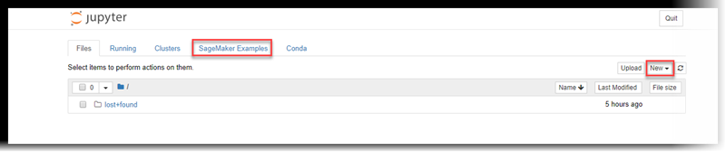

# Create a Notebook Instance

###### Important

Custom IAM policies that allow Amazon SageMaker Studio or Amazon SageMaker Studio Classic to create Amazon SageMaker
resources must also grant permissions to add tags to those resources. The permission to
add tags to resources is required because Studio and Studio Classic automatically tag
any resources they create. If an IAM policy allows Studio and Studio Classic to
create resources but does not allow tagging, "AccessDenied" errors can occur when
trying to create resources. For more information, see [Provide permissions for tagging SageMaker AI
resources](security_iam_id-based-policy-examples.md#grant-tagging-permissions "security_iam_id-based-policy-examples.md#grant-tagging-permissions").

[AWS managed policies for Amazon SageMaker AI](security-iam-awsmanpol.md "security-iam-awsmanpol.md")
that give permissions to create SageMaker resources already include permissions to add tags
while creating those resources.

Create a Jupyter notebook that contains a pre-installed environment with the default
Anaconda installation and Python3.

###### To create a Jupyter notebook

1. Open the Amazon SageMaker AI console at [https://console.aws.amazon.com/sagemaker/](https://console.aws.amazon.com/sagemaker/ "https://console.aws.amazon.com/sagemaker/").
2. Open a running notebook instance, by choosing **Open** next to its
   name. The Jupyter notebook server page appears:

 3. To create a notebook, choose **Files**, **New**,
and **conda_python3**. . 4. Name the notebook.

## Next Step

[Get the Amazon SageMaker AI Boto 3 Client](automatic-model-tuning-ex-client.md "automatic-model-tuning-ex-client.md")
