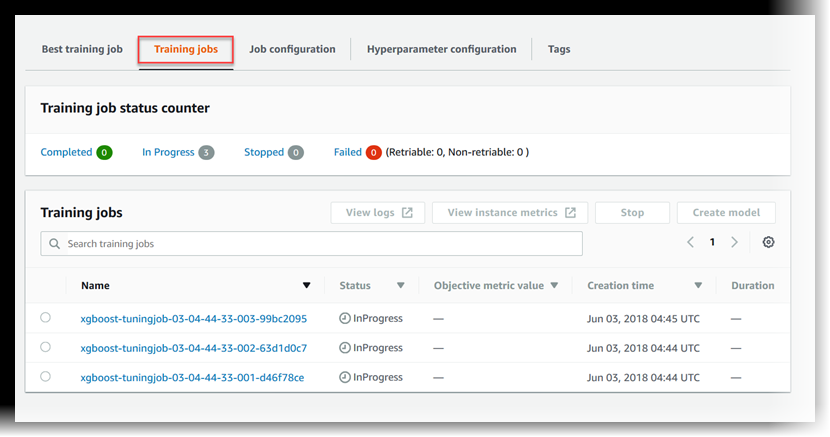
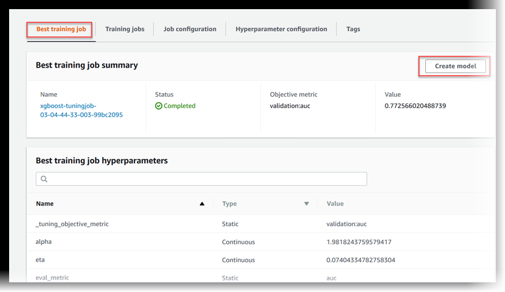

# Configure and Launch a Hyperparameter

Tuning Job

###### Important

Custom IAM policies that allow Amazon SageMaker Studio or Amazon SageMaker Studio Classic to create Amazon SageMaker
resources must also grant permissions to add tags to those resources. The permission to
add tags to resources is required because Studio and Studio Classic automatically tag
any resources they create. If an IAM policy allows Studio and Studio Classic to
create resources but does not allow tagging, "AccessDenied" errors can occur when
trying to create resources. For more information, see [Provide permissions for tagging SageMaker AI
resources](security_iam_id-based-policy-examples.md#grant-tagging-permissions "security_iam_id-based-policy-examples.md#grant-tagging-permissions").

[AWS managed policies for Amazon SageMaker AI](security-iam-awsmanpol.md "security-iam-awsmanpol.md")
that give permissions to create SageMaker resources already include permissions to add tags
while creating those resources.

A hyperparameter is a high-level parameter that influences the learning process during
model training. To get the best model predictions, you can optimize a hyperparameter
configuration or set hyperparameter values. The process of finding an optimal configuration
is called hyperparameter tuning. To configure and launch a hyperparameter tuning job,
complete the steps in these guides.

###### Topics

- [Settings for the
  hyperparameter tuning job](#automatic-model-tuning-ex-low-tuning-config "#automatic-model-tuning-ex-low-tuning-config")
- [Configure the training
  jobs](#automatic-model-tuning-ex-low-training-def "#automatic-model-tuning-ex-low-training-def")
- [Name and launch the hyperparameter
  tuning job](#automatic-model-tuning-ex-low-launch "#automatic-model-tuning-ex-low-launch")
- [Monitor the Progress of a Hyperparameter
  Tuning Job](automatic-model-tuning-monitor.md "automatic-model-tuning-monitor.md")
- [View the Status of the Training
  Jobs](#automatic-model-tuning-monitor-training "#automatic-model-tuning-monitor-training")
- [View
  the Best Training Job](#automatic-model-tuning-best-training-job "#automatic-model-tuning-best-training-job")

## Settings for the

hyperparameter tuning job

To specify settings for the hyperparameter tuning job, define a JSON object when you
create the tuning job. Pass this JSON object as the value of the
`HyperParameterTuningJobConfig` parameter to the [`CreateHyperParameterTuningJob`](../APIReference/API_CreateHyperParameterTuningJob.md "../APIReference/API_CreateHyperParameterTuningJob.md") API.

In this JSON object, specify the following:

In this JSON object, you specify:

- `HyperParameterTuningJobObjective` – The objective metric used
  to evaluate the performance of the training job launched by the hyperparameter tuning
  job.
- `ParameterRanges` – The range of values that a tunable
  hyperparameter can use during optimization. For more information, see [Define Hyperparameter Ranges](automatic-model-tuning-define-ranges.md "automatic-model-tuning-define-ranges.md")
- `RandomSeed` – A value used to initialize a pseudo-random number
  generator. Setting a random seed will allow the hyperparameter tuning search
  strategies to produce more consistent configurations for the same tuning job
  (optional).
- `ResourceLimits` – The maximum number of training and parallel
  training jobs that the hyperparameter tuning job can use.

###### Note

If you use your own algorithm for hyperparameter tuning, rather than a SageMaker AI [built-in algorithm](algos.md "algos.md"),
you must define metrics for your algorithm. For more information, see [Define metrics](automatic-model-tuning-define-metrics-variables.md#automatic-model-tuning-define-metrics "automatic-model-tuning-define-metrics-variables.md#automatic-model-tuning-define-metrics").

The following code example shows how to configure a hyperparameter tuning job using
the built-in [XGBoost
algorithm](xgboost.md "xgboost.md"). The code example shows how to define ranges for the `eta`,
`alpha`, `min_child_weight`, and `max_depth`
hyperparameters. For more information about these and other hyperparameters see [XGBoost
Parameters](https://xgboost.readthedocs.io/en/release_1.2.0/parameter.html "https://xgboost.readthedocs.io/en/release_1.2.0/parameter.html").

In this code example, the objective metric for the hyperparameter tuning job finds the
hyperparameter configuration that maximizes `validation:auc`. SageMaker AI built-in
algorithms automatically write the objective metric to CloudWatch Logs. The following code example
also shows how to set a `RandomSeed`.

```
tuning_job_config = {
    "ParameterRanges": {
      "CategoricalParameterRanges": [],
      "ContinuousParameterRanges": [
        {
          "MaxValue": "1",
          "MinValue": "0",
          "Name": "eta"
        },
        {
          "MaxValue": "2",
          "MinValue": "0",
          "Name": "alpha"
        },
        {
          "MaxValue": "10",
          "MinValue": "1",
          "Name": "min_child_weight"
        }
      ],
      "IntegerParameterRanges": [
        {
          "MaxValue": "10",
          "MinValue": "1",
          "Name": "max_depth"
        }
      ]
    },
    "ResourceLimits": {
      "MaxNumberOfTrainingJobs": 20,
      "MaxParallelTrainingJobs": 3
    },
    "Strategy": "Bayesian",
    "HyperParameterTuningJobObjective": {
      "MetricName": "validation:auc",
      "Type": "Maximize"
    },
    "RandomSeed" : 123
  }
```

## Configure the training

jobs

The hyperparameter tuning job will launch training jobs to find an optimal
configuration of hyperparameters. These training jobs should be configured using the SageMaker AI
[`CreateHyperParameterTuningJob`](../APIReference/API_CreateHyperParameterTuningJob.md "../APIReference/API_CreateHyperParameterTuningJob.md") API.

To configure the training jobs, define a JSON object and pass it as the value of the
`TrainingJobDefinition` parameter inside
`CreateHyperParameterTuningJob`.

In this JSON object, you can specify the following:

- `AlgorithmSpecification` – The [registry
  path](sagemaker-algo-docker-registry-paths.md "sagemaker-algo-docker-registry-paths.md") of the Docker image containing the training algorithm and related
  metadata. To specify an algorithm, you can use your own [custom built algorithm](your-algorithms.md "your-algorithms.md") inside
  a [Docker](https://docs.docker.com/get-started/overview/ "https://docs.docker.com/get-started/overview/") container
  or a [SageMaker AI built-in
  algorithm](algos.md "algos.md") (required).
- `InputDataConfig` – The input configuration, including the
  `ChannelName`, `ContentType`, and data source for your
  training and test data (required).
- `InputDataConfig` – The input configuration, including the
  `ChannelName`, `ContentType`, and data source for your
  training and test data (required).
- The storage location for the algorithm's output. Specify the S3 bucket where you
  want to store the output of the training jobs.
- `RoleArn` – The [Amazon Resource Name](../../../general/latest/gr/aws-arns-and-namespaces.md "../../../general/latest/gr/aws-arns-and-namespaces.md")
  (ARN) of an AWS Identity and Access Management (IAM) role that SageMaker AI uses to perform tasks. Tasks include
  reading input data, downloading a Docker image, writing model artifacts to an S3
  bucket, writing logs to Amazon CloudWatch Logs, and writing metrics to Amazon CloudWatch (required).
- `StoppingCondition` – The maximum runtime in seconds that a
  training job can run before being stopped. This value should be greater than the time
  needed to train your model (required).
- `MetricDefinitions` – The name and regular expression that
  defines any metrics that the training jobs emit. Define metrics only when you use a
  custom training algorithm. The example in the following code uses a built-in
  algorithm, which already has metrics defined. For information about defining metrics
  (optional), see [Define metrics](automatic-model-tuning-define-metrics-variables.md#automatic-model-tuning-define-metrics "automatic-model-tuning-define-metrics-variables.md#automatic-model-tuning-define-metrics").
- `TrainingImage` – The [Docker](https://docs.docker.com/get-started/overview/ "https://docs.docker.com/get-started/overview/")container image
  that specifies the training algorithm (optional).
- `StaticHyperParameters` – The name and values of hyperparameters
  that are not tuned in the tuning job (optional).

The following code example sets static values for the `eval_metric`,
`num_round`, `objective`, `rate_drop`, and
`tweedie_variance_power` parameters of the [XGBoost algorithm with Amazon SageMaker AI](xgboost.md "xgboost.md") built-in algorithm.

SageMaker Python SDK v1

```
from sagemaker.amazon.amazon_estimator import get_image_uri
training_image = get_image_uri(region, 'xgboost', repo_version='1.0-1')

s3_input_train = 's3://{}/{}/train'.format(bucket, prefix)
s3_input_validation ='s3://{}/{}/validation/'.format(bucket, prefix)

training_job_definition = {
    "AlgorithmSpecification": {
      "TrainingImage": training_image,
      "TrainingInputMode": "File"
    },
    "InputDataConfig": [
      {
        "ChannelName": "train",
        "CompressionType": "None",
        "ContentType": "csv",
        "DataSource": {
          "S3DataSource": {
            "S3DataDistributionType": "FullyReplicated",
            "S3DataType": "S3Prefix",
            "S3Uri": s3_input_train
          }
        }
      },
      {
        "ChannelName": "validation",
        "CompressionType": "None",
        "ContentType": "csv",
        "DataSource": {
          "S3DataSource": {
            "S3DataDistributionType": "FullyReplicated",
            "S3DataType": "S3Prefix",
            "S3Uri": s3_input_validation
          }
        }
      }
    ],
    "OutputDataConfig": {
      "S3OutputPath": "s3://{}/{}/output".format(bucket,prefix)
    },
    "ResourceConfig": {
      "InstanceCount": 2,
      "InstanceType": "ml.c4.2xlarge",
      "VolumeSizeInGB": 10
    },
    "RoleArn": role,
    "StaticHyperParameters": {
      "eval_metric": "auc",
      "num_round": "100",
      "objective": "binary:logistic",
      "rate_drop": "0.3",
      "tweedie_variance_power": "1.4"
    },
    "StoppingCondition": {
      "MaxRuntimeInSeconds": 43200
    }
}
```

SageMaker Python SDK v2

```
training_image = sagemaker.image_uris.retrieve('xgboost', region, '1.0-1')

s3_input_train = 's3://{}/{}/train'.format(bucket, prefix)
s3_input_validation ='s3://{}/{}/validation/'.format(bucket, prefix)

training_job_definition = {
    "AlgorithmSpecification": {
      "TrainingImage": training_image,
      "TrainingInputMode": "File"
    },
    "InputDataConfig": [
      {
        "ChannelName": "train",
        "CompressionType": "None",
        "ContentType": "csv",
        "DataSource": {
          "S3DataSource": {
            "S3DataDistributionType": "FullyReplicated",
            "S3DataType": "S3Prefix",
            "S3Uri": s3_input_train
          }
        }
      },
      {
        "ChannelName": "validation",
        "CompressionType": "None",
        "ContentType": "csv",
        "DataSource": {
          "S3DataSource": {
            "S3DataDistributionType": "FullyReplicated",
            "S3DataType": "S3Prefix",
            "S3Uri": s3_input_validation
          }
        }
      }
    ],
    "OutputDataConfig": {
      "S3OutputPath": "s3://{}/{}/output".format(bucket,prefix)
    },
    "ResourceConfig": {
      "InstanceCount": 2,
      "InstanceType": "ml.c4.2xlarge",
      "VolumeSizeInGB": 10
    },
    "RoleArn": role,
    "StaticHyperParameters": {
      "eval_metric": "auc",
      "num_round": "100",
      "objective": "binary:logistic",
      "rate_drop": "0.3",
      "tweedie_variance_power": "1.4"
    },
    "StoppingCondition": {
      "MaxRuntimeInSeconds": 43200
    }
}
```

## Name and launch the hyperparameter

tuning job

After you configure the hyperparameter tuning job, you can launch it by calling the
[`CreateHyperParameterTuningJob`](../APIReference/API_CreateHyperParameterTuningJob.md "../APIReference/API_CreateHyperParameterTuningJob.md") API. The following code example uses
`tuning_job_config` and `training_job_definition`. These were
defined in the previous two code examples to create a hyperparameter tuning job.

```
tuning_job_name = "MyTuningJob"
smclient.create_hyper_parameter_tuning_job(HyperParameterTuningJobName = tuning_job_name,
                                           HyperParameterTuningJobConfig = tuning_job_config,
                                           TrainingJobDefinition = training_job_definition)
```

## View the Status of the Training

Jobs

###### To view the status of the training jobs that the hyperparameter tuning job

launched

1. In the list of hyperparameter tuning jobs, choose the job that you
   launched.
2. Choose **Training jobs**.

 3. View the status of each training job. To see more details about a job, choose it
in the list of training jobs. To view a summary of the status of all of the training
jobs that the hyperparameter tuning job launched, see **Training job status
counter**.

A training job can be:

    * `Completed`—The training job successfully completed.
    * `InProgress`—The training job is in progress.
    * `Stopped`—The training job was manually stopped before it
     completed.
    * `Failed (Retryable)`—The training job failed, but can be
     retried. A failed training job can be retried only if it failed because an
     internal service error occurred.
    * `Failed (Non-retryable)`—The training job failed and can't
     be retried. A failed training job can't be retried when a client error
     occurs.

###### Note

Hyperparameter tuning jobs can be stopped and the underlying resources [deleted](automatic-model-tuning-ex-cleanup.md "automatic-model-tuning-ex-cleanup.md"),
but the jobs themselves cannot be deleted.

## View

the Best Training Job

A hyperparameter tuning job uses the objective metric that each training job returns
to evaluate training jobs. While the hyperparameter tuning job is in progress, the best
training job is the one that has returned the best objective metric so far. After the
hyperparameter tuning job is complete, the best training job is the one that returned the
best objective metric.

To view the best training job, choose **Best training job**.



To deploy the best training job as a model that you can host at a SageMaker AI endpoint,
choose **Create model**.

### Next Step

[Clean up](automatic-model-tuning-ex-cleanup.md "automatic-model-tuning-ex-cleanup.md")
