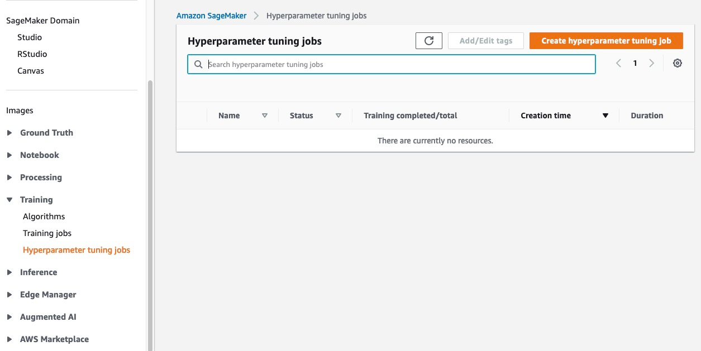

# Monitor the Progress of a Hyperparameter

Tuning Job

To monitor the progress of a hyperparameter tuning job and the training jobs that it
launches, use the Amazon SageMaker AI console.

###### Topics

- [View the Status of the
  Hyperparameter Tuning Job](#automatic-model-tuning-monitor-tuning "#automatic-model-tuning-monitor-tuning")

## View the Status of the

Hyperparameter Tuning Job

###### To view the status of the hyperparameter tuning job

1. Open the Amazon SageMaker AI console at [https://console.aws.amazon.com/sagemaker/](https://console.aws.amazon.com/sagemaker/ "https://console.aws.amazon.com/sagemaker/").
2. Choose **Hyperparameter tuning jobs**.

 3. In the list of hyperparameter tuning jobs, check the status of the
hyperparameter tuning job you launched. A tuning job can be:

    * `Completed`—The hyperparameter tuning job successfully
     completed.
    * `InProgress`—The hyperparameter tuning job is in progress.
     One or more training jobs are still running.
    * `Failed`—The hyperparameter tuning job failed.
    * `Stopped`—The hyperparameter tuning job was manually
     stopped before it completed. All training jobs that the hyperparameter tuning
     job launched are stopped.
    * `Stopping`—The hyperparameter tuning job is in the process
     of stopping.
