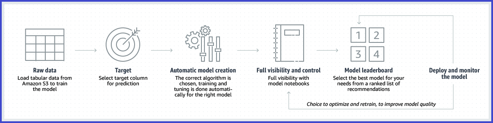

# SageMaker Autopilot

###### Important

As of November 30, 2023, Autopilot's UI is migrating to [Amazon SageMaker Canvas](canvas.md "canvas.md") as part of the
updated [Amazon SageMaker Studio](studio-updated.md "studio-updated.md") experience. SageMaker Canvas provides analysts
and citizen data scientists no-code capabilities for tasks such as data preparation, feature engineering,
algorithm selection, training and tuning, inference, and more. Users can leverage built-in visualizations
and what-if analysis to explore their data and different scenarios, with automated predictions enabling
them to easily productionize their models. Canvas supports a variety of use cases,
including computer vision, demand forecasting, intelligent search, and generative AI.

Users of
[Amazon SageMaker Studio Classic](studio.md "studio.md"), the previous experience of [Studio](studio-updated.md "studio-updated.md"),
can continue using the Autopilot UI in Studio Classic. Users with coding experience can continue using all
[API references](autopilot-reference.md "autopilot-reference.md")
in any supported SDK for technical implementation.

If you have been using Autopilot in Studio Classic until now and want to migrate to SageMaker Canvas,
you might have to grant additional permissions to your user profile or IAM role so that you can create and use the SageMaker Canvas application.
For more information, see [(Optional) Migrate from
Autopilot in Studio Classic to SageMaker Canvas](studio-updated-migrate-ui.md#studio-updated-migrate-autopilot "studio-updated-migrate-ui.md#studio-updated-migrate-autopilot").

All UI-related instructions in this guide pertain to Autopilot's standalone features before
migrating to [Amazon SageMaker Canvas](canvas.md "canvas.md"). Users following these instructions should use [Studio Classic](studio.md "studio.md").

Amazon SageMaker Autopilot is a feature set that simplifies and accelerates various stages of the machine
learning workflow by automating the process of building and deploying machine learning models
(AutoML). The following page explains key information about Amazon SageMaker Autopilot.

Autopilot performs the following key tasks that you can use on autopilot or with various
degrees of human guidance:

- **Data analysis and preprocessing:** Autopilot identifies
  your specific problem type, handles missing values, normalizes your data, selects features,
  and overall prepares the data for model training.
- **Model selection:** Autopilot explores a variety of
  algorithms and uses a cross-validation resampling technique to generate metrics that
  evaluate the predictive quality of the algorithms based on predefined objective
  metrics.
- **Hyperparameter optimization:** Autopilot automates the
  search for optimal hyperparameter configurations.
- **Model training and evaluation:** Autopilot automates the
  process of training and evaluating various model candidates. It splits the data into
  training and validation sets, trains the selected model candidates using the training data,
  and evaluates their performance on the unseen data of the validation set. Lastly, it ranks
  the optimized model candidates based on their performance and identifies the best performing
  model.
- **Model deployment:** Once Autopilot has identified the best
  performing model, it provides the option to deploy the model automatically by generating the
  model artifacts and the endpoint exposing an API. External applications can send data to the
  endpoint and receive the corresponding predictions or inferences.
  Autopilot supports building machine learning models on large datasets up to hundreds of
  GBs.

The following diagram outlines the tasks of this AutoML process managed by Autopilot.

Depending on your comfort level with the machine learning process and coding experience, you
can use Autopilot in different ways:

- **Using the Studio Classic UI**, users can choose between a
  no-code experience or have some level of human input.

###### Note

Only experiments created from tabular data for problem types such as regression or
classification are available via the Studio Classic UI.

- **Using the AutoML API**, users with coding experience
  can use available SDKs to create AutoML jobs. This approach provides greater flexibility and
  customization options and is available for all problem types.
  Autopilot currently supports the following problem types:

###### Note

For regression or classification problems involving tabular data, users can choose between
two options: using the Studio Classic user interface or the [API Reference](autopilot-reference.md "autopilot-reference.md").

Tasks such as text and image classification,
time-series forecasting, and fine-tuning of large language models are exclusively available
through the version 2 of the [AutoML REST API](autopilot-reference.md "autopilot-reference.md").
If your language of choice is Python, you can refer to [AWS SDK for Python (Boto3)](https://boto3.amazonaws.com/v1/documentation/api/latest/reference/services/sagemaker/client/create_auto_ml_job_v2.html "https://boto3.amazonaws.com/v1/documentation/api/latest/reference/services/sagemaker/client/create_auto_ml_job_v2.html") or the [AutoMLV2 object](https://sagemaker.readthedocs.io/en/stable/api/training/automlv2.html#sagemaker.automl.automlv2.AutoMLV2 "https://sagemaker.readthedocs.io/en/stable/api/training/automlv2.html#sagemaker.automl.automlv2.AutoMLV2") of the Amazon SageMaker Python SDK directly.

Users who prefer the convenience of a user interface can use [Amazon SageMaker Canvas](canvas-getting-started.md "canvas-getting-started.md") to access
pre-trained models and generative AI foundation models, or create custom models tailored for specific text, image classification,
forecasting needs, or generative AI.

- **Regression, binary, and multiclass classification**
  with tabular data formatted as CSV or Parquet files in which each column contains a feature
  with a specific data type and each row contains an observation. The column data types
  accepted include numerical, categorical, text, and time series that consists of strings of
  comma-separated numbers.
  - To create an Autopilot job as a pilot experiment using the SageMaker API reference, see
    [Create Regression or
    Classification Jobs for Tabular Data Using the AutoML API](autopilot-automate-model-development-create-experiment.md "autopilot-automate-model-development-create-experiment.md").
  - To create an Autopilot job as a pilot experiment using the Studio Classic UI, see [Create a Regression
    or Classification Autopilot experiment for tabular data using the Studio Classic UI](autopilot-automate-model-development-create-experiment-ui.md "autopilot-automate-model-development-create-experiment-ui.md").
  - If you are an administrator looking to pre-configure default infrastructure,
    networking, or security parameters of Autopilot experiments in Studio Classic UI, see [Configure the default
    parameters of an Autopilot experiment (for administrators)](autopilot-set-default-parameters-create-experiment.md "autopilot-set-default-parameters-create-experiment.md").

- **Text classification** with data formatted as CSV or
  Parquet files in which a column provides the sentences to be classified, while another
  column should provide the corresponding class label. See [Create an AutoML job
  for text classification using the API](autopilot-create-experiment-text-classification.md "autopilot-create-experiment-text-classification.md").
- **Image classification** with image formats such as PNG,
  JPEG, or a combination of both.See [Create an Image
  Classification Job using the AutoML API](autopilot-create-experiment-image-classification.md "autopilot-create-experiment-image-classification.md").
- **Time-series forecasting** with time-series data
  formatted as CSV or Parquet files.See [Create an AutoML job for
  time-series forecasting using the API](autopilot-create-experiment-timeseries-forecasting.md "autopilot-create-experiment-timeseries-forecasting.md").
- Fine-tuning of large language models (LLMs) for **text
  generation** with data formatted as CSV or Parquet files.See [Create an AutoML job to fine-tune
  text generation models using the API](autopilot-create-experiment-finetune-llms.md "autopilot-create-experiment-finetune-llms.md").
  Additionally, Autopilot helps users understand how models make predictions by automatically
  generating reports that show the importance of each individual feature. This provides
  transparency and insights into the factors influencing the predictions, which can be used by
  risk and compliance teams and external regulators. Autopilot also provides a model performance
  report, which encompasses a summary of evaluation metrics, a confusion matrix, various
  visualizations such as receiver operating characteristic curves and precision-recall curves, and
  more. The specific content of each report vary depending on the problem type of the Autopilot
  experiment.

The explainability and performance reports for the best model candidate in an Autopilot
experiment are available for text, image, and tabular data classification problem types.

For tabular data use cases such as regression or classification, Autopilot offers additional
visibility into how the data was wrangled and how the model candidates were selected, trained,
and tuned by generating notebooks that contain the code used to explore the data and find the
best performing model. These notebooks provide an interactive and exploratory environment to
help you learn about the impact of various inputs or the trade-offs made in the experiments. You
can experiment further with the higher performing model candidate by making your own
modifications to the data exploration and candidate definition notebooks provided by Autopilot.

With Amazon SageMaker AI, you pay only for what you use. You pay for the underlying compute and storage
resources within SageMaker AI or other AWS services, based on your usage. For more information about
the cost of using SageMaker AI, see [Amazon SageMaker
Pricing](https://aws.amazon.com/sagemaker/pricing "https://aws.amazon.com/sagemaker/pricing").

###### Topics

- [Create Regression or
  Classification Jobs for Tabular Data Using the AutoML API](autopilot-automate-model-development-create-experiment.md "autopilot-automate-model-development-create-experiment.md")
- [Create an Image
  Classification Job using the AutoML API](autopilot-create-experiment-image-classification.md "autopilot-create-experiment-image-classification.md")
- [Create an AutoML job
  for text classification using the API](autopilot-create-experiment-text-classification.md "autopilot-create-experiment-text-classification.md")
- [Create an AutoML job for
  time-series forecasting using the API](autopilot-create-experiment-timeseries-forecasting.md "autopilot-create-experiment-timeseries-forecasting.md")
- [Create an AutoML job to fine-tune
  text generation models using the API](autopilot-create-experiment-finetune-llms.md "autopilot-create-experiment-finetune-llms.md")
- [Create a Regression
  or Classification Autopilot experiment for tabular data using the Studio Classic UI](autopilot-automate-model-development-create-experiment-ui.md "autopilot-automate-model-development-create-experiment-ui.md")
- [Amazon SageMaker Autopilot example notebooks](autopilot-example-notebooks.md "autopilot-example-notebooks.md")
- [Videos: Use Autopilot to automate and explore the machine
  learning process](autopilot-videos.md "autopilot-videos.md")
- [Autopilot quotas](autopilot-quotas.md "autopilot-quotas.md")
- [API Reference guide for Autopilot](autopilot-reference.md "autopilot-reference.md")
