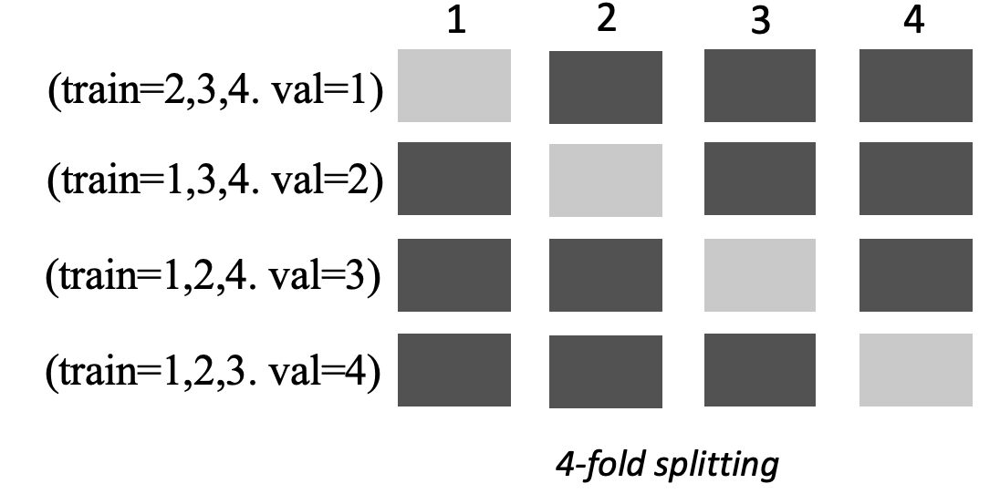
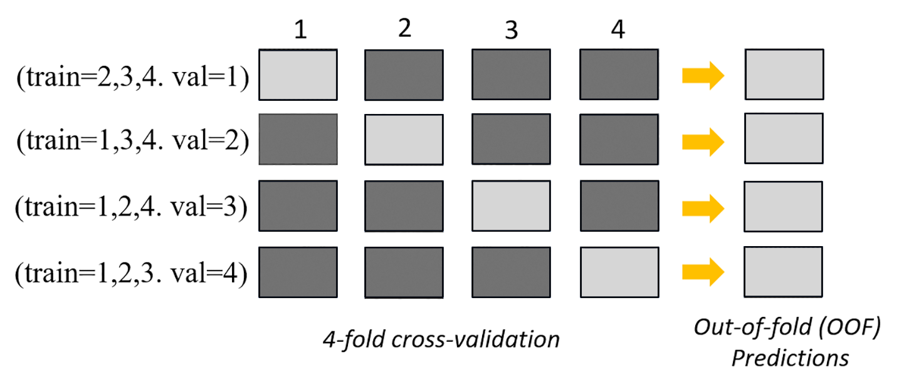

# Metrics and validation

This guide shows metrics and validation techniques that you can use to measure machine
learning model performance. Amazon SageMaker Autopilot produces metrics that measure the predictive quality of
machine learning model candidates. The metrics calculated for candidates are specified using an
array of [MetricDatum](../APIReference/API_MetricDatum.md "../APIReference/API_MetricDatum.md") types.

## Autopilot metrics

The following list contains the names of the metrics that are currently available to
measure model performance within Autopilot.

###### Note

Autopilot supports sample weights. To learn more about sample weights and the available
objective metrics, see [Autopilot weighted metrics](#autopilot-weighted-metrics "#autopilot-weighted-metrics").

The following are the available metrics.

**`Accuracy`**

The ratio of the number of correctly classified items to the total number of
(correctly and incorrectly) classified items. It is used for both binary and multiclass
classification. Accuracy measures how close the predicted class values are to the actual
values. Values for accuracy metrics vary between zero (0) and one (1). A value of 1
indicates perfect accuracy, and 0 indicates perfect inaccuracy.

**`AUC`**

The area under the curve (AUC) metric is used to compare and evaluate binary
classification by algorithms that return probabilities, such as logistic regression. To
map the probabilities into classifications, these are compared against a threshold
value.

The relevant curve is the receiver operating characteristic curve. The
curve plots the true positive rate (TPR) of predictions (or recall) against the
false positive rate (FPR) as a function of the threshold value, above which a prediction
is considered positive. Increasing the threshold results in fewer false positives, but
more false negatives.

AUC is the area under this
receiver operating characteristic curve. Therefore, AUC provides an aggregated measure
of the model performance across all possible classification thresholds. AUC scores vary
between 0 and 1. A score of 1 indicates perfect accuracy, and a score of one half (0.5)
indicates that the prediction is not better than a random classifier.

**`BalancedAccuracy`**

`BalancedAccuracy` is a metric that measures the ratio of accurate
predictions to all predictions. This ratio is calculated after normalizing true
positives (TP) and true negatives (TN) by the total number of positive (P) and negative
(N) values. It is used in both binary and multiclass classification and is defined as
follows: 0.5\*((TP/P)+(TN/N)), with values ranging from 0 to 1.
`BalancedAccuracy` gives a better measure of accuracy when the number of
positives or negatives differ greatly from each other in an imbalanced dataset, such as
when only 1% of email is spam.

**`F1`**

The `F1` score is the harmonic mean of the precision and recall, defined
as follows: F1 = 2 \* (precision \* recall) / (precision + recall). It is used for binary
classification into classes traditionally referred to as positive and negative.
Predictions are said to be true when they match their actual (correct) class, and false
when they do not.

Precision is the ratio of the true positive predictions to all positive predictions,
and it includes the false positives in a dataset. Precision measures the quality of the
prediction when it predicts the positive class.

Recall (or sensitivity) is the ratio of the true positive predictions to all actual
positive instances. Recall measures how completely a model predicts the actual class
members in a dataset.

F1 scores vary between 0 and 1. A score of 1 indicates the best possible
performance, and 0 indicates the worst.

**`F1macro`**

The `F1macro` score applies F1 scoring to multiclass classification
problems. It does this by calculating the precision and recall, and then taking their
harmonic mean to calculate the F1 score for each class. Lastly, the `F1macro`
averages the individual scores to obtain the `F1macro` score.
`F1macro` scores vary between 0 and 1. A score of 1 indicates the best
possible performance, and 0 indicates the worst.

**`InferenceLatency`**

Inference latency is the approximate amount of time between making a request for a
model prediction to receiving it from a real time endpoint to which the model is
deployed. This metric is measured in seconds and only available in ensembling
mode.

**`LogLoss`**

Log loss, also known as cross-entropy loss, is a metric used to evaluate the quality
of the probability outputs, rather than the outputs themselves. It is used in both
binary and multiclass classification and in neural nets. It is also the cost function
for logistic regression. Log loss is an important metric to indicate when a model makes
incorrect predictions with high probabilities. Values range from 0 to infinity. A value
of 0 represents a model that perfectly predicts the data.

**`MAE`**

The mean absolute error (MAE) is a measure of how different the predicted and actual
values are, when they're averaged over all values. MAE is commonly used in regression
analysis to understand model prediction error. If there is linear regression, MAE
represents the average distance from a predicted line to the actual value. MAE is
defined as the sum of absolute errors divided by the number of observations. Values
range from 0 to infinity, with smaller numbers indicating a better model fit to the
data.

**`MSE`**

The mean squared error (MSE) is the average of the squared differences between the
predicted and actual values. It is used for regression. MSE values are always positive.
The better a model is at predicting the actual values, the smaller the MSE value
is.

**`Precision`**

Precision measures how well an algorithm predicts the true positives (TP) out of all
of the positives that it identifies. It is defined as follows: Precision = TP/(TP+FP),
with values ranging from zero (0) to one (1), and is used in binary classification.
Precision is an important metric when the cost of a false positive is high. For example,
the cost of a false positive is very high if an airplane safety system is falsely deemed
safe to fly. A false positive (FP) reflects a positive prediction that is actually
negative in the data.

**`PrecisionMacro`**

The precision macro computes precision for multiclass classification problems. It
does this by calculating precision for each class and averaging scores to obtain
precision for several classes. `PrecisionMacro` scores range from zero (0) to
one (1). Higher scores reflect the model's ability to predict true positives (TP) out of
all of the positives that it identifies, averaged across multiple classes.

**`R2`**

R2, also known as the coefficient of determination, is
used in regression to quantify how much a model can explain the variance of a dependent
variable. Values range from one (1) to negative one (-1). Higher numbers indicate a
higher fraction of explained variability. `R2` values close to zero (0)
indicate that very little of the dependent variable can be explained by the model.
Negative values indicate a poor fit and that the model is outperformed by a constant
function. For linear regression, this is a horizontal line.

**`Recall`**

Recall measures how well an algorithm correctly predicts all of the true positives
(TP) in a dataset. A true positive is a positive prediction that is also an actual
positive value in the data. Recall is defined as follows: Recall = TP/(TP+FN), with
values ranging from 0 to 1. Higher scores reflect a better ability of the model to
predict true positives (TP) in the data. It is used in binary classification.

Recall is important when testing for cancer because it's used to find all of the
true positives. A false negative (FN) reflects a negative prediction that is actually
positive in the data. It is often insufficient to measure only recall, because
predicting every output as a true positive yields a perfect recall score.

**`RecallMacro`**

The `RecallMacro` computes recall for multiclass classification problems
by calculating recall for each class and averaging scores to obtain recall for several
classes. `RecallMacro` scores range from 0 to 1. Higher scores reflect the
model's ability to predict true positives (TP) in a dataset, whereas a true positive
reflects a positive prediction that is also an actual positive value in the data. It is
often insufficient to measure only recall, because predicting every output as a true
positive will yield a perfect recall score.

**`RMSE`**

Root mean squared error (RMSE) measures the square root of the squared difference
between predicted and actual values, and is averaged over all values. It is used in
regression analysis to understand model prediction error. It's an important metric to
indicate the presence of large model errors and outliers. Values range from zero (0) to
infinity, with smaller numbers indicating a better model fit to the data. RMSE is
dependent on scale, and should not be used to compare datasets of different
sizes.

Metrics that are automatically calculated for a model candidate are determined by the type
of problem being addressed.

Refer to the [Amazon SageMaker API reference documentation](../APIReference/API_AutoMLJobObjective.md "../APIReference/API_AutoMLJobObjective.md") for the list of available metrics supported by Autopilot.

## Autopilot weighted metrics

###### Note

Autopilot supports sample weights in ensembling mode only for all [available
metrics](autopilot-metrics-validation.md#autopilot-metrics "autopilot-metrics-validation.md#autopilot-metrics") with the exception of `Balanced Accuracy` and
`InferenceLatency`. `BalanceAccuracy` comes with its own weighting
scheme for imbalanced datasets that does not require sample weights.
`InferenceLatency` does not support sample weights. Both objective
`Balanced Accuracy` and `InferenceLatency` metrics ignore any
existing sample weights when training and evaluating a model.

Users can add a sample weights column to their data to ensure that each observation used
to train a machine learning model is given a weight corresponding to its perceived importance
to the model. This is especially useful in scenarios in which the observations in the dataset
have varying degrees of importance, or in which a dataset contains a disproportionate number
of samples from one class compared to others. Assigning a weight to each observation based on
its importance or greater importance to a minority class can help a model’s overall
performance, or ensure that a model is not biased toward the majority class.

For information about how to pass sample weights when creating an experiment in the
Studio Classic UI, see _Step 7_ in [Create
an Autopilot experiment using Studio Classic](autopilot-automate-model-development-create-experiment.md "autopilot-automate-model-development-create-experiment.md").

For information about how to pass sample weights programmatically when creating an Autopilot
experiment using the API, see _How to add sample weights to an AutoML
job_ in [Create an Autopilot experiment programmatically](autopilot-automate-model-development-create-experiment.md "autopilot-automate-model-development-create-experiment.md").

## Cross-validation in Autopilot

Cross-validation is used in to reduce overfitting and bias in model selection. It is also
used to assess how well a model can predict the values of an unseen validation dataset, if the
validation dataset is drawn from the same population. This method is especially important when
training on datasets that have a limited number of training instances.

Autopilot uses cross-validation to build models in hyperparameter optimization (HPO) and
ensemble training mode. The first step in the Autopilot cross-validation process is to split the
data into k-folds.

### K-fold splitting

K-fold splitting is a method that separates an input training dataset into multiple
training and validation datasets. The dataset is split into `k` equally-sized
sub-samples called folds. Models are then trained on `k-1` folds and tested
against the remaining kth fold, which is the validation dataset.
The process is repeated `k` times using a different data set for validation.

The following image depicts k-fold splitting with k = 4 folds. Each fold is represented
as a row. The dark-toned boxes represent the parts of the data used in training. The
remaining light-toned boxes indicate the validation datasets.

Autopilot uses k-fold cross-validation for both hyperparameter optimization (HPO) mode and
ensembling mode.

You can deploy Autopilot models that are built using cross-validation like you would with
any other Autopilot or SageMaker AI model.

### HPO mode

K-fold cross-validation uses the k-fold splitting method for cross-validation. In HPO
mode, Autopilot automatically implements k-fold cross-validation for small datasets with 50,000
or fewer training instances. Performing cross-validation is especially important when
training on small datasets because it protects against overfitting and selection bias.

HPO mode uses a _k_ value of 5 on each of the candidate
algorithms that are used to model the dataset. Multiple models are trained on different
splits, and the models are stored separately. When training is complete, validation metrics
for each of the models are averaged to produce a single estimation metric. Lastly, Autopilot
combines the models from the trial with the best validation metric into an ensemble model.
Autopilot uses this ensemble model to make predictions.

The validation metric for the models trained by Autopilot is presented as the objective
metric in the model leaderboard. Autopilot uses the default validation metric for each problem
type that it handles, unless you specify otherwise. For the list of all metrics that Autopilot
uses, see [Autopilot metrics](#autopilot-metrics "#autopilot-metrics").

For example, the [Boston Housing
dataset](http://lib.stat.cmu.edu/datasets/boston "http://lib.stat.cmu.edu/datasets/boston") contains only 861 samples. If you build a model to predict house sale
prices using this dataset without cross-validation, you risk training on a dataset that is
not representative of the Boston housing stock. If you split the data only once into
training and validation subsets, the training fold may only contain data mainly from the
suburbs. As a result, you would train on data that isn't representative of the rest of the
city. In this example, your model would likely overfit on this biased selection. K-fold
cross-validation can reduce the risk of this kind of error by making full and randomized use
of the available data for both training and validation.

Cross-validation can increase training times by an average of 20%. Training times may
also increase significantly for complex datasets.

###### Note

In HPO mode, you can see the training and validation metrics from each fold in your
`/aws/sagemaker/TrainingJobs` CloudWatch Logs. For more information about CloudWatch Logs, see
[CloudWatch Logs for Amazon SageMaker AI](logging-cloudwatch.md "logging-cloudwatch.md").

### Ensembling mode

###### Note

Autopilot supports sample weights in ensembling mode. For the list of available metrics
supporting sample weights, see [Autopilot metrics](#autopilot-metrics "#autopilot-metrics").

In ensembling mode, cross-validation is performed regardless of dataset size. Customers
can either provide their own validation dataset and custom data split ratio, or let Autopilot
split the dataset automatically into an 80-20% split ratio. The training data is then split
into `k`-folds for cross-validation, where the value of `k` is
determined by the AutoGluon engine. An ensemble consists of multiple machine learning
models, where each model is known as the base model. A single base model is trained on
(`k`-1) folds and makes out-of-fold predictions on the remaining fold. This
process is repeated for all `k` folds, and the out-of-fold (OOF) predictions are
concatenated to form a single set of predictions. All base models in the ensemble follow
this same process of generating OOF predictions.

The following image depicts k-fold validation with `k` = 4 folds. Each fold
is represented as a row. The dark-toned boxes represent the parts of the data used in
training. The remaining light-toned boxes indicate the validation datasets.

In the upper part of the image, in each fold, the first base model makes predictions on
the validation dataset after training on the training datasets. At each subsequent fold, the
datasets change roles. A dataset that was previously used for training is now used for
validation, and this also applies in reverse. At the end of `k` folds, all of the
predictions are concatenated to form a single set of predictions called an out-of-fold (OOF)
prediction. This process is repeated for each `n` base models.

The OOF predictions for each base model are then used as features to train a stacking
model. The stacking model learns the importance weights for each base model. These weights
are used to combine the OOF predictions to form the final prediction. Performance on the
validation dataset determines which base or stacking model is the best, and this model is
returned as the final model.

In ensemble mode, you can either provide your own validation dataset or let Autopilot split
the input dataset automatically into 80% train and 20% validation datasets. The training
data is then split into `k`-folds for cross-validation and produces an OOF
prediction and a base model for each fold.

These OOF predictions are used as features to train a stacking model, which
simultaneously learns weights for each base model. These weights are used to combine the OOF
predictions to form the final prediction. The validation datasets for each fold are used for
hyperparameter tuning of all base models and the stacking model. Performance on the
validation datasets determines which base or stacking model is the best model, and this
model is returned as the final model.
